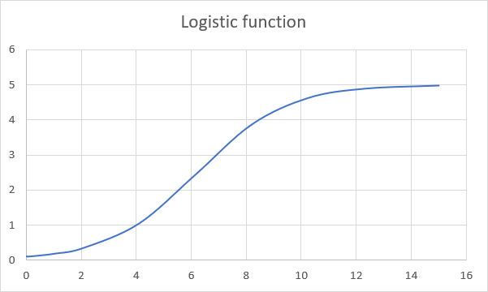

# Integration and ODEs

## Content

- [Integration](#Integration)
- [Multiple integral](#Multiple-integral)
- [Ordinary differential equations](#Ordinary-differential-equations)

## Integration

### `quad`

Compute a definite integral using Gaussian quadrature.
```cpp
template <class T, class Function = T(T)>
T quad(
    Function f, T a, T b,
    bool show = false,
    T tol = 1e-8, T rtol = 1e-8, size_t maxiter = 50
);
```

#### Arguments:

- `f`: Function to integrate.
- `a`: Lower limit of integration.
- `b`: Upper limit of integration.
- `show`: If `true`, prints a short description of the cause of termination. 
Default is `false`.
- `tol`: The desired absolute tolerance.
- `rtol`: The desired relative tolerance.
- `maxiter`: Maximum order of Gaussian quadrature.

#### Example

Calculate dx).

```cpp
#include <iostream>
#include "numcpp.h"
#include "scicpp/integrate.h"
using namespace std;
namespace np = numcpp;

double f(double x) {
    return np::exp(-x) * np::cos(2*x*x + 1);
}

int main() {
    double a = 0, b = 1;
    double integral = scicpp::quad(f, a, b, true);
    cout << "Integral: " << integral << "\n";
    return 0;
}
```

```
[Out] Converged after 7 iterations, value is 0.0508862
      Integral: 0.0508862
```

### `fixed_quad`

Compute a definite integral using fixed-order Gaussian quadrature.
```cpp
template <class T, class Function = T(T)>
T fixed_quad(Function f, T a, T b, size_t n);
```

#### Arguments:

- `f`: Function to integrate.
- `a`: Lower limit of integration.
- `b`: Upper limit of integration.
- `n`: Order of quadrature integration.

#### Example

```cpp
#include <iostream>
#include "numcpp.h"
#include "scicpp/integrate.h"
using namespace std;
namespace np = numcpp;

double f(double x) {
    return np::exp(-x) * np::cos(2*x*x + 1);
}

int main() {
    double a = 0, b = 1;
    cout << "5 points approximation: " << scicpp::fixed_quad(f, a, b, 5) 
         << "\n";
    return 0;
}
```

```
[Out] 5 points approximation: 0.0508857
```

### `leggauss`

Compute the sample points and weights for Gauss-Legendre quadrature. These 
sample points and weights will correctly integrate polynomials of degree 
 or less 
over the interval ![$[-1,1]$](https://render.githubusercontent.com/render/math?math=%5B-1%2C1%5D).
```cpp
template <class T>
void leggauss(
    size_t n, numcpp::array<T> &points, numcpp::array<T> &weights
);
```

#### Arguments:

- `n`: Number of sample points and weights. Must be greater than 1.
- `points`: Array that will contain the sample points.
- `weights`: Array that will contain the weights.

#### Example

```cpp
#include <iostream>
#include "numcpp.h"
#include "scicpp/integrate.h"
using namespace std;
namespace np = numcpp;
int main() {
    np::array<double> points, weights;
    scicpp::leggauss(5, points, weights);
    cout << "Points:\n" << points << "\nWeights:\n" << weights << "\n";
    return 0;
}
```

```
[Out] Points:
      [-0.90617985, -0.53846931, 8.3341178e-18, 0.53846931, 0.90617985]
      Weights:
      [0.23692689, 0.47862867, 0.56888889, 0.47862867, 0.23692689]
```

### `romberg`

Compute a definite integral using Romberg method.
```cpp
template <class T, class Function = T(T)>
T romberg(
    Function f, T a, T b,
    bool show = false,
    T tol = 1e-8, T rtol = 1e-8, size_t maxiter = 10
);
```

#### Arguments:

- `f`: Function to integrate.
- `a`: Lower limit of integration.
- `b`: Upper limit of integration.
- `show`: If `true`, prints the triangular matrix showing the Richardson 
extrapolations. Default is `false`.
- `tol`: The desired absolute tolerance.
- `rtol`: The desired relative tolerance.
- `maxiter`: Maximum order of extrapolation.


#### Example

Calculate dx).
```cpp
#include <iostream>
#include "numcpp.h"
#include "scicpp/integrate.h"
using namespace std;
namespace np = numcpp;

double f(double x) {
    return np::exp(-x) * np::cos(2*x*x + 1);
}

int main() {
    double a = 0, b = 1;
    double integral = scicpp::romberg(f, a, b, true);
    cout << "Integral: " << integral << "\n";
    return 0;
}
```

```
[Out] Steps StepSize Results
          1        1 0.0880522
          2      0.5 0.0654782 0.0579536
          4     0.25 0.0545416 0.0508961 0.0504256
          8    0.125 0.0517954   0.05088 0.0508789 0.0508861
         16   0.0625 0.0511131 0.0508857 0.0508861 0.0508862 0.0508862
         32  0.03125 0.0509429 0.0508861 0.0508862 0.0508862 0.0508862 0.0508862
         64 0.015625 0.0509003 0.0508862 0.0508862 0.0508862 0.0508862 0.0508862 0.0508862
      Converged after 7 iterations, value is 0.0508862
      Integral: 0.0508862
```

### `newton_cotes`

Return weights for Newton-Cotes integration. Let  
be equally spaced sample points over the interval ![$[a,b]$](https://render.githubusercontent.com/render/math?math=%5Ba%2Cb%5D). The Newton-Cotes formula 
for the integral is 

dx%20%5Capprox%20%5Cfrac%7Bb%20-%20a%7D%7Bn%7D%5Csum_%7Bi%20%3D%200%7D%5E%7Bn%7D%20w_i%20f(x_i))

```cpp
template <class T>
void newton_cotes(size_t n, numcpp::array<T> &weights);
```

#### Arguments:

- `n`: Number of sub-intervals.
- `weights`: Array that will contain the weights.

#### Example

Calculate dx). Analytic result is .
```cpp
#include <iostream>
#include "numcpp.h"
#include "scicpp/integrate.h"
using namespace std;
namespace np = numcpp;
int main() {
    np::array<double> integral(3);

    for (int n = 1; n <= 3; ++n) {
        np::array<double> x = numcpp::linspace(0.0, 1.0, n + 1);
        np::array<double> y = 3.0*x*np::exp(x) + 5.0*x - 1.0;
        np::array<double> weights;
        scicpp::newton_cotes(n, weights);
        integral[n - 1] = np::sum(weights * y) / n;
    }

    cout << "Trapezoidal rule: " << integral[0] << "\n";
    cout << "Simpson's rule: " << integral[1] << "\n";
    cout << "Simpson's 3/8 rule: " << integral[2] << "\n";

    return 0;
}
```

```
[Out] Trapezoidal rule: 5.57742
      Simpson's rule: 4.50786
      Simpson's 3/8 rule: 4.50351
```

## Multiple integral

### `dblquad`

Compute a double integral. Return the double (definite) integral of 
)
over the rectangle , %20%5Cleq%20y%20%5Cleq%20b_y(x)).
```cpp
template <
    class T, class Function = T(T, T),
    class LowerLimit = T(T), class UpperLimit = T(T)
>
T dblquad(
    Function f, T ax, T bx, LowerLimit ay, UpperLimit by,
    bool show = false,
    T tol = 1e-8, T rtol = 1e-8, size_t maxiter = 50
);
```

#### Arguments:

- `f`: Function to integrate.
- `ax`, `bx`: Lower and upper limits of integration for *x*.
- `ay`, `by`: Lower and upper limits of integration for *y*.
- `show`: If `true`, prints a short description of the cause of termination. 
Default is `false`.
- `tol`: The desired absolute tolerance.
- `rtol`: The desired relative tolerance.
- `maxiter`: Maximum order of quadrature.

#### Example

Calculate dydx).

```cpp
#include <iostream>
#include "numcpp.h"
#include "scicpp/integrate.h"
using namespace std;
namespace np = numcpp;

double f(double x, double y) {
    return 3*x*y*y - x*x + y;
}

int main() {
    double ax = 0, bx = 1;
    auto ay = [](double x) { return 0; };
    auto by = [](double x) { return x; };
    double integral = scicpp::dblquad(f, ax, bx, ay, by, true);
    cout << "Integral: " << integral << "\n";
    return 0;
}
```

```
[Out] Converged after 4 iterations, value is 0.116667
      Integral: 0.116667
```

### `tplquad`

Compute a triple integral. Return the triple (definite) integral of 
)
over the solid , %20%5Cleq%20y%20%5Cleq%20b_y(x)), %20%5Cleq%20z%20%5Cleq%20b_z(x%2C%20y)).
```cpp
template <
    class T, class Function = T(T, T, T),
    class LowerLimit1 = T(T), class UpperLimit1 = T(T),
    class LowerLimit2 = T(T, T), class UpperLimit2 = T(T, T)
>
T tplquad(
    Function f,
    T ax, T bx,
    LowerLimit1 ay, UpperLimit1 by,
    LowerLimit2 az, UpperLimit2 bz,
    bool show = false,
    T tol = 1e-8, T rtol = 1e-8, size_t maxiter = 50
);
```

#### Arguments:

- `f`: Function to integrate.
- `ax`, `bx`: Lower and upper limits of integration for *x*.
- `ay`, `by`: Lower and upper limits of integration for *y*.
- `az`, `bz`: Lower and upper limits of integration for *z*.
- `show`: If `true`, prints a short description of the cause of termination. 
Default is `false`.
- `tol`: The desired absolute tolerance.
- `rtol`: The desired relative tolerance.
- `maxiter`: Maximum order of quadrature.

#### Example

Calculate dzdydx).

```cpp
#include <iostream>
#include "numcpp.h"
#include "scicpp/integrate.h"
using namespace std;
namespace np = numcpp;

double f(double x, double y, double z) {
    return 3*x*y*y - z*z/2 + 5*x*y*z;
}

int main() {
    double ax = 0, bx = 1;
    auto ay = [](double x) { return 0; };
    auto by = [](double x) { return x; };
    auto az = [](double x, double y) { return 0; };
    auto bz = [](double x, double y) { return x + y; };
    double integral = scicpp::tplquad(f, ax, bx, ay, by, az, bz, true);
    cout << "Integral: " << integral << "\n";
    return 0;
}
```

```
[Out] Converged after 4 iterations, value is 0.756944
      Integral: 0.756944
```

## Ordinary differential equations

`OdeResult`

Class returned by `solve_ivp`.
```cpp
template <class T>
class OdeResult {
public:
    numcpp::array<T> t;
    numcpp::matrix<T> y;
    size_t nfev;
};
```

#### Attributes:

- `t`: Time points.
- `y`: Values of the solution at `t`. Each row of `y` represents the value of 
the solution at a fixed time.
- `nfev`: Number of evaluations of the system’s right-hand side.

`solve_ivp`

Solve an initial value problem for a system of ordinary differential equations.

%5C%5Cy(t_0)%20%26%3D%20y_0%5Cend%7Balign*%7D)

```cpp
template <class T, class Function>
OdeResult<T> solve_ivp(
    Function f, T t0, T tf, const numcpp::array<T> &y0,
    std::string method = "RK45",
    T first_step = 1e-3, T max_step = numcpp::inf,
    T tol = 1e-6, T rtol = 1e-3
);
```

#### Arguments:

- `f`: Right-hand side of the system.
- `t0`: Initial time.
- `tf`: Boundary time.
- `y0`: Initial state.
- `method`: Method to use. Must be one of
    * `"RK23"`: Explicit Runge-Kutta method of order 3(2). The error is 
    controlled assuming accuracy of the second-order method, but steps are 
    taken using the third-order accurate formula.
    * `"RK45"` (default): Explicit Runge-Kutta method of order 5(4). The error 
    is controlled assuming accuracy of the fourth-order method, but steps are 
    taken using the fifth-order accurate formula.
- `first_step`: Initial step size.
- `max_step`: Maximum allowed step size. By default, the step size is not 
bounded and determined solely by the solver.
- `tol`: The desired absolute tolerance.
- `rtol`: The desired relative tolerance.

#### Example 

Solves the initial value problem %2C%20y(0)%20%3D%200.1) 
for . The analytic solution is 
.

```cpp
#include <iostream>
#include "numcpp.h"
#include "scicpp/integrate.h"
using namespace std;
namespace np = numcpp;

np::array<double> f(double t, const np::array<double> &y) {
    return 0.125*y*(5. - y);
}

int main() {
    double t0 = 0, tf = 15;
    np::array<double> y0 = {0.1};

    // Numeric and analytic solution.
    scicpp::OdeResult<double> result = scicpp::solve_ivp(f, t0, tf, y0);
    np::array<double> logistic = 5./(1. + 49.*np::exp(-0.625*result.t));

    // Export the result to a .csv file.
    np::matrix<double> df;
    np::array<string> names = {"t", "y", "logistic"};
    df = np::column_stack(result.t, result.y);
    df = np::column_stack(df, logistic);
    np::save_txt("solution.csv", df, ',', names);

    cout << "Right-hand side evaluations: " << result.nfev << "\n";

    return 0;
}
```

```
[Out] Right-hand side evaluations: 143
```

```
[solution.csv]
t,y,logistic
0,0.1,0.1
0.001,0.10006127,0.10006127
0.003,0.10018392,0.10018392
0.007,0.10042965,0.10042965
0.015,0.1009229,0.1009229
0.031,0.10191651,0.10191651
0.063,0.10393257,0.10393257
0.127,0.10808245,0.10808245
0.255,0.1168739,0.1168739
0.511,0.13659879,0.13659878
1.023,0.18619589,0.18619559
2.047,0.34172001,0.34170872
4.095,1.0443452,1.0437759
6.143,2.4362453,2.4344584
8.191,3.8680478,3.8669515
10.239,4.6249673,4.6233487
12.287,4.8909706,4.8892539
15,4.9810645,4.9793055
```



### `OdeSolver`

Base class for ODE solvers.
```cpp
template <class T, class Function>
class OdeSolver {
public:
    size_t n;
    Function f;
    T t;
    numcpp::array<T> y;
    T step_size, max_step;
    T tol, rtol;
    size_t nfev;
};
```

#### Attributes:

- `n`: Number of equations.
- `f`: Right-hand side of the system.
- `t`: Current time.
- `y`: Current state.
- `step_size`: Size of the last step.
- `max_step`: Maximum allowed step size.
- `tol`: The desired absolute tolerance.
- `rtol`: The desired relative tolerance.
- `nfev`: Number of evaluations of the system’s right-hand side.

#### Constructor

```cp
OdeSolver(
    Function f, T t0, const numcpp::array<T> &y0,
    T first_step = 1e-3, T max_step = numcpp::inf,
    T tol = 1e-6, T rtol = 1e-3
);
```

#### Methods

Perform one integration step.
```cpp
virtual void step();
```

### `RK23`

Explicit Runge-Kutta method of order 3(2). 

The error is controlled assuming accuracy of the second-order method, but steps 
are taken using the third-order accurate formula.
```cpp
template <class T, class Function>
class RK23 : public OdeSolver<T, Function> {
public:
    RK23(
        Function f, T t0, const numcpp::array<T> &y0,
        T first_step = 1e-3, T max_step = numcpp::inf,
        T tol = 1e-6, T rtol = 1e-3
    );

    void step();
};
```

### `RK45`

Explicit Runge-Kutta method of order 5(4). 

The error is controlled assuming accuracy of the fourth-order method, but steps 
are taken using the fifth-order accurate formula.
```cpp
template <class T, class Function>
class RK45 : public OdeSolver<T, Function> {
public:
    RK45(
        Function f, T t0, const numcpp::array<T> &y0,
        T first_step = 1e-3, T max_step = numcpp::inf,
        T tol = 1e-6, T rtol = 1e-3
    );

    void step();
};
```