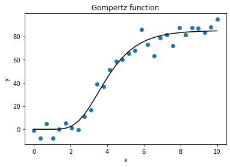

# Optimización y búsqueda de raíces

## Contenido

- [Búsqueda de raíces (Funciones escalares)](#Búsqueda-de-raíces-Funciones-escalares)
- [Optimización local (multivariada)](#Optimización-local-multivariada)
- [Mínimos cuadrados](#Mínimos-cuadrados)

## Búsqueda de raíces (Funciones escalares)

### `RootResults`

Clase devuelta por los métodos de búsqueda de raíces.

```cpp
template <class T>
class RootResults {
public:
    T root;
    size_t iterations;
    size_t function_calls;
    bool converged;
    std::string status;
};
```

#### Atributos

- `root`: Ubicación estimada de la raíz.
- `iterations`: Número de iteraciones requeridas para encontrar la raíz.
- `function_calls`: Número de veces que la función fue llamada.
- `converged`: `true` si el método convergió.
- `status`: Descripción de la causa de terminación.


### `bisect`

Calcula una raíz de una función dentro de un intervalo utilizando bisección.
```cpp
template <class T, class Function = T(T)>
RootResults<T> bisect(
    Function f, T a, T b, T tol = 1e-9, size_t maxiter = 100
);
```

#### Argumentos

- `f`: La función cuya raíz se quiere calcular. Debe ser continua y `f(a)` y 
`f(b)` deben tener signos opuestos.
- `a`: Un extremo del intervalo delimitador *[a, b]*.
- `b`: El otro extremo del intervalo delimitador *[a, b]*.
- `tol`: La tolerancia deseada.
- `maxiter`: Máximo número de iteraciones.

#### Ejemplo

```cpp
#include <iostream>
#include "scicpp/optimize.h"
using namespace std;

double f(double x) {
    return x*x*x - 2;
}

int main() {
    scicpp::RootResults<double> output = scicpp::bisect(f, 0.0, 2.0);
    cout << output.status << "\n";
    return 0;
}
```

```
[Out] Converged after 30 iterations, value is 1.25992
```

### `newton`

Calcula una raíz de una función usando el método de Newton-Raphson.
```cpp
template <class T, class Function = T(T), class Derivative = T(T)>
RootResults<T> newton(
    Function f, T x0, Derivative df, T tol = 1e-9, size_t maxiter = 50
);
```

#### Argumentos:

- `f`: La función cuya raíz se quiere calcular.
- `x0`: Una estimación inicial de la raíz que debe estar cerca de la verdadera 
raíz.
- `df`: La derivada de la función.
- `tol`: La tolerancia deseada.
- `maxiter`: Máximo número de iteraciones.

#### Ejemplo

```cpp
#include <iostream>
#include "scicpp/optimize.h"
using namespace std;

double f(double x) {
    return x*x*x - 2;
}

double df(double x) {
    return 3*x*x;
}

int main() {
    scicpp::RootResults<double> output = scicpp::newton(f, 3.0, df);
    cout << output.status << "\n";
    return 0;
}
```

```
[Out] Converged after 7 iterations, value is 1.25992
```

### `secant`

Calcula una raíz de una función usando el método de la secante.
```cpp
template <class T, class Function = T(T)>
RootResults<T> secant(
    Function f, T x0, T x1, T tol = 1e-9, size_t maxiter = 50
);
```

#### Argumentos:

- `f`: La función cuya raíz se quiere calcular.
- `x0`: Una estimación inicial de la raíz que debe estar cerca de la verdadera 
raíz.
- `x1`: Otra estimación de la raíz que debe estar cerca de la verdadera raíz.
- `tol`: La tolerancia deseada.
- `maxiter`: Máximo número de iteraciones.

#### Ejemplo

```cpp
#include <iostream>
#include "scicpp/optimize.h"
using namespace std;

double f(double x) {
    return x*x*x - 2;
}

int main() {
    scicpp::RootResults<double> output = scicpp::secant(f, 3.0, 2.9);
    cout << output.status << "\n";
    return 0;
}
```

```
[Out] Converged after 9 iterations, value is 1.25992
```

### `halley`

Calcula una raíz de una función usando el método de Halley.
```cpp
template <
    class T, class Function = T(T),
    class Derivative = T(T), class Derivative2 = T(T)
>
RootResults<T> halley(
    Function f, T x0, Derivative df, Derivative2 df2,
    T tol = 1e-9, size_t maxiter = 50
);
```

#### Argumentos:

- `f`: La función cuya raíz se quiere calcular.
- `x0`: Una estimación inicial de la raíz que debe estar cerca de la verdadera 
raíz.
- `df`: La primera derivada de la función.
- `df2`: La segunda derivada de la función.
- `tol`: La tolerancia deseada.
- `maxiter`: Máximo número de iteraciones.

#### Ejemplo

```cpp
#include <iostream>
#include "scicpp/optimize.h"
using namespace std;

double f(double x) {
    return x*x*x - 2;
}

double df(double x) {
    return 3*x*x;
}

double df2(double x) {
    return 6*x;
}

int main() {
    scicpp::RootResults<double> output = scicpp::halley(f, 3.0, df, df2);
    cout << output.status << "\n";
    return 0;
}
```

```
[Out] Converged after 5 iterations, value is 1.25992
```

## Optimización local (multivariada)

### `OptimizeResult`

Clase devuelta por los optimizadores.
```cpp
template <class T>
class OptimizeResult {
public:
    T fun;
    numcpp::array<T> x;
    numcpp::array<T> jac;
    numcpp::matrix<T> hess, hess_inv;
    bool success;
    std::string status;
    size_t niter;
    size_t nfev, njev, nhev;
};
```

#### Atributos 

- `fun`: Valor de la función objetivo.
- `x`: La solución de la optimización.
- `jac`: Valor del gradiente de la función objetivo.
- `hess`: Valor del Hessiano de la función objetivo.
- `hess_inv`: Inversa del Hessiano de la función objetivo; puede ser una 
aproximación.
- `success`: Si el optimizador terminó exitosamente o no.
- `status`: Descripción de la causa de terminación.
- `niter`: Número de iteraciones realizadas por el optimizador.
- `nfev`, `njev`, `nhev`: Número de evaluaciones de la función objetivo y de 
su gradiente y Hessiano.

### `minimize_cg`

Minimiza una función utilizando un algoritmo de gradiente conjugado no lineal. 
Esta implementación utiliza la fórmula de Polak y Ribier.
```cpp
template <class T, class Function, class Jacobian>
OptimizeResult<T> minimize_cg(
    Function fun, const numcpp::array<T> x0, Jacobian jac,
    T gtol = 1e-5, double ordnorm = numcpp::inf, size_t maxiter = 1000
);
```

#### Argumentos

- `fun`: Función objetivo a minimizar.
- `x0`: Una estimación inicial para el valor óptimo de *x*.
- `jac`: Una función que devuelve el vector gradiente de *f* en *x*.
- `gtol`: El algoritmo se detiene cuando la norma del gradiente es menor que 
`gtol`.
- `ordnorm`: Orden a usar para la norma del gradiente.
- `maxiter`: Máximo número de iteraciones a realizar.

#### Ejemplo

Calcula un mínimo local de la función de Rosenbrock. La función de Rosenbrock 
está definida por

%20%3D%20%5Csum_%7Bi%3D1%7D%5E%7Bn-1%7D%20100(x_%7Bi%2B1%7D-x_i%5E2)%5E2%20%2B%20(1-x_i)%5E2)

Tiene un mínimo global en ).
```cpp
#include <iostream>
#include "numcpp.h"
#include "scicpp/optimize.h"
using namespace std;
namespace np = numcpp;

// Función de Rosenbrock.
double rosen(const np::array<double> &x) {
    double f = 0;
    for (int i = 0; i < x.size() - 1; ++i) {
        f += 100*(x[i + 1] - x[i]*x[i])*(x[i + 1] - x[i]*x[i]) +
             (1 - x[i])*(1 - x[i]);
    }
    return f;
}

// Derivada (gradiente) de la función de Rosenbrock.
np::array<double> rosen_der(const np::array<double> &x) {
    np::array<double> jac = np::zeros<double>(x.size());
    for (int i = 0; i < x.size() - 1; ++i) {
        jac[i] += -400*x[i]*(x[i + 1] - x[i]*x[i]) - 2*(1 - x[i]);
        jac[i + 1] += 200*(x[i + 1] - x[i]*x[i]);
    }
    return jac;
}

int main() {
    np::array<double> x0 = {-1.2, 1., -1.2, 1.};
    scicpp::OptimizeResult<double> result;
    result = scicpp::minimize_cg(rosen, x0, rosen_der);
    cout << result;
    return 0;
}
```

```
[Out] fun: 2.3138263e-11
      x: [0.99999896, 0.99999791, 0.99999582, 0.99999159]
      jac: [9.3998262e-07, -2.4901198e-06, 7.1508592e-06, -8.5579434e-06]
      success: true
      status: Optimization terminated successfully.
      niter: 95
      nfev: 1228
      njev: 337
```

### `minimize_ncg`

Minimiza una función utilizando el algoritmo de Newton-CG (también conocido como 
método de Newton truncado). Utiliza un método de gradiente conjugado para 
calcular la dirección de búsqueda.
```cpp
template <class T, class Function, class Jacobian, class Hessian>
OptimizeResult<T> minimize_ncg(
    Function fun, const numcpp::array<T> &x0, Jacobian jac, Hessian hess,
    T gtol = 1e-5, double ordnorm = numcpp::inf, size_t maxiter = 1000
);
```

#### Argumentos

- `fun`: Función objetivo a minimizar.
- `x0`: Una estimación inicial para el valor óptimo de *x*.
- `jac`: Una función que devuelve el vector gradiente de *f* en *x*.
- `hess`: Una función que devuelve la matriz Hessiana de *f* en *x*.
- `gtol`: El algoritmo se detiene cuando la norma del gradiente es menor que 
`gtol`.
- `ordnorm`: Orden a usar para la norma del gradiente.
- `maxiter`: Máximo número de iteraciones a realizar.

#### Ejemplo

Calcula un mínimo local de la función de Rosenbrock.
```cpp
#include <iostream>
#include "numcpp.h"
#include "scicpp/optimize.h"
using namespace std;
namespace np = numcpp;

// Función de Rosenbrock.
double rosen(const np::array<double> &x) {
    double f = 0;
    for (int i = 0; i < x.size() - 1; ++i) {
        f += 100*(x[i + 1] - x[i]*x[i])*(x[i + 1] - x[i]*x[i]) +
             (1 - x[i])*(1 - x[i]);
    }
    return f;
}

// Derivada (gradiente) de la función de Rosenbrock.
np::array<double> rosen_der(const np::array<double> &x) {
    np::array<double> jac = np::zeros<double>(x.size());
    for (int i = 0; i < x.size() - 1; ++i) {
        jac[i] += -400*x[i]*(x[i + 1] - x[i]*x[i]) - 2*(1 - x[i]);
        jac[i + 1] += 200*(x[i + 1] - x[i]*x[i]);
    }
    return jac;
}

// Hessiano de la función de Rosenbrock.
np::matrix<double> rosen_hess(const np::array<double> &x) {
    np::matrix<double> hess = np::zeros<double>(x.size(), x.size());
    for (int i = 0; i < x.size() - 1; ++i) {
        hess[i][i] += -400*x[i + 1] + 1200*x[i]*x[i] + 2;
        hess[i][i + 1] += -400*x[i];
        hess[i + 1][i + 1] += 200;
        hess[i + 1][i] += -400*x[i];
    }
    return hess;
}

int main() {
    np::array<double> x0 = {-1.2, 1., -1.2, 1.};
    scicpp::OptimizeResult<double> result;
    result = scicpp::minimize_ncg(rosen, x0, rosen_der, rosen_hess);
    cout << result;
    return 0;
}
```

```
[Out] fun: 1.37688e-12
      x: [0.99999975, 0.99999951, 0.999999, 0.99999798]
      jac: [7.7789427e-07, 1.4612809e-06, 7.4658088e-06, -5.4988463e-06]
      hess:
      [[801.99961, -399.9999,         0,         0]
       [-399.9999, 1001.9992, -399.9998,         0]
       [        0, -399.9998, 1001.9984, -399.9996]
       [        0,         0, -399.9996,       200]]
      success: true
      status: Optimization terminated successfully.
      niter: 89
      nfev: 290
      njev: 186
      nhev: 89
```

### `minimize_bfgs`

Minimiza una función utilizando el algoritmo de Broyden, Fletcher, Goldfarb, y 
Shanno (BFGS).
```cpp
template <class T, class Function, class Jacobian>
OptimizeResult<T> minimize_bfgs(
    Function fun, const numcpp::array<T> &x0, Jacobian jac,
    const numcpp::matrix<T> &B0,
    T gtol = 1e-5, double ordnorm = numcpp::inf, size_t maxiter = 1000
);
```

#### Argumentos

- `fun`: Función objetivo a minimizar.
- `x0`: Una estimación inicial para el valor óptimo de *x*.
- `jac`: Una función que devuelve el vector gradiente de *f* en *x*.
- `B0`: Una estimación para la inversa de la matriz Hessiana de *f* en `x0`.
- `gtol`: El algoritmo se detiene cuando la norma del gradiente es menor que 
`gtol`.
- `ordnorm`: Orden a usar para la norma del gradiente.
- `maxiter`: Máximo número de iteraciones a realizar.

#### Ejemplo

Calcula un mínimo local de la función de Rosenbrock.
```cpp
#include <iostream>
#include "numcpp.h"
#include "scicpp/optimize.h"
using namespace std;
namespace np = numcpp;

// Rosenbrock function.
double rosen(const np::array<double> &x) {
    double f = 0;
    for (int i = 0; i < x.size() - 1; ++i) {
        f += 100*(x[i + 1] - x[i]*x[i])*(x[i + 1] - x[i]*x[i]) +
             (1 - x[i])*(1 - x[i]);
    }
    return f;
}

// Derivative (gradient) of Rosenbrock function.
np::array<double> rosen_der(const np::array<double> &x) {
    np::array<double> jac = np::zeros<double>(x.size());
    for (int i = 0; i < x.size() - 1; ++i) {
        jac[i] += -400*x[i]*(x[i + 1] - x[i]*x[i]) - 2*(1 - x[i]);
        jac[i + 1] += 200*(x[i + 1] - x[i]*x[i]);
    }
    return jac;
}

int main() {
    np::array<double> x0 = {-1.2, 1., -1.2, 1.};
    np::matrix<double> B0 = np::eye<double>(4, 4);
    scicpp::OptimizeResult<double> result;
    result = scicpp::minimize_bfgs(rosen, x0, rosen_der, B0);
    cout << result;
    return 0;
}
```

```
[Out] fun: 2.75892e-13
      x: [0.9999999, 0.9999998, 0.99999959, 0.99999915]
      jac: [4.5691454e-07, 1.7022435e-06, 6.768782e-06, -4.4084408e-06]
      hess_inv:
      [[0.026480784, 0.050239632, 0.099123274, 0.19728892]
       [0.050239632,  0.10058458,  0.19838138, 0.39491722]
       [0.099123274,  0.19838138,  0.39714857,  0.7905933]
       [ 0.19728892,  0.39491722,   0.7905933,  1.5796873]]
      success: true
      status: Optimization terminated successfully.
      niter: 65
      nfev: 230
      njev: 132
```

### `line_search`

Dado un punto inicial  y una dirección de búsqueda , 
encuentra una longitud de paso  que satisfaga las conidiciones de Wolfe:

i) %20%5Cleq%20f(%5Cmathbf%7Bx%7D_k)%20%2B%20c_1%5Calpha%5Cmathbf%7Bp%7D_k%5E%7B%5Ctop%7D%5Cnabla%20f(%5Cmathbf%7Bx%7D_k))

ii) %20%5Cleq%20-c_2%5Cmathbf%7Bp%7D_k%5E%7B%5Ctop%7D%5Cnabla%20f(%5Cmathbf%7Bx%7D_k))

 ```cpp
template <class T, class Function, class Jacobian>
RootResults<T> line_search(
    Function fun, Jacobian jac,
    const numcpp::array<T> &xk, const numcpp::array<T> &pk,
    const numcpp::array<T> &gfk, T fk,
    T c1 = 0.0001, T c2 = 0.9, T amax = 1.0, size_t maxiter = 20
);
 ```

#### Argumentos

- `fun`: Función objetivo.
- `jac`: Gradiente de la función objetivo.
- `xk`: Punto inicial.
- `pk`: Dirección de búsqueda.
- `gfk`: Valor del gradiente para *x = xk*.
- `fk`: Valor de la función para *x = xk*.
- `c1`: Parámetro para la condición de Armijo.
- `c2`: Parámetro para la condición de curvatura.
- `amax`: Tamaño de paso máximo.
- `maxiter`: Máximo número de iteraciones.

#### Ejemplo

 ```cpp
#include <iostream>
#include "numcpp.h"
#include "scicpp/optimize.h"
using namespace std;
namespace np = numcpp;

// Función de Rosenbrock.
double rosen(const np::array<double> &x) {
    double f = 0;
    for (int i = 0; i < x.size() - 1; ++i) {
        f += 100*(x[i + 1] - x[i]*x[i])*(x[i + 1] - x[i]*x[i]) +
             (1 - x[i])*(1 - x[i]);
    }
    return f;
}

// Derivada (gradiente) de la función de Rosenbrock.
np::array<double> rosen_der(const np::array<double> &x) {
    np::array<double> jac = np::zeros<double>(x.size());
    for (int i = 0; i < x.size() - 1; ++i) {
        jac[i] += -400*x[i]*(x[i + 1] - x[i]*x[i]) - 2*(1 - x[i]);
        jac[i + 1] += 200*(x[i + 1] - x[i]*x[i]);
    }
    return jac;
}

int main() {
    // Nos movemos en la dirección opuesta al gradiente.
    np::array<double> x0 = {-1.2, 1., -1.2, 1.};
    double f0 = rosen(x0);
    np::array<double> gf0 = rosen_der(x0);
    np::array<double> p0 = -gf0;

    // Método de búsqueda en línea.
    double c1 = 0.0001, c2 = 0.9;
    scicpp::RootResults<double> result;
    result = scicpp::line_search(rosen, rosen_der, x0, p0, gf0, f0, c1, c2);

    // Verifica las condiciones de Wolfe.
    double alpha = result.root;
    bool cond1 = rosen(x0 + alpha*p0) <= f0 + c1*alpha*p0.dot(gf0);
    bool cond2 = -p0.dot(rosen_der(x0 + alpha*p0)) <= -c2*p0.dot(gf0);
    cout << "alpha: " << alpha << "\n";
    cout << boolalpha << "i) " << cond1 << "\nii) " << cond2 << "\n";

    return 0;
}
 ```

 ```
 [Out] alpha: 0.00195312
       i) true
       ii) true
 ```

  ## Mínimos cuadrados

 ### `least_squares`

Resuelve un problema de mínimos cuadrados no lineales utilizando el algoritmo 
de Levenberg-Marquardt.

 Dado los residuos ) 
 (una función *m*-dimensional de *n* variables), encuentra un mínimo local de la función de costo

 %20%3D%20%5Cfrac%7B1%7D%7B2%7D%5Csum_%7Bi%3D1%7D%5E%7Bm%7D%20r_i(%5Cmathbf%7Bx%7D)%5E2) 
```cpp
template <class T, class Residual, class Jacobian>
OptimizeResult<T> least_squares(
    Residual res, const numcpp::array<T> &x0, Jacobian jac,
    T ftol = 1e-8, T xtol = 1e-8, T gtol = 1e-8, size_t maxiter = 1000
);
```

#### Argumentos

- `res`: Función que calcula el vector de residuos.
- `x0`: Estimación inicial de las variables independientes.
- `jac`: Método para calcular la matriz Jacobiana (una matriz de *m* por *n*, 
donde el elemento *(i, j)* es la derivada parcial de  
con respecto a  ).
- `ftol`: Tolerancia de terminación por el cambio en la función de costo.
- `xtol`: Tolerancia de terminación por el cambio en las variables 
independientes.
- `gtol`: Tolerancia de terminación por la norma del gradiente.
- `maxiter`: Máximo número de iteraciones a realizar.

#### Ejemplo

Calcula un mínimo local de la función de Rosenbrock. La función de Rosenbrock 
puede ser reformulada como un problema de mínimos cuadrados. En esta 
formulación, no necesitamos escribir la función de costo puesto que está 
definida implicitamente por los residuos.
```cpp
#include <iostream>
#include "numcpp.h"
#include "scicpp/optimize.h"
using namespace std;
namespace np = numcpp;

// Residuos de la función de Rosenbrock function.
np::array<double> rosen_res(const np::array<double> &x) {
    np::array<double> r(2*(x.size() - 1));
    for (int i = 0; i < x.size() - 1; ++i) {
        r[2*i] = 10*(x[i + 1] - x[i]*x[i]);
        r[2*i + 1] = 1 - x[i];
    }
    return r;
}

// Matriz Jacobiana de los residuos de Rosenbrock.
np::matrix<double> rosen_jac(const np::array<double> &x) {
    np::matrix<double> J = np::zeros<double>(2*(x.size() - 1), x.size());
    for (int i = 0; i < x.size() - 1; ++i) {
        J[2*i][i] = -20*x[i];
        J[2*i][i + 1] = 10;
        J[2*i + 1][i] = -1;
    }
    return J;
}

int main() {
    np::array<double> x0 = {-1.2, 1., -1.2, 1.};
    scicpp::OptimizeResult<double> result;
    result = scicpp::least_squares(rosen_res, x0, rosen_jac);
    cout << result;
    return 0;
}
```

```
[Out] fun: 9.56782e-17
      x: [1, 0.99999999, 0.99999999, 0.99999998]
      jac: [-7.940204e-11, 3.0103722e-09, -1.667888e-10, 6.0286846e-09, -3.6381786e-10, 1.2074048e-08]
      hess:
      [[-20,  10,   0,  0]
       [ -1,   0,   0,  0]
       [  0, -20,  10,  0]
       [  0,  -1,   0,  0]
       [  0,   0, -20, 10]
       [  0,   0,  -1,  0]]
      success: true
      status: "ftol" termination condition is satisfied.
      niter: 18
      nfev: 37
      njev: 37
      nhev: 19
```

### `curve_fit`

Utiliza mínimos cuadrados no lineales para ajustar una función *f* sobre datos.
```cpp
template <class T, class Function, class Jacobian>
OptimizeResult<T> curve_fit(
    Function f,
    const numcpp::array<T> &xdata, const numcpp::array<T> &ydata,
    const numcpp::array<T> &p0, Jacobian jac,
    T ftol = 1e-8, T xtol = 1e-8, T gtol = 1e-8, size_t maxiter = 1000
);
```

#### Argumentos

- `f`: La función modelo. Debe recibir la variable independiente como el 
primer argumento y los parámetros a ajustar como el segundo argumento.
- `xdata`: La variable independiente donde los datos se miden.
- `ydata`: Los datos dependientes.
- `p0`: Estimación inicial de los parámetros.
- `jac`: Función que calcula el vector gradiente de *f* con respecto a los 
parámetros.
- `ftol`: Tolerancia de terminación por el cambio en la función de costo.
- `xtol`: Tolerancia de terminación por el cambio en los parámetros.
- `gtol`: Tolerancia de terminación por la norma del gradiente.
- `maxiter`: Máximo número de iteraciones a realizar.

#### Ejemplo

Estima los parámetros de la función de Gompertz sobre una muestra de puntos. La 
función de Gompertz está definida por

%20%3D%20%5Calpha%5Cexp%5Cleft(-%5Cbeta%5Cexp%5Cleft(-kx%5Cright)%5Cright))
```cpp
#include <iostream>
#include <random>
#include "numcpp.h"
#include "scicpp/optimize.h"
using namespace std;
namespace np = numcpp;

// Función de Gompertz.
double gompertz(double x, const np::array<double> &param) {
    double a = param[0], b = param[1], k = param[2];
    return a*np::exp(-b*np::exp(-k*x));
}

// Derivada (gradiente) de la función de Gompertz.
np::array<double> gompertz_der(double x, const np::array<double> &param) {
    double a = param[0], b = param[1], k = param[2];
    return {
        np::exp(-b*np::exp(-k*x)),
        -a*np::exp(-k*x - b*np::exp(-k*x)),
        a*b*x*np::exp(-k*x - b*np::exp(-k*x))
    };
}

int main() {
    default_random_engine seed(0);
    normal_distribution<double> error(0., 7.);
    np::printoptions::threshold = 10;

    // Muestrea n puntos alrededor de la función.
    size_t n = 30;
    np::array<double> xdata = np::linspace(0., 10., n);
    np::array<double> ydata(n);
    for (int i = 0; i < n; ++i) {
        ydata[i] = gompertz(xdata[i], {89., 29., 0.9}) + error(seed);
    }

    // Estima los parámetros por mínimos cuadrados.
    np::array<double> p0 = {100., 10., 1.};
    scicpp::OptimizeResult<double> result;
    result = scicpp::curve_fit(gompertz, xdata, ydata, p0, gompertz_der);
    cout << result;

    // Guarda los puntos y la función estimada en un archivo .csv para graficar
    // posteriormente.
    np::matrix<double> df(n, 3);
    for (int i = 0; i < n; ++i) {
        df[i][0] = xdata[i];
        df[i][1] = ydata[i];
        df[i][2] = gompertz(xdata[i], result.x);
    }
    np::save_txt("gompertz.csv", df, ',', {"x", "y", "f"});

    return 0;
}
```

```
[Out] fun: 510.402
      x: [85.083976, 20.086788, 0.85627244]
      jac: [0.85376065, 7.6077536, -4.7887953, ..., 0.84324832, -3.4041356, -9.9317662]
      hess:
      [[1.8898132e-09, -1.6079282e-07,             0]
       [3.2117968e-07, -2.0340578e-05, 0.00014088858]
       [1.4684405e-05, -0.00069221185,  0.0095891811]
       ...
       [   0.99309557,   -0.029144724,     5.4504983]
       [   0.99485625,   -0.021731849,     4.2147053]
       [   0.99616881,   -0.016197081,     3.2534732]]
      success: true
      status: "ftol" termination condition is satisfied.
      niter: 11
      nfev: 12
      njev: 12
      nhev: 12
```
