# Random sampling

Defined in `numcpp/random.h`

- [Random sampling](#random-sampling)
  - [Generators](#generators)
    - [Template parameters](#template-parameters)
    - [Constructors](#constructors)
    - [Destructor](#destructor)
    - [Seeding](#seeding)
    - [`default_rng`](#default_rng)
  - [Sample random data](#sample-random-data)
    - [`Generator::integers`](#generatorintegers)
    - [`Generator::random`](#generatorrandom)
    - [`Generator::choice`](#generatorchoice)
  - [Permutations](#permutations)
    - [`Generator::shuffle`](#generatorshuffle)
    - [`Generator::permutation`](#generatorpermutation)
  - [Distributions](#distributions)
    - [`Generator::beta`](#generatorbeta)
    - [`Generator::binomial`](#generatorbinomial)
    - [`Generator::cauchy`](#generatorcauchy)
    - [`Generator::chisquare`](#generatorchisquare)
    - [`Generator::exponential`](#generatorexponential)
    - [`Generator::fisher_f`](#generatorfisher_f)
    - [`Generator::gamma`](#generatorgamma)
    - [`Generator::geometric`](#generatorgeometric)
    - [`Generator::gumbel`](#generatorgumbel)
    - [`Generator::laplace`](#generatorlaplace)
    - [`Generator::logistic`](#generatorlogistic)
    - [`Generator::lognormal`](#generatorlognormal)
    - [`Generator::negative_binomial`](#generatornegative_binomial)
    - [`Generator::normal`](#generatornormal)
    - [`Generator::pareto`](#generatorpareto)
    - [`Generator::poisson`](#generatorpoisson)
    - [`Generator::rayleigh`](#generatorrayleigh)
    - [`Generator::standard_normal`](#generatorstandard_normal)
    - [`Generator::student_t`](#generatorstudent_t)
    - [`Generator::triangular`](#generatortriangular)
    - [`Generator::uniform`](#generatoruniform)
    - [`Generator::wald`](#generatorwald)
    - [`Generator::weibull`](#generatorweibull)

## Generators

```cpp
template <class bit_generator> class Generator
```
A Generator is a wrapper class of a random number engine that transforms
sequence of random bits into a sequence of numbers that follow a specific
probability distribution (such as uniform, normal or binomial).

### Template parameters

* `bit_generator` Random number engine to use. Must meet the requirements
listed by [Uniform Random Bit Generator](https://en.cppreference.com/w/cpp/named_req/UniformRandomBitGenerator)
and [Random Number Engine](https://en.cppreference.com/w/cpp/named_req/RandomNumberEngine)
Common examples are `std::default_random_engine` and `std::random_device`.

### Constructors

Default constructor. Constructs a `Generator` with default seed.
```cpp
Generator();
```

Seed constructor. Constructs a `Generator` from a seed value or a seed
sequence.
```cpp
Generator(typename bit_generator::result_type s);

template <class Sseq>
Generator(Sseq &s);
```

Parameters

* `s` Seed value or seed sequence to use.

### Destructor

```cpp
~Generator() = default;
```

### Seeding

Reinitializes the internal state of the random-number engine using a new seed
value.
```cpp
void seed(typename bit_generator::result_type s);

template <class Sseq>
void seed(Sseq &s);
```

Parameters

* `s` Seed value or seed sequence to use.

Returns

* None

### `default_rng`

Default random generator class that generates pseudo-random numbers.
```cpp
using default_rng = Generator<std::default_random_engine>;
```

## Sample random data

### `Generator::integers`

Return random integers from `low` to `high` (inclusive).
```cpp
template <class T>
T integers(T low, T high);
```

Template parameters

* `T` An integer type.

Parameters

* `low` Lowest integer to be drawn.
* `high` Largest integer to be drawn.

Returns

* A random integer.

<h3><code>Generator::integers</code></h3>

Return a tensor of random integers from `low` to `high` (inclusive).
```cpp
template <class T>
tensor<T, 1> integers(T low, T high, size_t size);

template <class T, size_t Rank>
tensor<T, Rank> integers(T low, T high, const shape_t<Rank> &size);
```

Template parameters

* `T` An integer type.
* `Rank` Dimension of the tensor.

Parameters

* `low` Lowest integer to be drawn.
* `high` Largest integer to be drawn.
* `size` Output shape.

Returns

* A tensor of random integers.

Exceptions

* `std::bad_alloc` If the function fails to allocate storage it may throw an
exception.

Example

```cpp
#include <iostream>
#include "numcpp.h"
#include "numcpp/random.h"
namespace np = numcpp;
int main() {
    // Set seed to 0 to replicate results.
    np::default_rng rng(0);
    int low, high, size;
    std::cin >> low >> high >> size;
    std::cout << rng.integers(low, high, size) << "\n";
    return 0;
}
```

Input

```
0 100 10
```

Possible output

```
[ 0, 13, 76, 46, 53, 22,  4, 68, 68, 94]
```

### `Generator::random`

Return random floating point numbers in the half-open interval $[0, 1)$.
```cpp
template <class T>
T random();
```

Template parameters

* `T` A floating-point type.

Parameters

* None

Returns

* A random floating point number.

<h3><code>Generator::random</code></h3>

Return a tensor of random floating point numbers in the half-open interval
$[0, 1)$.
```cpp
template <class T>
tensor<T, 1> random(size_t size);

template <class T, size_t Rank>
tensor<T, Rank> random(const shape_t<Rank> &size);
```

Template parameters

* `T` A floating-point type.
* `Rank` Dimension of the tensor.

Parameters

* `size` Output shape.

Returns

* A tensor of random floating point numbers.

Exceptions

* `std::bad_alloc` If the function fails to allocate storage it may throw an
exception.

Example

```cpp
#include <iostream>
#include "numcpp.h"
#include "numcpp/random.h"
namespace np = numcpp;
int main() {
    // Set seed to 0 to replicate results.
    np::default_rng rng(0);
    int size;
    std::cin >> size;
    std::cout << rng.random<double>(size) << "\n";
    return 0;
}
```

Input

```
10
```

Possible output

```
[  0.13153779,   0.45865013,   0.21895919,   0.67886472,    0.9346929,
   0.51941637,   0.03457211,   0.52970019, 0.0076981861,  0.066842237]
```

### `Generator::choice`

Generates a random sample from a given sequence.
```cpp
template <class T>
T choice(const tensor<T, 1> &population);

template <class T, class W>
T choice(const tensor<T, 1> &population, const tensor<W, 1> &weights);
```

Parameters

* `population` A 1-dimensional tensor with the values to sample from.
* `weights` A 1-dimensional tensor with the weights associated to each entry of
`population`. If not provided, the sample assumes a uniform distribution over
all entries of `population`.

Returns

* The generated random sample.

Exceptions

* `std::invalid_argument` Thrown if the population size is 0 or if `population`
and `weights` have different sizes.

<h3><code>Generator::choice</code></h3>

Generates a random sample from a given sequence.
```cpp
template <class T>
tensor<T, 1> choice(
    const tensor<T, 1> &population, size_t size,
    bool replace = true, bool shuffle = true
);
template <class T, size_t Rank>
tensor<T, Rank> choice(
    const tensor<T, 1> &population, const shape_t<Rank> &size,
    bool replace = true, bool shuffle = true
);

template <class T, class W>
tensor<T, 1> choice(
    const tensor<T, 1> &population, size_t size,
    const tensor<W, 1> &weights, bool replace = true
);
template <class T, size_t Rank, class W>
tensor<T, Rank> choice(
    const tensor<T, 1> &population, const shape_t<Rank> &size,
    const tensor<W, 1> &weights, bool replace = true
);
```

Parameters

* `population` A 1-dimensional tensor with the values to sample from.
* `size` Output shape.
* `weights` A 1-dimensional tensor with the weights associated to each entry of
`population`. If not provided, the sample assumes a uniform distribution over
all entries of `population`.
* `replace` Whether the sample is with or without replacement. Default is
`true`, meaning that a value can be selected multiple times.
* `shuffle` Whether the sample is shuffled when sampling without replacement.
Default is `true`.

Returns

* A tensor with the generated random samples.

Exceptions

* `std::invalid_argument` Thrown if the population size is 0, if `population`
and `weights` have different sizes or if `replace = false` and the sample size
is greater than the population size.
* `std::bad_alloc` If the function fails to allocate storage it may throw an
exception.

Example

```cpp
#include <iostream>
#include "numcpp.h"
#include "numcpp/random.h"
namespace np = numcpp;
int main() {
    // Set seed to 0 to replicate results.
    np::default_rng rng(0);
    int size;
    bool replace;
    std::cin >> size >> std::boolalpha >> replace;
    // Fill population with alpha-numeric characters.
    char alphanum[] = "ABCDEFGHIJKLMNOPQRSTUVWXYZ"
                      "abcdefghijklmnopqrstuvwxyz"
                      "0123456789";
    np::array_view<char> population(62, alphanum);
    // Sample characters with equal probabilities.
    np::array<char> sample = rng.choice(population, size, replace);
    std::string str(sample.begin(), sample.end());
    std::cout << str << "\n";
    return 0;
}
```

Input

```
24
true
```

Possible output

```
AIuchNCqq5XgzCDgpAXEZqk5
```

Input

```
24
false
```

Possible output

```
XclL5aiHby0pKRFn7IdsJ4qZ
```

Example

```cpp
#include <iostream>
#include "numcpp.h"
#include "numcpp/random.h"
namespace np = numcpp;
int main() {
    // Set seed to 0 to replicate results.
    np::default_rng rng(0);
    np::array<std::string> population, sample;
    int size;
    bool replace;
    std::cin >> population >> size >> std::boolalpha >> replace;
    // Generate weights decreasing exponentially.
    double pop_sz = population.size();
    np::array<double> weights = np::exp(-np::arange(pop_sz) / (pop_sz - 1));
    std::cout << "weights:\n" << weights << "\n";
    // Sample values with the given weights. Each weight is proportional to the
    // probability of that element to be chosen.
    sample = rng.choice(population, size, weights, replace);
    std::cout << "sample:\n" << sample << "\n";
    return 0;
}
```

Input

```
["red", "orange", "yellow", "green", "blue", "purple", "brown", "white",
 "gray", "black"]
7
true
```

Possible output

```
weights:
[         1, 0.89483932,  0.8007374, 0.71653131, 0.64118039, 0.57375342,
 0.51341712, 0.45942582, 0.41111229, 0.36787944]
sample:
[   "red",  "green", "orange", "purple",   "gray",  "green",    "red"]
```

Input

```
["red", "orange", "yellow", "green", "blue", "purple", "brown", "white",
 "gray", "black"]
7
false
```

Possible output

```
weights:
[         1, 0.89483932,  0.8007374, 0.71653131, 0.64118039, 0.57375342,
 0.51341712, 0.45942582, 0.41111229, 0.36787944]
sample:
[   "red",   "blue", "yellow",  "brown",  "black",  "green", "orange"]
```

## Permutations

### `Generator::shuffle`

Modify a tensor in-place by shuffling its contents.
```cpp
template <class T, size_t Rank>
void shuffle(tensor<T, Rank> &arg, size_t axis = Rank - 1);
```

Parameters

* `arg` The tensor to be shuffled.
* `axis` Axis along which to shuffle. Defaults to `Rank - 1`, which means
shuffle along the last axis.

Returns

* None

Example

```cpp
#include <iostream>
#include "numcpp.h"
#include "numcpp/random.h"
namespace np = numcpp;
int main() {
    // Set seed to 0 to replicate results.
    np::default_rng rng(0);
    np::array<int> a;
    std::cin >> a;
    rng.shuffle(a);
    std::cout << a << "\n";
    return 0;
}
```

Input

```
[12, -2, 19, 0, 4, 18, -3, -5, 3, 12]
```

Output

```
[19, -5, -2, -3,  3, 12,  4, 12, 18,  0]
```

### `Generator::permutation`

Return a permuted range.
```cpp
template <class T>
tensor<T, 1> permutation(T n);
```

Parameters

* `n` Randomly permute the range 0, 1, 2, ..., `n` - 1.

Returns

* The permuted range.

Exceptions

* `std::bad_alloc` If the function fails to allocate storage it may throw an
exception.

Example

```cpp
#include <iostream>
#include "numcpp.h"
#include "numcpp/random.h"
namespace np = numcpp;
int main() {
    // Set seed to 0 to replicate results.
    np::default_rng rng(0);
    int n;
    std::cin >> n;
    // Returns array<int>
    std::cout << rng.permutation(n) << "\n";
    return 0;
}
```

Input

```
10
```

Output

```
[2, 7, 1, 6, 8, 0, 4, 9, 5, 3]
```

<h3><code>Generator::permutation</code></h3>

Randomly permute a tensor.
```cpp
template <class T, size_t Rank>
tensor<T, 1> permutation(const tensor<T, Rank> &arg);

template <class T, size_t Rank>
tensor<T, Rank> permutation(const tensor<T, Rank> &arg, size_t axis);
```

Parameters

* `arg` Make a copy of the tensor and shuffle the elements randomly.
* `axis` Axis along which to permute. If not provided, the flattened tensor is
used.

Returns

* The permuted tensor.

Exceptions

* `std::bad_alloc` If the function fails to allocate storage it may throw an
exception.

Example

```cpp
#include <iostream>
#include "numcpp.h"
#include "numcpp/random.h"
namespace np = numcpp;
int main() {
    // Set seed to 0 to replicate results.
    np::default_rng rng(0);
    np::array<int> a;
    std::cin >> a;
    std::cout << rng.permutation(a) << "\n";
    return 0;
}
```

Input

```
[12, -2, 19, 0, 4, 18, -3, -5, 3, 12]
```

Output

```
[19, -5, -2, -3,  3, 12,  4, 12, 18,  0]
```

Example

```cpp
#include <iostream>
#include "numcpp.h"
#include "numcpp/random.h"
namespace np = numcpp;
int main() {
    // Set seed to 0 to replicate results.
    np::default_rng rng(0);
    np::matrix<int> a;
    std::cin >> a;
    std::cout << "Axis 0:\n" << rng.permutation(a, 0) << "\n";
    std::cout << "Axis 1:\n" << rng.permutation(a, 1) << "\n";
    return 0;
}
```

Input

```
[[11, 18, -3, 13, -2, 15],
 [10, -4, 15,  1,  0, -5],
 [ 9,  3, -1,  4,  3, -3],
 [-1, -3, 12,  2, 18, -1]]
```

Output

```
Axis 0:
[[-1, -4, 12,  2, 18, 15],
 [10,  3, 15, 13, -2, -5],
 [11, -3, -3,  1,  3, -3],
 [ 9, 18, -1,  4,  0, -1]]
Axis 1:
[[-2, -3, 15, 18, 11, 13],
 [ 1, 15, -4, -5, 10,  0],
 [ 9, -3, -1,  3,  4,  3],
 [ 2, 18, 12, -1, -1, -3]]
```

## Distributions

### `Generator::beta`

Draw samples from a Beta distribution.
```cpp
template <class T>
T beta(T shape1, T shape2);
```

The probability density function for the Beta distribution is

$$f(x;\alpha,\beta) = \frac{\Gamma(\alpha+\beta)}
    {\Gamma(\alpha)\Gamma(\beta)} x^{\alpha-1} (1-x)^{\beta-1}$$

for $0 \leq x \leq 1$, where $\alpha$ and $\beta$ are shape parameters.

Template parameters

* `T` A floating-point type.

Paramters

* `shape1` Shape parameter. This shall be a positive value.
* `shape2` Shape parameter. This shall be a positive value.

Returns

* A sample from the distribution.

<h3><code>Generator::beta</code></h3>

Draw samples from a Beta distribution.
```cpp
template <class T>
tensor<T, 1> beta(T shape1, T shape2, size_t size);

template <class T, size_t Rank>
tensor<T, Rank> beta(T shape1, T shape2, const shape_t<Rank> &size);
```

Template paramters

* `T` A floating-point type.
* `Rank` Dimension of the tensor.

Parameters

* `shape1` Shape parameter. This shall be a positive value.
* `shape2` Shape parameter. This shall be a positive value.
* `size` Output shape.

Returns

* A tensor with samples from the distribution.

Exceptions

* `std::bad_alloc` If the function fails to allocate storage it may throw an
exception.

Example

```cpp
#include <iostream>
#include "numcpp.h"
#include "numcpp/random.h"
namespace np = numcpp;
int main() {
    // Set seed to 0 to replicate results.
    np::default_rng rng(0);
    double shape1, shape2;
    int size;
    std::cin >> shape1 >> shape2 >> size;
    // Sample from a beta distribution and print a few samples.
    np::array<double> a = rng.beta(shape1, shape2, size);
    std::cout << a << "\n";
    // Export sample to .csv for latter plotting.
    np::savetxt("beta-sample.csv", a);
    return 0;
}
```

Input

```
3 5 1000
```

Output

```
[ 0.4788716, 0.29615235, 0.40601717, ..., 0.40486009, 0.19895942, 0.44644586]
```

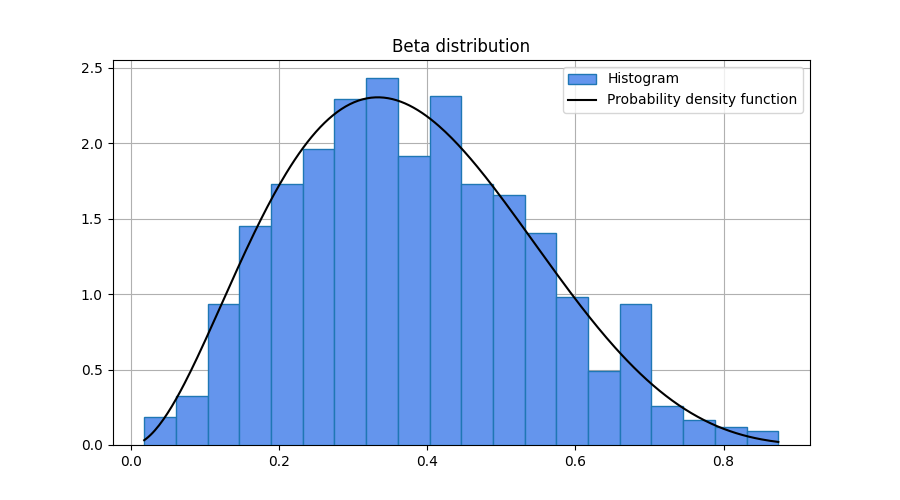

### `Generator::binomial`

Draw samples from a binomial distribution.
```cpp
template <class T>
T binomial(T n, double prob);
```

The probability mass function for the binomial distribution is

$$f(x;n,p) = \binom{n}{x} p^x (1-p)^{n-x}$$

for $x = 0, 1, 2, \ldots , n$, where $n$ is the number of trials and $p$ is the
probability of success.

Template parameters

* `T` An integer type.

Parameters

* `n` Number of trials.
* `prob` Probability of success. This shall be a value between 0 and 1
(inclusive).

Returns

* A sample from the distribution.

<h3><code>Generator::binomial</code></h3>

Draw samples from a binomial distribution.
```cpp
template <class T>
tensor<T, 1> binomial(T n, double prob, size_t size);

template <class T, size_t Rank>
tensor<T, Rank> binomial(T n, double prob, const shape_t<Rank> &size);
```

Template parameters

* `T` An integer type.
* `Rank` Dimension of the tensor.

Parameters

* `n` Number of trials.
* `prob` Probability of success. This shall be a value between 0 and 1
(inclusive).
* `size` Output shape.

Returns

* A tensor with samples from the distribution.

Exceptions

* `std::bad_alloc` If the function fails to allocate storage it may throw an
exception.

Example

```cpp
#include <iostream>
#include "numcpp.h"
#include "numcpp/random.h"
namespace np = numcpp;
int main() {
    // Set seed to 0 to replicate results.
    np::default_rng rng(0);
    int n, size;
    double prob;
    std::cin >> n >> prob >> size;
    // Sample from a binomial distribution and print a few samples.
    np::array<int> a = rng.binomial(n, prob, size);
    std::cout << a << "\n";
    // Export sample to .csv for latter plotting.
    np::savetxt("binomial-sample.csv", a);
    return 0;
}
```

Input

```
10 0.3 1000
```

Output

```
[4, 5, 2, ..., 4, 1, 4]
```

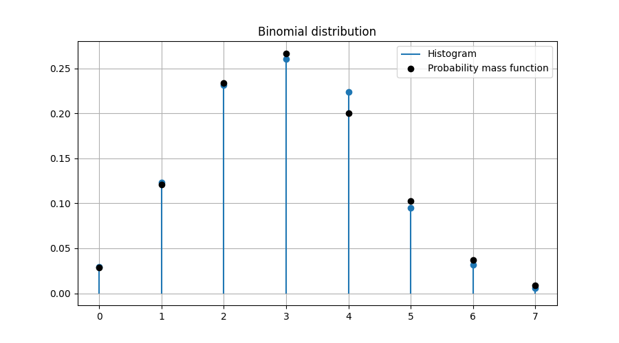

### `Generator::cauchy`

Draw samples from a Cauchy distribution.
```cpp
template <class T>
T cauchy(T loc, T scale);
```

The probability density function for the Cauchy distribution is

$$f(x;x_0,\gamma) = \frac{1}
    {\pi\gamma\left[1+\left(\frac{x-x_0}{\gamma}\right)^2\right]}$$

for all $x$, where $x_0$ and $\gamma$ are location and scale parameters.

Template parameters

* `T` A floating-point type.

Parameters

* `loc` Location parameter.
* `scale` Scale parameter. This shall be a positive value.

Returns

* A sample from the distribution.

<h3><code>Generator::cauchy</code></h3>

Draw samples from a Cauchy distribution.
```cpp
template <class T>
tensor<T, 1> cauchy(T loc, T scale, size_t size);

template <class T, size_t Rank>
tensor<T, Rank> cauchy(T loc, T scale, const shape_t<Rank> &size);
```

Template parameters

* `T` A floating-point type.
* `Rank` Dimension of the tensor.

Parameters

* `loc` Location parameter.
* `scale` Scale parameter. This shall be a positive value.
* `size` Output shape.

Returns

* A tensor with samples from the distribution.

Exceptions

* `std::bad_alloc` If the function fails to allocate storage it may throw an
exception.

Example

```cpp
#include <iostream>
#include "numcpp.h"
#include "numcpp/random.h"
namespace np = numcpp;
int main() {
    // Set seed to 0 to replicate results.
    np::default_rng rng(0);
    double loc, scale;
    int size;
    std::cin >> loc >> scale >> size;
    // Sample from a cauchy distribution and print a few samples.
    np::array<double> a = rng.cauchy(loc, scale, size);
    std::cout << a << "\n";
    // Export sample to .csv for latter plotting.
    np::savetxt("cauchy-sample.csv", a);
    return 0;
}
```

Input

```
0 1 1000
```

Output

```
[0.43848649,  7.6546159, 0.82177918, ...,  1.4471235,  2.2834329, 0.11030869]
```

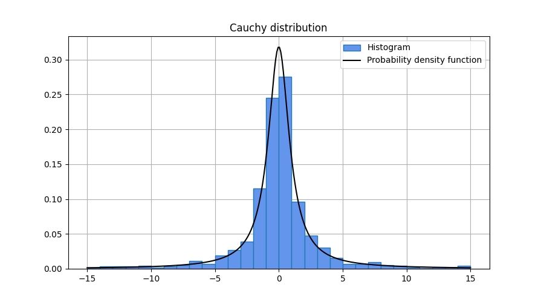

### `Generator::chisquare`

Draw samples from a chi-squared distribution.
```cpp
template <class T>
T chisquare(T df);
```

The probability density function for the chi-squared distribution is

$$f(x;k) = \frac{1}{2^{k/2}\Gamma(k/2)} x^{k/2-1} e^{-x/2}$$

for $x \geq 0$, where $k$ is the degrees of freedom.

Template parameters

* `T` A floating-point type.

Parameters

* `df` Degrees of freedom. This shall be a positive value.

Returns

* A sample from the distribution.

<h3><code>Generator::chisquare</code></h3>

Draw samples from a chi-squared distribution.
```cpp
template <class T>
tensor<T, 1> chisquare(T df, size_t size);

template <class T, size_t Rank>
tensor<T, Rank> chisquare(T df, const shape_t<Rank> &size);
```

Template parameters

* `T` A floating-point type.
* `Rank` Dimension of the tensor.

Parameters

* `df` Degrees of freedom. This shall be a positive value.
* `size` Output shape.

Returns

* A tensor with samples from the distribution.

Exceptions

* `std::bad_alloc` If the function fails to allocate storage it may throw an
exception.

Example

```cpp
#include <iostream>
#include "numcpp.h"
#include "numcpp/random.h"
namespace np = numcpp;
int main() {
    // Set seed to 0 to replicate results.
    np::default_rng rng(0);
    double df;
    int size;
    std::cin >> df >> size;
    // Sample from a chi-squared distribution and print a few samples.
    np::array<double> a = rng.chisquare(df, size);
    std::cout << a << "\n";
    // Export sample to .csv for latter plotting.
    np::savetxt("chisquare-sample.csv", a);
    return 0;
}
```

Input

```
10 1000
```

Output

```
[8.8162358, 5.3811734, 9.4778131, ..., 12.611585, 13.209053, 12.202197]
```


### `Generator::exponential`

Draw samples from an exponential distribution.
```cpp
template <class T>
T exponential(T rate);
```

The probability density function for the exponential distribution is

$$f(x;\lambda) = \lambda e^{-\lambda x}$$

for $x \geq 0$, where $\lambda$ is the rate parameter.

Template parameters

* `T` A floating-point type.

Parameters

* `rate` Rate parameter. This shall be a positive value.

Returns

* A sample from the distribution.

<h3><code>Generator::exponential</code></h3>

Draw samples from an exponential distribution.
```cpp
template <class T>
tensor<T, 1> exponential(T rate, size_t size);

template <class T, size_t Rank>
tensor<T, Rank> exponential(T rate, const shape_t<Rank> &size);
```

Template parameters

* `T` A floating-point type.
* `Rank` Dimension of the tensor.

Parameters

* `rate` Rate parameter. This shall be a positive value.
* `size` Output shape.

Returns

* A tensor with samples from the distribution.

Exceptions

* `std::bad_alloc` If the function fails to allocate storage it may throw an
exception.

Example

```cpp
#include <iostream>
#include "numcpp.h"
#include "numcpp/random.h"
namespace np = numcpp;
int main() {
    // Set seed to 0 to replicate results.
    np::default_rng rng(0);
    double rate;
    int size;
    std::cin >> rate >> size;
    // Sample from an exponential distribution and print a few samples.
    np::array<double> a = rng.exponential(rate, size);
    std::cout << a << "\n";
    // Export sample to .csv for latter plotting.
    np::savetxt("exponential-sample.csv", a);
    return 0;
}
```

Input

```
1 1000
```

Output

```
[  0.1410312,   0.6136895,  0.24712787, ...,  0.36748328,  0.45982982,
 0.035597086]
```

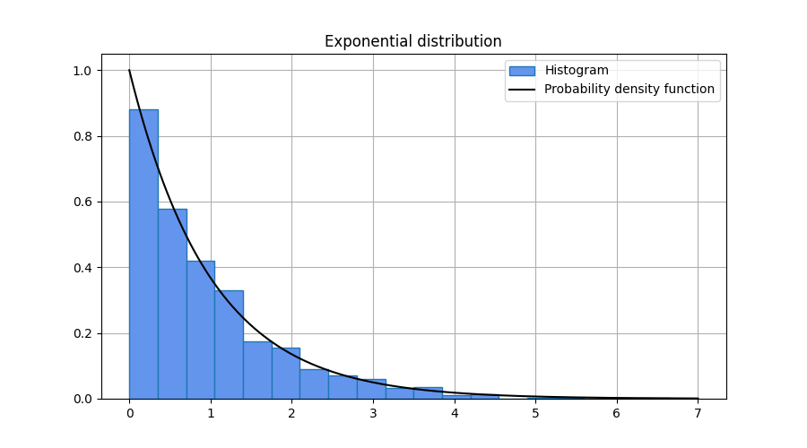

### `Generator::fisher_f`

Draw samples from a Fisher F-distribution.
```cpp
template <class T>
T fisher_f(T df1, T df2);
```

The probability density function for the F distribution is

$$f(x;d_1,d_2) = \frac{\Gamma\left(\frac{d_1+d_2}{2}\right)}
    {\Gamma\left(\frac{d_1}{2}\right)\Gamma\left(\frac{d_2}{2}\right)}
    \frac{\left(\frac{d_1x}{d_2}\right)^{d_1/2}}
    {x\left(1+\frac{d_1x}{d_2}\right)^{(d_1+d_2)/2}}$$

for $x \geq 0$, where $d_1$ and $d_2$ are the degrees of freedom.

Template parameters

* `T` A floating-point type.

Parameters

* `df1` Degrees of freedom. This shall be a positive value.
* `df2` Degrees of freedom. This shall be a positive value.

Returns

* A sample from the distribution.

<h3><code>Generator::fisher_f</code></h3>

Draw samples from a Fisher F-distribution.
```cpp
template <class T>
tensor<T, 1> fisher_f(T df1, T df2, size_t size);

template <class T, size_t Rank>
tensor<T, Rank> fisher_f(T df1, T df2, const shape_t<Rank> &size);
```

Template parameters

* `T` A floating-point type.
* `Rank` Dimension of the tensor.

Parameters

* `df1` Degrees of freedom. This shall be a positive value.
* `df2` Degrees of freedom. This shall be a positive value.
* `size` Output shape.

Returns

* A tensor with samples from the distribution.

Exceptions

* `std::bad_alloc` If the function fails to allocate storage it may throw an
exception.

Example

```cpp
#include <iostream>
#include "numcpp.h"
#include "numcpp/random.h"
namespace np = numcpp;
int main() {
    // Set seed to 0 to replicate results.
    np::default_rng rng(0);
    double df1, df2;
    int size;
    std::cin >> df1 >> df2 >> size;
    // Sample from a F distribution and print a few samples.
    np::array<double> a = rng.fisher_f(df1, df2, size);
    std::cout << a << "\n";
    // Export sample to .csv for latter plotting.
    np::savetxt("f-sample.csv", a);
    return 0;
}
```

Input

```
5 7 1000
```

Output

```
[ 0.6874124, 0.36971954, 0.66868149, ...,  1.2507282, 0.13758113,  2.0387201]
```

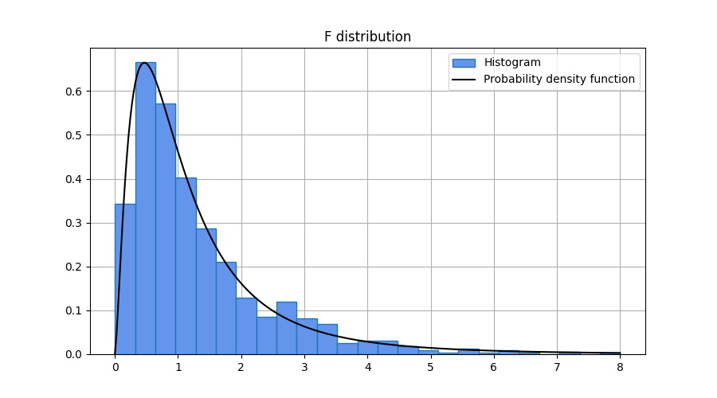

### `Generator::gamma`

Draw samples from a Gamma distribution.
```cpp
template <class T>
T gamma(T shape, T scale);
```

The probability density function for the Gamma distribution is

$$f(x;\alpha,\beta) = \frac{1}{\Gamma(\alpha)\beta^{\alpha}}
    x^{\alpha-1} e^{-x/\beta}$$

for $x > 0$, where $\alpha$ is the shape parameter and $\beta$ is the scale
parameter.


Template parameters

* `T` A floating-point type.

Parameters

* `shape` Shape parameter. This shall be a positive value.
* `scale` Scale parameter. This shall be a positive value.

Returns

* A sample from the distribution.

<h3><code>Generator::gamma</code></h3>

Draw samples from a Gamma distribution.
```cpp
template <class T>
tensor<T, 1> gamma(T shape, T scale, size_t size);

template <class T, size_t Rank>
tensor<T, Rank> gamma(T shape, T scale, const shape_t<Rank> &size);
```

Template parameters

* `T` A floating-point type.
* `Rank` Dimension of the tensor.

Parameters

* `shape` Shape parameter. This shall be a positive value.
* `scale` Scale parameter. This shall be a positive value.
* `size` Output shape.

Returns

* A tensor with samples from the distribution.

Exceptions

* `std::bad_alloc` If the function fails to allocate storage it may throw an
exception.

Example

```cpp
#include <iostream>
#include "numcpp.h"
#include "numcpp/random.h"
namespace np = numcpp;
int main() {
    // Set seed to 0 to replicate results.
    np::default_rng rng(0);
    double shape, scale;
    int size;
    std::cin >> shape >> scale >> size;
    // Sample from a Gamma distribution and print a few samples.
    np::array<double> a = rng.gamma(shape, scale, size);
    std::cout << a << "\n";
    // Export sample to .csv for latter plotting.
    np::savetxt("gamma-sample.csv", a);
    return 0;
}
```

Input

```
5 1 1000
```

Output

```
[4.4081179, 2.6905867, 4.7389065, ..., 6.3057923, 6.6045263, 6.1010987]
```

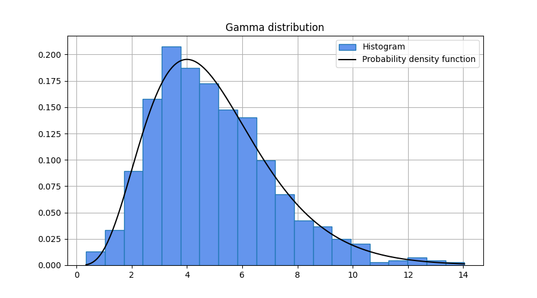

### `Generator::geometric`

Draw samples from a geometric distribution.
```cpp
template <class T>
T geometric(double prob);
```

The probability mass function for the geometric distribution is

$$f(x;p) = p(1-p)^x$$

for $x = 0, 1, 2, \ldots,$ where $p$ is the probability of success.

Template parameters

* `T` An integer type.

Parameters

* `prob` Probability of success. This shall be a value between 0 and 1
(inclusive).

Returns

* A sample from the distribution.

<h3><code>Generator::geometric</code></h3>

Draw samples from a geometric distribution.
```cpp
template <class T>
tensor<T, 1> geometric(double prob, size_t size);

template <class T, size_t Rank>
tensor<T, Rank> geometric(double prob, const shape_t<Rank> &size);
```

Template parameters

* `T` An integer type.
* `Rank` Dimension of the tensor.

Parameters

* `prob` Probability of success. This shall be a value between 0 and 1
(inclusive).
* `size` Output shape.

Returns

* A tensor with samples from the distribution.

Exceptions

* `std::bad_alloc` If the function fails to allocate storage it may throw an
exception.

Example

```cpp
#include <iostream>
#include "numcpp.h"
#include "numcpp/random.h"
namespace np = numcpp;
int main() {
    // Set seed to 0 to replicate results.
    np::default_rng rng(0);
    double prob;
    int size;
    std::cin >> prob >> size;
    // Sample from a geometric distribution and print a few samples.
    np::array<int> a = rng.geometric<int>(prob, size);
    std::cout << a << "\n";
    // Export sample to .csv for latter plotting.
    np::savetxt("geometric-sample.csv", a);
    return 0;
}
```

Input

```
0.3 1000
```

Output

```
[0, 1, 0, ..., 1, 1, 0]
```

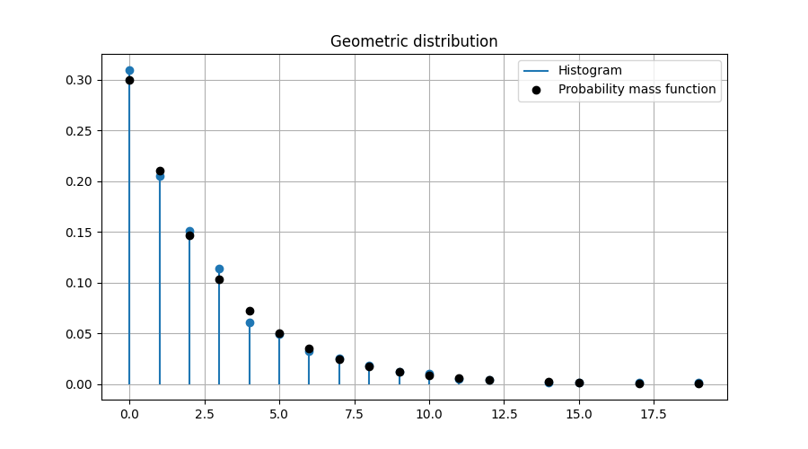

### `Generator::gumbel`

Draw samples from a Gumbel distribution.
```cpp
template <class T>
T gumbel(T loc, T scale);
```

The probability density function for the Gumbel distribution is

$$f(x;a,b) = \frac{1}{b}e^{-z-e^{-z}}, \ z=\frac{x-a}{b}$$

for all $x$, where $a$ is the location parameter and $b$ is the scale
parameter.

Template parameters

* `T` A floating-point type.

Parameters

* `loc` Location parameter.
* `scale` Scale parameter. This shall be a positive value.

Returns

* A sample from the distribution.

<h3><code>Generator::gumbel</code></h3>

Draw samples from a Gumbel distribution.
```cpp
template <class T>
tensor<T, 1> gumbel(T loc, T scale, size_t size);

template <class T, size_t Rank>
tensor<T, Rank> gumbel(T loc, T scale, const shape_t<Rank> &size);
```

Template parameters

* `T` A floating-point type.
* `Rank` Dimension of the tensor.

Parameters

* `loc` Location parameter.
* `scale` Scale parameter. This shall be a positive value.
* `size` Output shape.

Returns

* A tensor with samples from the distribution.

Exceptions

* `std::bad_alloc` If the function fails to allocate storage it may throw an
exception.

Example

```cpp
#include <iostream>
#include "numcpp.h"
#include "numcpp/random.h"
namespace np = numcpp;
int main() {
    // Set seed to 0 to replicate results.
    np::default_rng rng(0);
    double loc, scale;
    int size;
    std::cin >> loc >> scale >> size;
    // Sample from a Gumbel distribution and print a few samples.
    np::array<double> a = rng.gumbel(loc, scale, size);
    std::cout << a << "\n";
    // Export sample to .csv for latter plotting.
    np::savetxt("gumbel-sample.csv", a);
    return 0;
}
```

Input

```
0 1 1000
```

Output

```
[ 1.9587741, 0.48826617,  1.3978494, ...,  1.0010775, 0.77689881,  3.3354915]
```

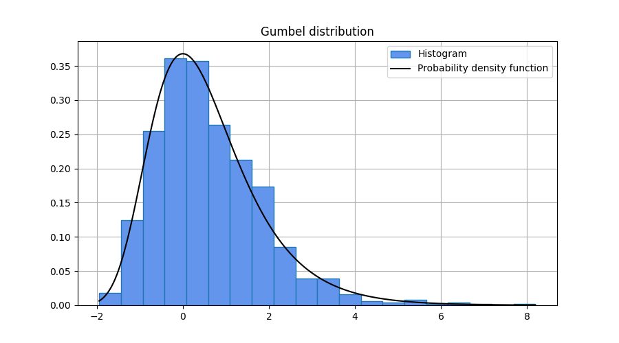

### `Generator::laplace`

Draw samples from a Laplace distribution.
```cpp
template <class T>
T laplace(T loc, T scale);
```

The probability density function for the Laplace distribution is

$$f(x;\mu,s) = \frac{1}{2s}\exp\left(-\frac{|x-\mu|}{s}\right)$$

for all $x$, where $\mu$ is the location parameter and $s$ is the scale
parameter.

Template parameters

* `T` A floating-point type.

Parameters

* `loc` Location parameter.
* `scale` Scale parameter. This shall be a positive value.

Returns

* A sample from the distribution.

<h3><code>Generator::laplace</code></h3>

Draw samples from a Laplace distribution.
```cpp
template <class T>
tensor<T, 1> laplace(T loc, T scale, size_t size);

template <class T, size_t Rank>
tensor<T, Rank> laplace(T loc, T scale, const shape_t<Rank> &size);
```

Template parameters

* `T` A floating-point type.
* `Rank` Dimension of the tensor.

Parameters

* `loc` Location parameter.
* `scale` Scale parameter. This shall be a positive value.
* `size` Output shape.

Returns

* A tensor with samples from the distribution.

Exceptions

* `std::bad_alloc` If the function fails to allocate storage it may throw an
exception.

Example

```cpp
#include <iostream>
#include "numcpp.h"
#include "numcpp/random.h"
namespace np = numcpp;
int main() {
    // Set seed to 0 to replicate results.
    np::default_rng rng(0);
    double loc, scale;
    int size;
    std::cin >> loc >> scale >> size;
    // Sample from a Laplace distribution and print a few samples.
    np::array<double> a = rng.laplace(loc, scale, size);
    std::cout << a << "\n";
    // Export sample to .csv for latter plotting.
    np::savetxt("laplace-sample.csv", a);
    return 0;
}
```

Input

```
0 1 1000
```

Output

```
[  -1.3353139, -0.086320419,  -0.82572275, ...,   -0.4860514,  -0.30487187,
   -2.6600901]
```

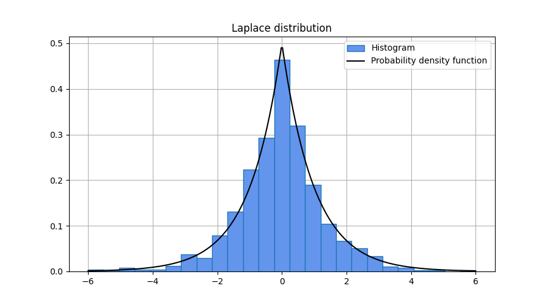

### `Generator::logistic`

Draw samples from a logistic distribution.
```cpp
template <class T>
T logistic(T loc, T scale);
```

The probability density function for the logistic distribution is

$$f(x;\mu,s) = \frac{e^{-(x-\mu)/2}}{s\left(1+e^{-(x-\mu)/s}\right)^2}$$

for all $x$, where $\mu$ is the location parameter and $s$ is the scale
parameter.

Template parameters

* `T` A floating-point type.

Parameters

* `loc` Location parameter.
* `scale` Scale parameter. This shall be a positive value.

Returns

* A sample from the distribution.

<h3><code>Generator::logistic</code></h3>

Draw samples from a logistic distribution.
```cpp
template <class T>
tensor<T, 1> logistic(T loc, T scale, size_t size);

template <class T, size_t Rank>
tensor<T, Rank> logistic(T loc, T scale, const shape_t<Rank> &size);
```

Template parameters

* `T` A floating-point type.
* `Rank` Dimension of the tensor.

Parameters

* `loc` Location parameter.
* `scale` Scale parameter. This shall be a positive value.
* `size` Output shape.

Returns

* A tensor with samples from the distribution.

Exceptions

* `std::bad_alloc` If the function fails to allocate storage it may throw an
exception.

Example

```cpp
#include <iostream>
#include "numcpp.h"
#include "numcpp/random.h"
namespace np = numcpp;
int main() {
    // Set seed to 0 to replicate results.
    np::default_rng rng(0);
    double loc, scale;
    int size;
    std::cin >> loc >> scale >> size;
    // Sample from a logistic distribution and print a few samples.
    np::array<double> a = rng.logistic(loc, scale, size);
    std::cout << a << "\n";
    // Export sample to .csv for latter plotting.
    np::savetxt("logistic-sample.csv", a);
    return 0;
}
```

Input

```
0 1 1000
```

Output

```
[ -1.8874299,  -0.1657781,  -1.2717421, ...,  -0.8117153, -0.53818923,
  -3.3176402]
```

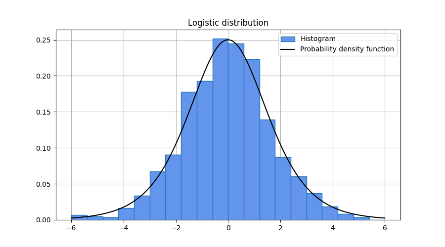

### `Generator::lognormal`

Draw samples from a log-normal distribution.
```cpp
template <class T>
T lognormal(T logmean, T logscale);
```

The probability density function for the log-normal distribution is

$$f(x;\mu,\sigma) = \frac{1}{x\sigma\sqrt{2\pi}}
    \exp\left(-\frac{(\log x-\mu)^2}{2\sigma^2}\right)$$

for $x > 0$, where $\mu$ and $\sigma$ are the mean and standard deviation of
the underlying normal distribution formed by the logaritm transformation.

Template parameters

* `T` A floating-point type.

Parameters

* `logmean` Mean of the underlying normal distribution.
* `logscale` Standard deviation of the underlying normal distribution. This
shall be a positive value.

Returns

* A sample from the distribution.

<h3><code>Generator::lognormal</code></h3>

Draw samples from a log-normal distribution.
```cpp
template <class T>
tensor<T, 1> lognormal(T logmean, T logscale, size_t size);

template <class T, size_t Rank>
tensor<T, Rank> lognormal(T logmean, T logscale, const shape_t<Rank> &size);
```

Template parameters

* `T` A floating-point type.
* `Rank` Dimension of the tensor.

Parameters

* `logmean` Mean of the underlying normal distribution.
* `logscale` Standard deviation of the underlying normal distribution. This
shall be a positive value.
* `size` Output shape.

Returns

* A tensor with samples from the distribution.

Exceptions

* `std::bad_alloc` If the function fails to allocate storage it may throw an
exception.

Example

```cpp
#include <iostream>
#include "numcpp.h"
#include "numcpp/random.h"
namespace np = numcpp;
int main() {
    // Set seed to 0 to replicate results.
    np::default_rng rng(0);
    double logmean, logscale;
    int size;
    std::cin >> logmean >> logscale >> size;
    // Sample from a lognormal distribution and print a few samples.
    np::array<double> a = rng.lognormal(logmean, logscale, size);
    std::cout << a << "\n";
    // Export sample to .csv for latter plotting.
    np::savetxt("lognormal-sample.csv", a);
    return 0;
}
```

Input

```
0 1 1000
```

Output

```
[0.88517866, 0.33728802,  1.9823637, ..., 0.66364397, 0.96942976, 0.64501241]
```

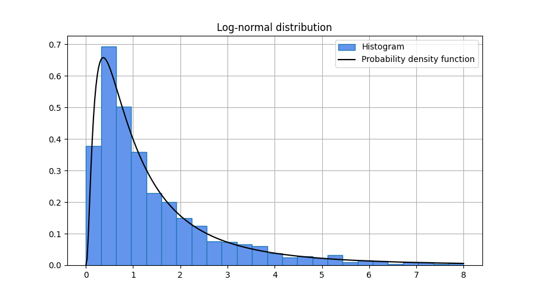

### `Generator::negative_binomial`

Draw samples from a negative binomial distribution.
```cpp
template <class T>
T negative_binomial(T n, double prob);
```

The probability mass function for the negative binomial distribution is

$$f(x;n,p) = \binom{n+x-1}{x} p^{n} (1-p)^{x}$$

for $x = 0, 1, 2, \ldots$, where $n$ is the number of successes before the
experiment is stopped and $p$ is the probability of success.

Template parameters

* `T` An integer type.

Parameters

* `n` Number of successes.
* `prob` Probability of success. This shall be a value between 0 and 1
(inclusive).

Returns

* A sample from the distribution.

<h3><code>Generator::negative_binomial</code></h3>

Draw samples from a negative binomial distribution.
```cpp
template <class T>
tensor<T, 1> negative_binomial(T n, double prob, size_t size);

template <class T, size_t Rank>
tensor<T, Rank> negative_binomial(T n, double prob, const shape_t<Rank> &size);
```

Template parameters

* `T` An integer type.
* `Rank` Dimension of the tensor.

Parameters

* `n` Number of successes.
* `prob` Probability of success. This shall be a value between 0 and 1
(inclusive).
* `size` Output shape.

Returns

* A tensor with samples from the distribution.

Exceptions

* `std::bad_alloc` If the function fails to allocate storage it may throw an
exception.

Example

```cpp
#include <iostream>
#include "numcpp.h"
#include "numcpp/random.h"
namespace np = numcpp;
int main() {
    // Set seed to 0 to replicate results.
    np::default_rng rng(0);
    int n, size;
    double prob;
    std::cin >> n >> prob >> size;
    // Sample from a negative binomial distribution and print a few samples.
    np::array<int> a = rng.negative_binomial(n, prob, size);
    std::cout << a << "\n";
    // Export sample to .csv for latter plotting.
    np::savetxt("negative-binomial-sample.csv", a);
    return 0;
}

```

Input

```
3 0.5 1000
```

Output

```
[3, 0, 4, ..., 2, 4, 5]
```

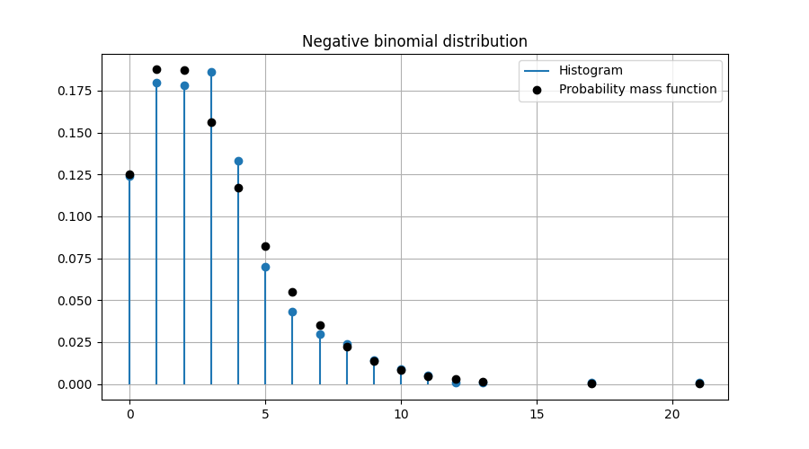

### `Generator::normal`

Draw samples from a normal distribution.
```cpp
template <class T>
T normal(T mean, T stddev);
```

The probability density function for the normal distribution is

$$f(x;\mu,\sigma) = \frac{1}{\sigma\sqrt{2\pi}}
    \exp\left(-\frac{(x-\mu)^2}{2\sigma^2}\right)$$

for all $x$, where $\mu$ and $\sigma$ are the mean and standard deviation.

Template parameters

* `T` A floating-point type.

Parameters

* `mean` Mean of the distribution.
* `stddev` Standard deviation of the distribution. This shall be a positive
value.

Returns

* A sample from the distribution.

<h3><code>Generator::normal</code></h3>

Draw samples from a normal distribution.
```cpp
template <class T>
tensor<T, 1> normal(T mean, T stddev, size_t size);

template <class T, size_t Rank>
tensor<T, Rank> normal(T mean, T stddev, const shape_t<Rank> &size);
```

Template parameters

* `T` A floating-point type.
* `Rank` Dimension of the tensor.

Parameters

* `mean` Mean of the distribution.
* `stddev` Standard deviation of the distribution. This shall be a positive
value.
* `size` Output shape.

Returns

* A tensor with samples from the distribution.

Exceptions

* `std::bad_alloc` If the function fails to allocate storage it may throw an
exception.

Example

```cpp
#include <iostream>
#include "numcpp.h"
#include "numcpp/random.h"
namespace np = numcpp;
int main() {
    // Set seed to 0 to replicate results.
    np::default_rng rng(0);
    double mean, stddev;
    int size;
    std::cin >> mean >> stddev >> size;
    // Sample from a normal distribution and print a few samples.
    np::array<double> a = rng.normal(mean, stddev, size);
    std::cout << a << "\n";
    // Export sample to .csv for latter plotting.
    np::savetxt("normal-sample.csv", a);
    return 0;
}
```

Input

```
0 1 1000
```

Output

```
[ -0.12196578,    -1.086818,   0.68428994, ...,  -0.41000947, -0.031047253,
  -0.43848572]
```

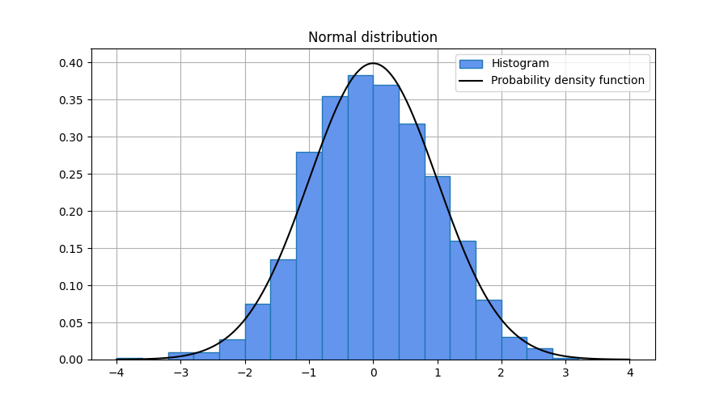

### `Generator::pareto`

Draw samples from a Pareto distribution.
```cpp
template <class T>
T pareto(T shape, T scale);
```

The probability density function for the Pareto distribution is

$$f(x;\alpha,x_m) = \frac{\alpha x_m^{\alpha}}{x^{\alpha+1}}$$

for $x \geq x_m$, where $\alpha$ is the shape parameter and $x_m$ is the scale
parameter.

Template parameters

* `T` A floating-point type.

Parameters

* `shape` Shape parameter. This shall be a positive value.
* `scale` Scale parameter. This shall be a positive value.

Returns

* A sample from the distribution.

<h3><code>Generator::pareto</code></h3>

Draw samples from a Pareto distribution.
```cpp
template <class T>
tensor<T, 1> pareto(T shape, T scale, size_t size);

template <class T, size_t Rank>
tensor<T, Rank> pareto(T shape, T scale, const shape_t<Rank> &size);
```

Template parameters

* `T` A floating-point type.
* `Rank` Dimension of the tensor.

Parameters

* `shape` Shape parameter. This shall be a positive value.
* `scale` Scale parameter. This shall be a positive value.
* `size` Output shape.

Returns

* A tensor with samples from the distribution.

Exceptions

* `std::bad_alloc` If the function fails to allocate storage it may throw an
exception.

Example

```cpp
#include <iostream>
#include "numcpp.h"
#include "numcpp/random.h"
namespace np = numcpp;
int main() {
    // Set seed to 0 to replicate results.
    np::default_rng rng(0);
    double shape, scale;
    int size;
    std::cin >> shape >> scale >> size;
    // Sample from a pareto distribution and print a few samples.
    np::array<double> a = rng.pareto(shape, scale, size);
    std::cout << a << "\n";
    // Export sample to .csv for latter plotting.
    np::savetxt("pareto-sample.csv", a);
    return 0;
}
```

Input

```
3 1 1000
```

Output

```
[1.0481329,  1.226989,  1.085864, ..., 1.1303128, 1.1656474, 1.0119364]
```

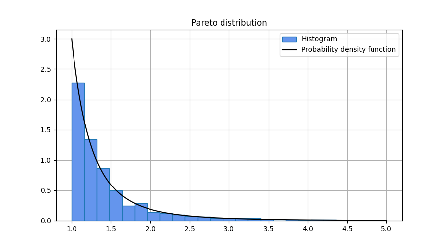

### `Generator::poisson`

Draw samples from a Poisson distribution.
```cpp
template <class T>
T poisson(double rate);
```

The probability mass function for the Poisson distribution is

$$f(x;\lambda) = \frac{\lambda^{x}}{x!} e^{-\lambda}$$

for $x = 0, 1, 2, \ldots$, where $\lambda$ is the rate parameter.

Template parameters

* `T` An integer type.

Parameters

* `rate` Rate parameter. This shall be a positive value.

Returns

* A sample from the distribution.

<h3><code>Generator::poisson</code></h3>

Draw samples from a Poisson distribution.
```cpp
template <class T>
tensor<T, 1> poisson(double rate, size_t size);

template <class T, size_t Rank>
tensor<T, Rank> poisson(double rate, const shape_t<Rank> &size);
```

Template parameters

* `T` An integer type.
* `Rank` Dimension of the tensor.

Parameters

* `rate` Rate parameter. This shall be a positive value.
* `size` Output shape.

Returns

* A tensor with samples from the distribution.

Exceptions

* `std::bad_alloc` If the function fails to allocate storage it may throw an
exception.

Example

```cpp
#include <iostream>
#include "numcpp.h"
#include "numcpp/random.h"
namespace np = numcpp;
int main() {
    // Set seed to 0 to replicate results.
    np::default_rng rng(0);
    double rate;
    int size;
    std::cin >> rate >> size;
    // Sample from a Poisson distribution and print a few samples.
    np::array<int> a = rng.poisson<int>(rate, size);
    std::cout << a << "\n";
    // Export sample to .csv for latter plotting.
    np::savetxt("poisson-sample.csv", a);
    return 0;
}
```

Input

```
10 1000
```

Output

```
[ 8, 10,  9, ...,  9,  3,  7]
```


### `Generator::rayleigh`

Draw samples from a Rayleigh distribution.
```cpp
template <class T>
T rayleigh(T scale);
```

The probability density function for the Rayleigh distribution is

$$f(x;\sigma) = \frac{x}{\sigma^2}e^{-x^2/(2\sigma^2)}$$

for $x \geq 0$, where $\sigma$ is the scale parameter.

Template parameters

* `T` A floating-point type.

Parameters

* `scale` Scale parameter. This shall be a positive value.

Returns

* A sample from the distribution.

<h3><code>Generator::rayleigh</code></h3>

Draw samples from a Rayleigh distribution.
```cpp
template <class T>
tensor<T, 1> rayleigh(T scale, size_t size);

template <class T, size_t Rank>
tensor<T, Rank> rayleigh(T scale, const shape_t<Rank> &size);
```

Template parameters

* `T` A floating-point type.
* `Rank` Dimension of the tensor.

Parameters

* `scale` Scale parameter. This shall be a positive value.
* `size` Output shape.

Returns

* A tensor with samples from the distribution.

Exceptions

* `std::bad_alloc` If the function fails to allocate storage it may throw an
exception.

Example

```cpp
#include <iostream>
#include "numcpp.h"
#include "numcpp/random.h"
namespace np = numcpp;
int main() {
    // Set seed to 0 to replicate results.
    np::default_rng rng(0);
    double scale;
    int size;
    std::cin >> scale >> size;
    // Sample from a Rayleigh distribution and print a few samples.
    np::array<double> a = rng.rayleigh(scale, size);
    std::cout << a << "\n";
    // Export sample to .csv for latter plotting.
    np::savetxt("rayleigh-sample.csv", a);
    return 0;
}
```

Input

```
1 1000
```

Output

```
[0.53109548,  1.1078714, 0.70303325, ..., 0.85730191, 0.95898887, 0.26682236]
```

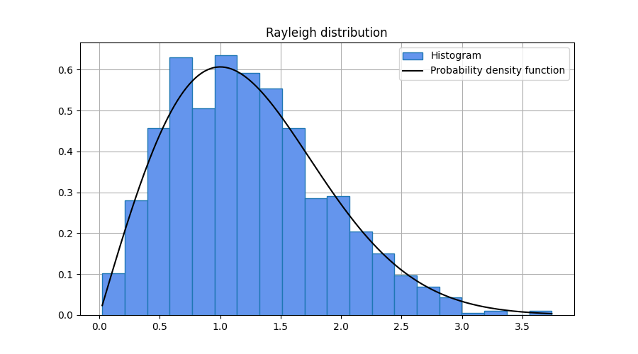

### `Generator::standard_normal`

Draw samples from a standard normal distribution (`mean = 0`, `stddev = 1`).
```cpp
template <class T>
T standard_normal();
```

Template parameters

* `T` A floating-point type.

Parameters

* None

Returns

* A sample from the distribution.

<h3><code>Generator::standard_normal</code></h3>

Draw samples from a standard normal distribution (`mean = 0`, `stddev = 1`).
```cpp
template <class T>
tensor<T, 1> standard_normal(size_t size);

template <class T, size_t Rank>
tensor<T, Rank> standard_normal(const shape_t<Rank> &size);
```

Template parameters

* `T` A floating-point type.
* `Rank` Dimension of the tensor.

Parameters

* `size` Output shape.

Returns

* A tensor with samples from the distribution.

Exceptions

* `std::bad_alloc` If the function fails to allocate storage it may throw an
exception.

### `Generator::student_t`

Draw samples from a Student's t distribution.
```cpp
template <class T>
T student_t(T df);
```

The probability density function for the Student's t distribution is

$$f(x;\nu) = \frac{1}{\sqrt{\pi\nu}}
    \frac{\Gamma\left(\frac{\nu+1}{2}\right)}{\Gamma\left(\frac{\nu}{2}\right)}
    \left(1+\frac{x^2}{\nu}\right)^{-(\nu+1)/2}$$

for all $x$, where $\nu$ is the degrees of freedom.

Template parameters

* `T` A floating-point type.

Parameters

* `df` Degrees of freedom. This shall be a positive value.

Returns

* A sample from the distribution.

<h3><code>Generator::student_t</code></h3>

Draw samples from a Student's t distribution.
```cpp
template <class T>
tensor<T, 1> student_t(T df, size_t size);

template <class T, size_t Rank>
tensor<T, Rank> student_t(T df, const shape_t<Rank> &size);
```

Template parameters

* `T` A floating-point type.
* `Rank` Dimension of the tensor.

Parameters

* `df` Degrees of freedom. This shall be a positive value.
* `size` Output shape.

Returns

* A tensor with samples from the distribution.

Exceptions

* `std::bad_alloc` If the function fails to allocate storage it may throw an
exception.

Example

```cpp
#include <iostream>
#include "numcpp.h"
#include "numcpp/random.h"
namespace np = numcpp;
int main() {
    // Set seed to 0 to replicate results.
    np::default_rng rng(0);
    double df;
    int size;
    std::cin >> df >> size;
    // Sample from a Student's t distribution and print a few samples.
    np::array<double> a = rng.student_t(df, size);
    std::cout << a << "\n";
    // Export sample to .csv for latter plotting.
    np::savetxt("student-t-sample.csv", a);
    return 0;
}
```

Input

```
3 1000
```

Output

```
[-0.10375263,  -2.2562108, 0.031193867, ...,  0.21611675,  -3.1166077,
  0.99482596]
```


### `Generator::triangular`

Draw samples from a triangular distribution.
```cpp
template <class T>
T triangular(T left, T mode, T right);
```

The probability density function for the triangular distribution is

$$f(x;a,c,b) = \begin{cases}
        \frac{2(x-a)}{(b-a)(c-a)}, & a \leq x \leq c,\\
        \frac{2(b-x)}{(b-a)(b-c)}, & c \leq x \leq b,\\
        0, & \text{otherwise}
    \end{cases}$$

where $a$ is the lower boundary, $b$ is the upper boundary, and $c$ is the mode
of the distribution.

Template parameters

* `T` A floating-point type.

Parameters

* `left` Lower boundary.
* `mode` Mode of the distribution.
* `right` Upper boundary.

Returns

* A sample from the distribution.

<h3><code>Generator::triangular</code></h3>

Draw samples from a triangular distribution.
```cpp
template <class T>
tensor<T, 1> triangular(T left, T mode, T right, size_t size);

template <class T, size_t Rank>
tensor<T, Rank> triangular(T left, T mode, T right, const shape_t<Rank> &size);
```

Template parameters

* `T` A floating-point type.
* `Rank` Dimension of the tensor.

Parameters

* `left` Lower boundary.
* `mode` Mode of the distribution.
* `right` Upper boundary.
* `size` Output shape.

Returns

* A tensor with samples from the distribution.

Exceptions

* `std::bad_alloc` If the function fails to allocate storage it may throw an
exception.

Example

```cpp
#include <iostream>
#include "numcpp.h"
#include "numcpp/random.h"
namespace np = numcpp;
int main() {
    // Set seed to 0 to replicate results.
    np::default_rng rng(0);
    double left, mode, right;
    int size;
    std::cin >> left >> mode >> right >> size;
    // Sample from a triangular distribution and print a few samples.
    np::array<double> a = rng.triangular(left, mode, right, size);
    std::cout << a << "\n";
    // Export sample to .csv for latter plotting.
    np::savetxt("triangular-sample.csv", a);
    return 0;
}
```

Input

```
0 1 5 1000
```

Output

```
[0.81098023,  1.7095597,  1.0476822, ...,  1.2785086,  1.4464354, 0.41815644]
```

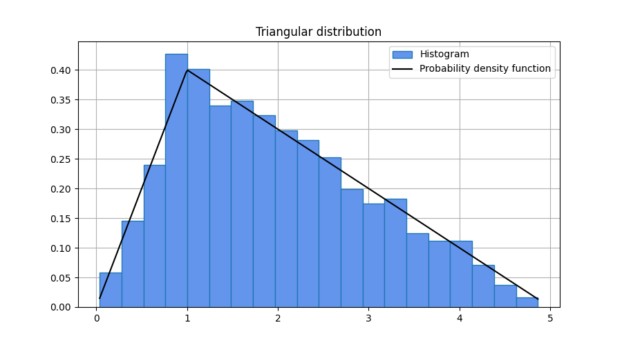

### `Generator::uniform`

Draw samples from an uniform distribution.
```cpp
template <class T>
T uniform(T low, T high);
```

The probability density function for the uniform distribution is

$$f(x;a,b) = \frac{1}{b-a}$$

for $a \leq x < b$, where $a$ and $b$ are the lower and upper boundaries of the
distribution.

Template parameters

* `T` A floating-point type.

Parameters

* `low` Lower boundary.
* `high` Upper boundary.

Returns

* A sample from the distribution.

<h3><code>Generator::uniform</code></h3>

Draw samples from an uniform distribution.
```cpp
template <class T>
tensor<T, 1> uniform(T low, T high, size_t size);

template <class T, size_t Rank>
tensor<T, Rank> uniform(T low, T high, const shape_t<Rank> &size);
```

Template parameters

* `T` A floating-point type.
* `Rank` Dimension of the tensor.

Parameters

* `low` Lower boundary.
* `high` Upper boundary.
* `size` Output shape.

Returns

* A tensor with samples from the distribution.

Exceptions

* `std::bad_alloc` If the function fails to allocate storage it may throw an
exception.

Example

```cpp
#include <iostream>
#include "numcpp.h"
#include "numcpp/random.h"
namespace np = numcpp;
int main() {
    // Set seed to 0 to replicate results.
    np::default_rng rng(0);
    double low, high;
    int size;
    std::cin >> low >> high >> size;
    // Sample from an uniform distribution and print a few samples.
    np::array<double> a = rng.uniform(low, high, size);
    std::cout << a << "\n";
    // Export sample to .csv for latter plotting.
    np::savetxt("uniform-sample.csv", a);
    return 0;
}
```

Input

```
0 10 1000
```

Output

```
[ 1.3153779,  4.5865013,  2.1895919, ...,   3.075251,  3.6860891, 0.34970961]
```

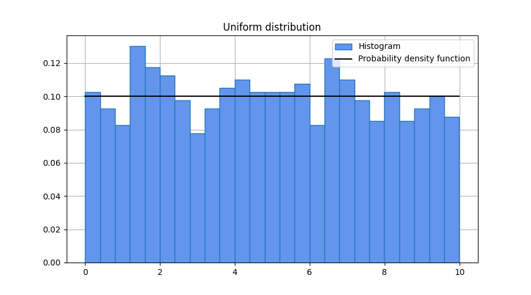

### `Generator::wald`

Draw samples from a Wald, or inverse Gaussian, distribution.
```cpp
template <class T>
T wald(T mean, T scale);
```

The probability density function for the Wald distribution is

$$f(x;\mu,\lambda) = \sqrt{\frac{\lambda}{2\pi x^3}}
    \exp\left(-\frac{\lambda(x-\mu)^2}{2\mu^2 x}\right)$$

for $x > 0$, where $\mu$ is the mean and $\lambda$ is the scale parameter.

Template parameters

* `T` A floating-point type.

Parameters

* `mean` Mean of the distribution. This shall be a positive value.
* `scale` Scale parameter. This shall be a positive value.

Returns

* A sample from the distribution.

<h3><code>Generator::wald</code></h3>

Draw samples from a Wald distribution.
```cpp
template <class T>
tensor<T, 1> wald(T mean, T scale, size_t size);

template <class T, size_t Rank>
tensor<T, Rank> wald(T mean, T scale, const shape_t<Rank> &size);
```

Template parameters

* `T` A floating-point type.
* `Rank` Dimension of the tensor.

Parameters

* `mean` Mean of the distribution. This shall be a positive value.
* `scale` Scale parameter. This shall be a positive value.
* `size` Output shape.

Returns

* A tensor with samples from the distribution.

Exceptions

* `std::bad_alloc` If the function fails to allocate storage it may throw an
exception.

Example

```cpp
#include <iostream>
#include "numcpp.h"
#include "numcpp/random.h"
namespace np = numcpp;
int main() {
    // Set seed to 0 to replicate results.
    np::default_rng rng(0);
    double mean, scale;
    int size;
    std::cin >> mean >> scale >> size;
    // Sample from a Wald distribution and print a few samples.
    np::array<double> a = rng.wald(mean, scale, size);
    std::cout << a << "\n";
    // Export sample to .csv for latter plotting.
    np::savetxt("wald-sample.csv", a);
    return 0;
}

```

Input

```
3 1 1000
```

Output

```
[ 2.4296621, 0.56003132,  2.8320359, ...,  1.9240562, 0.41776467,  2.6238812]
```

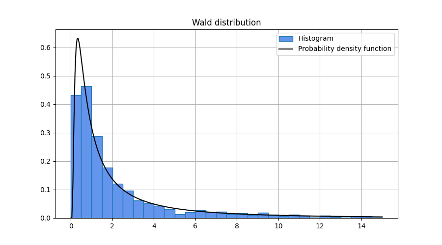

### `Generator::weibull`

Draw samples from a Weibull distribution.
```cpp
template <class T>
T weibull(T shape, T scale);
```

The probability density function for the Weibull distribution is

$$f(x;a,b) = \frac{a}{b}\left(\frac{x}{b}\right)^{a-1}e^{-(x/b)^a}$$

for $x \geq 0$, where $a$ is the shape parameter and $b$ is the scale
parameter.

Template parameters

* `T` A floating-point type.

Parameters

* `shape` Shape parameter. This shall be a positive value.
* `scale` Scale parameter. This shall be a positive value.

Returns

* A sample from the distribution.

<h3><code>Generator::weibull</h3></code>

Draw samples from a Weibull distribution.
```cpp
template <class T>
tensor<T, 1> weibull(T shape, T scale, size_t size);

template <class T, size_t Rank>
tensor<T, Rank> weibull(T shape, T scale, const shape_t<Rank> &size);
```

Template parameters

* `T` A floating-point type.
* `Rank` Dimension of the tensor.

Parameters

* `shape` Shape parameter. This shall be a positive value.
* `scale` Scale parameter. This shall be a positive value.
* `size` Output shape.

Returns

* A tensor with samples from the distribution.

Exceptions

* `std::bad_alloc` If the function fails to allocate storage it may throw an
exception.

Example

```cpp
#include <iostream>
#include "numcpp.h"
#include "numcpp/random.h"
namespace np = numcpp;
int main() {
    // Set seed to 0 to replicate results.
    np::default_rng rng(0);
    double shape, scale;
    int size;
    std::cin >> shape >> scale >> size;
    // Sample from a Weibull distribution and print a few samples.
    np::array<double> a = rng.weibull(shape, scale, size);
    std::cout << a << "\n";
    // Export sample to .csv for latter plotting.
    np::savetxt("weibull-sample.csv", a);
    return 0;
}
```

Input

```
5 1 1000
```

Output

```
[ 0.6758698, 0.90696335, 0.75610889, ..., 0.81855434, 0.85609001, 0.51319556]
```

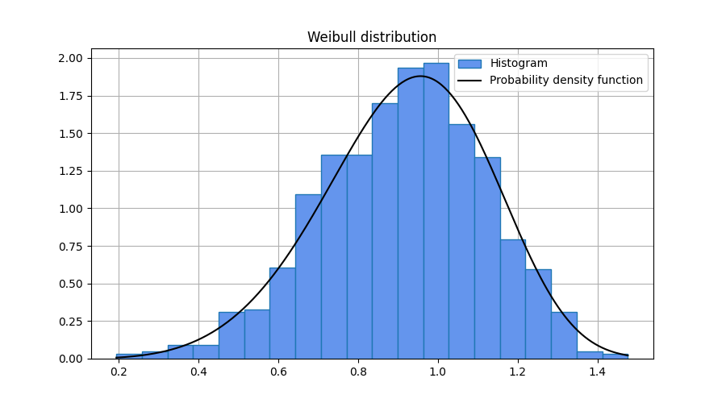
