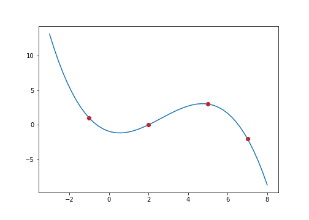
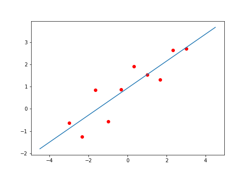
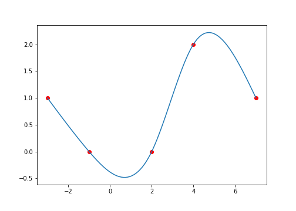

# Interpolación.

Biblioteca: `interpolate.h`

Requisitos: C++11

## Particiones de intervalos

```cpp
template<class T, class OutputIterator>
void linspace(
    T a,
    T b,
    OutputIterator first,
    OutputIterator last,
    bool endpoint = true
)
```

Genera una muestra de números equi-espaciados sobre un intervalo.

Argumentos:
* `a`, `b`: Extremos del intervalo.
* `first`, `last`: Iteradores correspondientes a la muestra. El rango usado es [`first`, `last`).
* `endpoint`: Si `endpoint` es `true`, entonces `b` será el último número de la muestra. De lo contrario se excluye de la muestra.

Ejemplo:

Genera una muestra de 5 puntos del intervalo ![\[0,1\]](https://render.githubusercontent.com/render/math?math=%5B0%2C1%5D).

```cpp
#include <cstdio>
#include "interpolate.h"
using namespace num_met;
int main() {
    const int n = 5;
    double x[n];
    linspace(0.0, 1.0, x, x + n);
    for (int i = 0; i < n; ++i)
        printf("%.6f\n", x[i]);
    return 0;
}
```

```
0.000000
0.250000
0.500000
0.750000
1.000000
```

## Polinomios

```cpp
template <class T, class InputIterator>
T polynomial(
    T x,
    InputIterator first,
    InputIterator last
)
```

Evalua un polinomio en un punto.

Argumentos:
* `x`: El punto a evaluar.
* `first, last`: Iteradores correspondientes a los coeficientes del polinomio, ordenados de mayor a menor grado. El rango usado es [`first`, `last`).

Regresa:
* El valor del polinomio. 

Ejemplo:

Evalua %20%3D%20-x%5E5%20%2B%202x%5E3%20-%205x%5E2%20%2B%201) en .

```cpp
#include <cstdio>
#include "interpolate.h"
using namespace num_met;
int main() {
    const int n = 6;
    int coef[] = {-1, 0, 2, -5, 0, 1};
    printf("%d\n", polynomial(3, coef, coef + n));
    return 0;
}
```

```
-233
```

## Polonomios a pedazos

```cpp
template <class T>
T piecewise_polynomial(
    T x,
    const matrix<T> &coeff,
    unsigned int hint = -1
)
```

Evalua en un punto la función definida por sub-intervalos de la siguiente manera


Argumentos:
* `x`: El punto a evaluar.
* `coeff`: La matriz con los coeficientes del polinomio a pedazos.
* `hint`: El índice del sub-intervalo al cual pertenece `x`. Cuando no se proporcione un valor adecuado, la función busca por sí misma el sub-intervalo correspondiente.

Regresa:
* El valor del polinomio a pedazos.

Ejemplo: Evalua ,
 
en distintos puntos.

```cpp
#include <cstdio>
#include "matrix.h"
#include "interpolate.h"
using namespace std;
using namespace num_met;
int main() {
    const int n = 5;
    double x[n];
    linspace(-1.0, 1.0, x, x + n);

    matrix<double> coeff = {{-1, -1, 1, 0},
                            {0, 0, 0, 1},
                            {1, 0, 0, 0}};
    for (int i = 0; i < n; ++i)
        printf("(%.6f, %.6f)\n", x[i], piecewise_polynomial(x[i], coeff));

    return 0;
}
```

```
(-1.000000, -1.000000)
(-0.500000, -0.500000)
(0.000000, 0.000000)
(0.500000, 0.250000)
(1.000000, 1.000000)
```


## Polinomio interpolador

### Matriz de Vandermonde

```cpp
template <class InputIterator, class T>
matrix<T> vandermonde(
    unsigned int m,
    unsigned int n,
    InputIterator first
)
```

Calcula la matriz de Vandermonde de una lista de puntos. La matriz de Vandermonde viene dada por


Argumentos:
* `m`, `n`: Dimensiones de la matriz.
* `first`: Iterador correspondientes a los puntos.

Regresa:
 * La matriz de Vandermonde.

Ejemplo:

```cpp
#include <cstdio>
#include "matrix.h"
#include "interpolate.h"
using namespace num_met;
int main() {
    int x[] = {2, 3, 4};
    matrix<int> V = vandermonde(3, 4, x);
    for (int i = 0; i < V.rows(); ++i) {
        for (int j = 0; j < V.columns(); ++j)
            printf("%d ", V[i][j]);
        printf("\n");
    }
    return 0;
}
```

```
1 2 4 8
1 3 9 27
1 4 16 64
```

### Coeficientes de interpolación

```cpp
template <class InputIterator1, class InputIterator2, class OutputIterator>
void poly_interpolate(
    unsigned int npts,
    InputIterator1 xfirst,
    InputIterator2 yfirst,
    OutputIterator coeff
)
```
Interpola un polinomio sobre una lista de puntos.

Argumentos:
* `npts`: Número de puntos a interpolar.
* `xfirst`, `yfirst`: Iteradores correspondientes a las coordenadas de los puntos.
* `coeff`: Iterador correspondiente a los coeficientes del polinomio. 

Ejemplo:

Calcula los coeficientes de un polinomio que pase por los puntos ), ), ) y ).

```cpp
#include <cstdio>
#include "interpolate.h"
using namespace num_met;
int main() {
    const int n = 4;
    double x[] = {-1, 2, 5, 7};
    double y[] = {1, 0, 3, -2};
    double coeff[n];
    poly_interpolate(n, x, y, coeff);
    for (int i = 0; i < n; ++i) 
        printf("%.6f ", coeff[i]);
    printf("\n");
    return 0;
}
```

```
-0.115278 0.913889 -0.901389 -0.930556
```




## Ajuste polinomial

```cpp
template <class InputIterator1, class InputIterator2, class OutputIterator>
void poly_fit(
    unsigned int n,
    unsigned int npts,
    InputIterator1 xfirst,
    InputIterator2 yfirst,
    OutputIterator coeff
)
```

Ajusta un polinomio de determinado grado sobre una lista de puntos.

Argumentos:
* `n`: Grado del polinomio.
* `npts`: Número de puntos.
* `xfirst`, `yfirst`: Iteradores correspondientes a las coordenadas de los puntos.
* `coeff`: Iterador correspondiente a los coeficientes del polinomio.

Ejemplo:

Genera 10 puntos con ruido sobre la recta  en el intervalo ![\[-3,3\]](https://render.githubusercontent.com/render/math?math=%5B-3%2C3%5D). A estos puntos se les ajusta un polinomio de grado 1 (una recta).

```cpp
#include <cstdio>
#include <random>
#include "interpolate.h"
using namespace std;
using namespace num_met;
int main() {
    const int npts = 10, n = 1;
    default_random_engine seed(0);
    normal_distribution<double> noise;
    double x[npts], y[npts], coeff[n + 1];

    printf("Puntos:\n");
    linspace(-3.0, 3.0, x, x + npts);
    for (int i = 0; i < npts; ++i) {
        y[i] = 0.5*x[i] + 1 + noise(seed);
        printf("(%.6f, %.6f)\n", x[i], y[i]);
    }
    
    printf("Coeficientes:\n");
    poly_fit(n, npts, x, y, coeff);
    for (int i = 0; i <= n; ++i) 
        printf("%.6f ", coeff[i]);
    printf("\n");

    return 0;
}
```

```
(-3.000000, -0.621966)
(-2.333333, -1.253485)
(-1.666667, 0.850957)
(-1.000000, -0.575189)
(-0.333333, 0.866603)
(0.333333, 1.911502)
(1.000000, 1.533606)
(1.666667, 1.306696)
(2.333333, 2.629199)
(3.000000, 2.700699)
Coeficientes:
0.606661 0.934862
```




## Spline de interpolación

```cpp
template <class InputIterator1, class InputIterator2, class T>
matrix<T> spline_interpolate(
    unsigned int npts,
    InputIterator1 xfirst,
    InputIterator2 yfirst
)
```

Interpola un spline natural cúbico sobre una lista de puntos.

Argumentos:
* `npts`: Número de puntos a interpolar.
* `xfirst`, `yfirst`: Iteradores correspondientes a las coordenadas de los puntos. Los puntos deben estar ordenados por su coordenada en .

Regresa:
* Una matriz con los coeficientes del spline, el cual puede ser evaluado con `piecewise_polynomial`.


Ejemplo:

Calcula los coeficientes de un spline cúbico que pase por los puntos ), ), ), ) y ) y lo evalua en .

```cpp
#include <cstdio>
#include "matrix.h"
#include "interpolate.h"
using namespace num_met;
int main() {
    const int npts = 5;
    double x[] = {-3, -1, 2, 4, 7};
    double y[] = {1, 0, 0, 2, 1};

    printf("Coeficientes:\n");
    matrix<double> coeff = spline_interpolate(npts, x, y);
    for (int i = 0; i < coeff.rows(); ++i) {
        for (int j = 0; j < coeff.columns(); ++j)
            printf("%.6f ", coeff[i][j]);
        printf("\n");
    }

printf("S(0) = %.6f\n", piecewise_polynomial(0.0, coeff));
    return 0;
}
```

```
Coeficientes:
-3.000000 1.000000 -0.522989 0.000000 0.005747
-1.000000 0.000000 -0.454023 0.034483 0.038953
2.000000 0.000000 0.804598 0.385057 -0.143678
4.000000 2.000000 0.620690 -0.477011 0.053001
7.000000 1.000000 0.000000 0.000000 0.000000
S(0) = -0.380587
```

