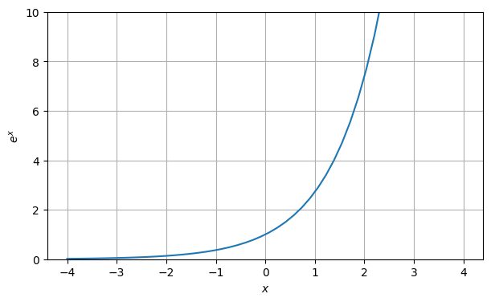
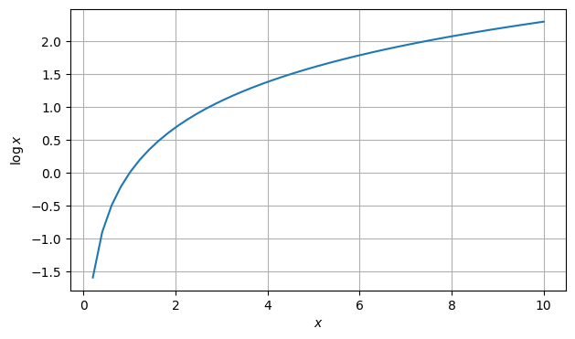

# [Mathematical functions](readme.md)

Defined in header [`numcpp/math.h`](/include/numcpp/math.h)

- [Mathematical functions](#mathematical-functions)
  - [Exponential and logarithmic functions](#exponential-and-logarithmic-functions)
    - [`exp`](#exp)
    - [`log`](#log)
    - [`log10`](#log10)
    - [`exp2`](#exp2)
    - [`log2`](#log2)
    - [`expm1`](#expm1)
    - [`log1p`](#log1p)

## Exponential and logarithmic functions

### `exp`

Return the base- $e$ exponential, which is $e$ raised to the power $x$: $e^x$,element-wise.
```cpp
template <class T, size_t Rank>
tensor<T, Rank> exp(const tensor<T, Rank> &x);
```

Parameters

* `x` A tensor-like object with the values of the exponent.

Returns

* A light-weight object with the exponential of each element in the tensor. This function does not create a new tensor, instead, an expression object is returned (see [lazy-evaluation](/doc/Tensor%20class/Tensor/Operators.md)).

Example

```cpp
#include <iostream>
#include "numcpp/tensor.h"
#include "numcpp/math.h"
#include "numcpp/routines.h" // np::linspace
#include "numcpp/io.h"
namespace np = numcpp;
int main() {
    np::vector<double> x = np::linspace(-4., 4.);
    np::vector<double> y = np::exp(x);
    std::cout << "x:\n" << x << "\n";
    std::cout << "exp(x):\n" << y << "\n";
    return 0;
}
```

Output

```
x:
[          -4,   -3.8367347,   -3.6734694,   -3.5102041,   -3.3469388, 
   -3.1836735,   -3.0204082,   -2.8571429,   -2.6938776,   -2.5306122, 
   -2.3673469,   -2.2040816,   -2.0408163,    -1.877551,   -1.7142857, 
   -1.5510204,   -1.3877551,   -1.2244898,   -1.0612245,  -0.89795918, 
  -0.73469388,  -0.57142857,  -0.40816327,  -0.24489796, -0.081632653, 
  0.081632653,   0.24489796,   0.40816327,   0.57142857,   0.73469388, 
   0.89795918,    1.0612245,    1.2244898,    1.3877551,    1.5510204, 
    1.7142857,     1.877551,    2.0408163,    2.2040816,    2.3673469, 
    2.5306122,    2.6938776,    2.8571429,    3.0204082,    3.1836735, 
    3.3469388,    3.5102041,    3.6734694,    3.8367347,            4]
exp(x):
[0.018315639, 0.021563899, 0.025388235, 0.029890814,  0.03519192, 0.041433172, 
 0.048781304, 0.057432619, 0.067618237, 0.079610264, 0.093729066,  0.11035182, 
  0.12992261,  0.15296425,  0.18009231,   0.2120315,  0.24963508,  0.29390761, 
  0.34603184,  0.40740024,  0.47965227,  0.56471812,  0.66487032,  0.78278441, 
  0.92161045,   1.0850571,    1.277491,   1.5040527,    1.770795,   2.0848437, 
   2.4545886,   2.8899075,   3.4024297,   4.0058472,   4.7162803,   5.5527079, 
   6.5374751,   7.6968898,   9.0619256,   10.669049,   12.561194,    14.78891, 
   17.411708,   20.499657,   24.135251,   28.415614,   33.455095,   39.388322, 
   46.373802,    54.59815]
```



### `log`

Return the natural logarithm, which is the inverse of the exponential function (exp), element-wise.
```cpp
template <class T, size_t Rank>
tensor<T, Rank> log(const tensor<T, Rank> &x);
```

Parameters

* `x` A tensor-like object with the values whose logarithm is computed.

Returns

* A light weight-object with the natural logarithm of each element in the tensor. This function does not create a new tensor, instead, an expression object is returned (see [lazy-evaluation](/doc/Tensor%20class/Tensor/Operators.md)).

Example

```cpp
#include <iostream>
#include "numcpp/tensor.h"
#include "numcpp/math.h"
#include "numcpp/routines.h" // np::linspace
#include "numcpp/io.h"
namespace np = numcpp;
int main() {
    np::vector<double> x = np::linspace(0., 10.);;
    np::vector<double> y = np::log(x);
    std::cout << "x:\n" << x << "\n";
    std::cout << "log(x):\n" << y << "\n";
    return 0;
}
```

Output

```
x:
[         0, 0.20408163, 0.40816327,  0.6122449, 0.81632653,  1.0204082, 
  1.2244898,  1.4285714,  1.6326531,  1.8367347,  2.0408163,   2.244898, 
  2.4489796,  2.6530612,  2.8571429,  3.0612245,  3.2653061,  3.4693878, 
  3.6734694,   3.877551,  4.0816327,  4.2857143,  4.4897959,  4.6938776, 
  4.8979592,  5.1020408,  5.3061224,  5.5102041,  5.7142857,  5.9183673, 
   6.122449,  6.3265306,  6.5306122,  6.7346939,  6.9387755,  7.1428571, 
  7.3469388,  7.5510204,   7.755102,  7.9591837,  8.1632653,  8.3673469, 
  8.5714286,  8.7755102,  8.9795918,  9.1836735,  9.3877551,  9.5918367, 
  9.7959184,         10]
log(x):
[       -inf,  -1.5892352, -0.89608802, -0.49062292, -0.20294084, 0.020202707, 
  0.20252426,  0.35667494,  0.49020634,  0.60798937,  0.71334989,  0.80866007, 
  0.89567144,  0.97571415,   1.0498221,    1.118815,   1.1833535,   1.2439781, 
   1.3011366,   1.3552038,   1.4064971,   1.4552872,   1.5018072,    1.546259, 
   1.5888186,   1.6296406,   1.6688613,   1.7066017,   1.7429693,   1.7780606, 
   1.8119622,    1.844752,   1.8765007,   1.9072724,   1.9371253,   1.9661129, 
   1.9942837,   2.0216827,    2.048351,   2.0743264,   2.0996442,   2.1243369, 
   2.1484344,   2.1719649,   2.1949544,   2.2174273,   2.2394062,   2.2609124, 
   2.2819658,   2.3025851]
```



### `log10`

Return the common (base-10) logarithm, element-wise.
```cpp
template <class T, size_t Rank>
tensor<T, Rank> log10(const tensor<T, Rank> &x);
```

Parameters

* `x` A tensor-like object with the values whose logarithm is computed.

Returns

* A light-weight object with the common logarithm of each element in the tensor. This function does not create a new tensor, instead, an expression object is returned (see [lazy-evaluation](/doc/Tensor%20class/Tensor/Operators.md)).

Example

```cpp
#include <iostream>
#include "numcpp/tensor.h"
#include "numcpp/math.h"
#include "numcpp/io.h"
namespace np = numcpp;
int main() {
    np::vector<double> x;
    std::cin >> x;
    std::cout << np::log10(x) << "\n";
    return 0;
}
```

Input

```
[0.001, 0.01, 0.1, 1, 10, 100, 1000, 10000, 100000, 1000000]
```

Output

```
[-3, -2, -1,  0,  1,  2,  3,  4,  5,  6]
```

### `exp2`

Return the base-2 exponential, which is 2 raised to the power $x$: $2^x$, element-wise.
```cpp
template <class T, size_t Rank>
tensor<T, Rank> exp2(const tensor<T, Rank> &x);
```

Parameters

* `x` A tensor-like object with the values of the exponent.

Returns

* A light-weight object with the base-2 exponential of each element in the tensor. This function does not create a new tensor, instead, an  expression object is returned (see [lazy-evaluation](/doc/Tensor%20class/Tensor/Operators.md)).

Example

```cpp
#include <iostream>
#include "numcpp/tensor.h"
#include "numcpp/math.h"
#include "numcpp/io.h"
namespace np = numcpp;
int main() {
    np::vector<double> x;
    std::cin >> x;
    std::cout << np::exp2(x) << "\n";
    return 0;
}
```

Input

```
[-3, -2, -1,  0,  1,  2,  3,  4,  5,  6]
```

Output

```
[0.125,  0.25,   0.5,     1,     2,     4,     8,    16,    32,    64]
```

### `log2`

Return the binary (base-2) logarithm, element-wise.
```cpp
template <class T, size_t Rank>
tensor<T, Rank> log2(const tensor<T, Rank> &x);
```

Parameters

* `x` A tensor-like object with the values whose logarithm is computed.

Returns

* A light-weight object with the binary logarithm of each element in the tensor. This function does not create a new tensor, instead, an expression object is returned (see [lazy-evaluation](/doc/Tensor%20class/Tensor/Operators.md)).

Example

```cpp
#include <iostream>
#include "numcpp/tensor.h"
#include "numcpp/math.h"
#include "numcpp/io.h"
namespace np = numcpp;
int main() {
    np::vector<double> x;
    std::cin >> x;
    std::cout << np::log2(x) << "\n";
    return 0;
}
```

Input

```
[0.125, 0.25, 0.5, 1, 2, 4, 8, 16, 32, 64]
```

Output

```
[-3, -2, -1,  0,  1,  2,  3,  4,  5,  6]
```

### `expm1`

Return $e$ raised to the power $x$ minus one: $e^x - 1$, element-wise. For
values of $x$ close to zero, `expm1` is more accurate than `exp(x) - 1`.
```cpp
template <class T, size_t Rank>
tensor<T, Rank> expm1(const tensor<T, Rank> &x);
```

Parameters

* `x` A tensor-like object with the values of the exponent.

Returns

* A light-weight object with the exponential minus one of each element in the tensor. This function does not create a new tensor, instead, an expression object is returned (see [lazy-evaluation](/doc/Tensor%20class/Tensor/Operators.md)).

Example

```cpp
#include <iostream>
#include "numcpp/tensor.h"
#include "numcpp/math.h"
#include "numcpp/routines.h" // np::allclose
#include "numcpp/io.h"
namespace np = numcpp;
int main() {
    np::vector<double> x = np::linspace(-1., 1.);
    std::cout << std::boolalpha;
    std::cout << np::allclose(np::exp(x) - 1, np::expm1(x)) << "\n";
    return 0;
}
```

Output

```
true
```

### `log1p`

Return the natural logarithm of one plus $x$, element-wise. For values of $x$ close to zero, `log1p` is more accurate than `log(1 + x)`.
```cpp
template <class T, size_t Rank>
tensor<T, Rank> log1p(const tensor<T, Rank> &x);
```

Parameters

* `x` A tensor-like object with the values whose logarithm is computed.

Returns

* A light-weight object with the natural logarithm of $(1 + x)$ for each element in the tensor. This function does not create a new tensor, instead, an expression object is returned (see [lazy-evaluation](/doc/Tensor%20class/Tensor/Operators.md)).

Example

```cpp
#include <iostream>
#include "numcpp/tensor.h"
#include "numcpp/math.h"
#include "numcpp/routines.h" // np::allclose
#include "numcpp/io.h"
namespace np = numcpp;
int main() {
    np::vector<double> x = np::linspace(0., 1.);
    std::cout << std::boolalpha;
    std::cout << np::allclose(np::log(1 + x), np::log1p(x)) << "\n";
    return 0;
}
```

Output

```
true
```
