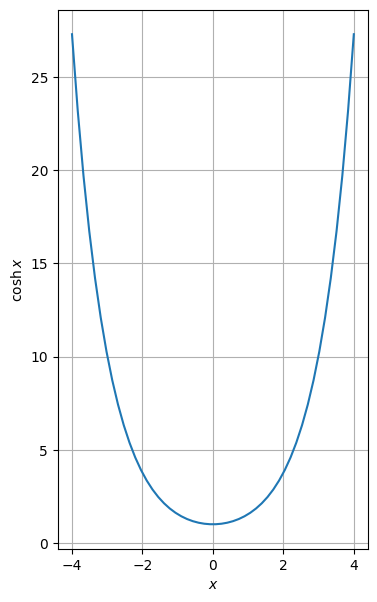
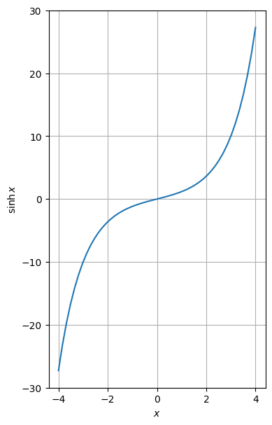
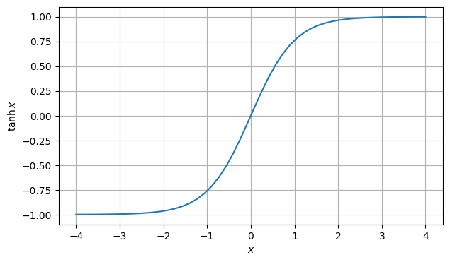
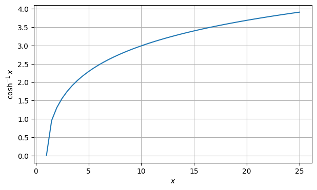
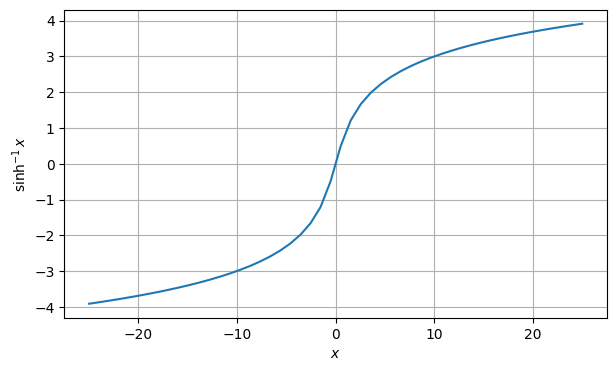
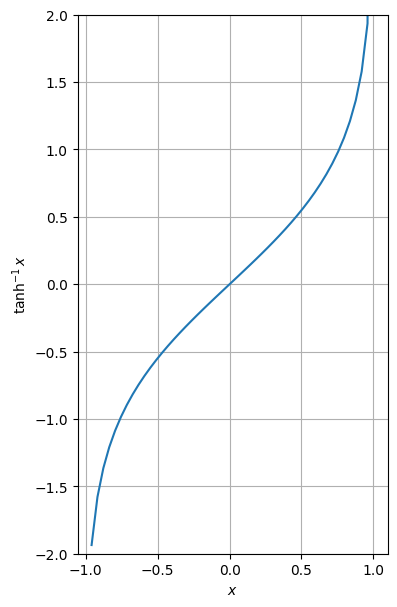

# [Mathematical functions](readme.md)

Defined in header [`numcpp/math.h`](/include/numcpp/math.h)

- [Mathematical functions](#mathematical-functions)
  - [Hyperbolic functions](#hyperbolic-functions)
    - [`cosh`](#cosh)
    - [`sinh`](#sinh)
    - [`tanh`](#tanh)
    - [`acosh`](#acosh)
    - [`asinh`](#asinh)
    - [`atanh`](#atanh)

## Hyperbolic functions

### `cosh`

Return the hyperbolic cosine, element-wise.
```cpp
template <class T, size_t Rank>
tensor<T, Rank> cosh(const tensor<T, Rank> &x);
```

Parameters

* `x` A tensor-like object with the hyperbolic angles.

Returns

* A light-weight object with the hyperbolic cosine of each element in the tensor. This function does not create a new tensor, instead, an expression object is returned (see [lazy-evaluation](/doc/Tensor%20class/Tensor/Operators.md)).

Example

```cpp
#include <iostream>
#include "numcpp/tensor.h"
#include "numcpp/math.h"
#include "numcpp/routines.h" // np::linspace
#include "numcpp/io.h"
namespace np = numcpp;
int main() {
    np::vector<double> x = np::linspace(-4., 4.);
    np::vector<double> y = np::cosh(x);
    std::cout << "x:\n" << x << "\n";
    std::cout << "cosh(x):\n" << y << "\n";
    return 0;
}
```

Output

```
x:
[          -4,   -3.8367347,   -3.6734694,   -3.5102041,   -3.3469388, 
   -3.1836735,   -3.0204082,   -2.8571429,   -2.6938776,   -2.5306122, 
   -2.3673469,   -2.2040816,   -2.0408163,    -1.877551,   -1.7142857, 
   -1.5510204,   -1.3877551,   -1.2244898,   -1.0612245,  -0.89795918, 
  -0.73469388,  -0.57142857,  -0.40816327,  -0.24489796, -0.081632653, 
  0.081632653,   0.24489796,   0.40816327,   0.57142857,   0.73469388, 
   0.89795918,    1.0612245,    1.2244898,    1.3877551,    1.5510204, 
    1.7142857,     1.877551,    2.0408163,    2.2040816,    2.3673469, 
    2.5306122,    2.6938776,    2.8571429,    3.0204082,    3.1836735, 
    3.3469388,    3.5102041,    3.6734694,    3.8367347,            4]
cosh(x):
[27.308233, 23.197683, 19.706855, 16.742493, 14.225403, 12.088342, 10.274219, 
 8.7345703, 7.4282639, 6.3204023, 5.3813891, 4.5861387, 3.9134062, 3.3452197, 
 2.8664001, 2.4641559, 2.1277412, 1.8481687, 1.6179697, 1.4309944,  1.282248, 
 1.1677565, 1.0844615, 1.0301377, 1.0033338, 1.0033338, 1.0301377, 1.0844615, 
 1.1677565,  1.282248, 1.4309944, 1.6179697, 1.8481687, 2.1277412, 2.4641559, 
 2.8664001, 3.3452197, 3.9134062, 4.5861387, 5.3813891, 6.3204023, 7.4282639, 
 8.7345703, 10.274219, 12.088342, 14.225403, 16.742493, 19.706855, 23.197683, 
 27.308233]
```



### `sinh`

Return the hyperbolic sine, element-wise.
```cpp
template <class T, size_t Rank>
tensor<T, Rank> sinh(const tensor<T, Rank> &x);
```

Parameters

* `x` A tensor-like object with the hyperbolic angles.

Returns

* A light-weight object with the hyperbolic sine of each element in the tensor. This function does not create a new tensor, instead, an expression object is returned (see [lazy-evaluation](/doc/Tensor%20class/Tensor/Operators.md)).

Example

```cpp
#include <iostream>
#include "numcpp/tensor.h"
#include "numcpp/math.h"
#include "numcpp/routines.h" // np::linspace
#include "numcpp/io.h"
namespace np = numcpp;
int main() {
    np::vector<double> x = np::linspace(-4., 4.);
    np::vector<double> y = np::sinh(x);
    std::cout << "x:\n" << x << "\n";
    std::cout << "sinh(x):\n" << y << "\n";
    return 0;
}
```

Output

```
x:
[          -4,   -3.8367347,   -3.6734694,   -3.5102041,   -3.3469388, 
   -3.1836735,   -3.0204082,   -2.8571429,   -2.6938776,   -2.5306122, 
   -2.3673469,   -2.2040816,   -2.0408163,    -1.877551,   -1.7142857, 
   -1.5510204,   -1.3877551,   -1.2244898,   -1.0612245,  -0.89795918, 
  -0.73469388,  -0.57142857,  -0.40816327,  -0.24489796, -0.081632653, 
  0.081632653,   0.24489796,   0.40816327,   0.57142857,   0.73469388, 
   0.89795918,    1.0612245,    1.2244898,    1.3877551,    1.5510204, 
    1.7142857,     1.877551,    2.0408163,    2.2040816,    2.3673469, 
    2.5306122,    2.6938776,    2.8571429,    3.0204082,    3.1836735, 
    3.3469388,    3.5102041,    3.6734694,    3.8367347,            4]
sinh(x):
[  -27.289917,   -23.176119,   -19.681467,   -16.712602,   -14.190211, 
   -12.046909,   -10.225438,   -8.6771377,   -7.3606457,    -6.240792, 
     -5.28766,   -4.4757869,   -3.7834836,   -3.1922554,   -2.6863078, 
   -2.2521244,   -1.8781061,    -1.554261,   -1.2719378,   -1.0235942, 
   -0.8025957,  -0.60303842,  -0.41959119,  -0.24735327, -0.081723348, 
  0.081723348,   0.24735327,   0.41959119,   0.60303842,    0.8025957, 
    1.0235942,    1.2719378,     1.554261,    1.8781061,    2.2521244, 
    2.6863078,    3.1922554,    3.7834836,    4.4757869,      5.28766, 
     6.240792,    7.3606457,    8.6771377,    10.225438,    12.046909, 
    14.190211,    16.712602,    19.681467,    23.176119,    27.289917]
```



### `tanh`

Return the hyperbolic tangent, element-wise.
```cpp
template <class T, size_t Rank>
tensor<T, Rank> tanh(const tensor<T, Rank> &x);
```

Parameters

* `x` A tensor-like object with the hyperbolic angles.

Returns

* A light-weight object with the hyperbolic tangent of each element in the tensor. This function does not create a new tensor, instead, an expression object is returned (see [lazy-evaluation](/doc/Tensor%20class/Tensor/Operators.md)).

Example

```cpp
#include <iostream>
#include "numcpp/tensor.h"
#include "numcpp/math.h"
#include "numcpp/routines.h" // np::linspace
#include "numcpp/io.h"
namespace np = numcpp;
int main() {
    np::vector<double> x = np::linspace(-4., 4.);
    np::vector<double> y = np::tanh(x);
    std::cout << "x:\n" << x << "\n";
    std::cout << "tanh(x):\n" << y << "\n";
    return 0;
}
```

Output

```
x:
[          -4,   -3.8367347,   -3.6734694,   -3.5102041,   -3.3469388, 
   -3.1836735,   -3.0204082,   -2.8571429,   -2.6938776,   -2.5306122, 
   -2.3673469,   -2.2040816,   -2.0408163,    -1.877551,   -1.7142857, 
   -1.5510204,   -1.3877551,   -1.2244898,   -1.0612245,  -0.89795918, 
  -0.73469388,  -0.57142857,  -0.40816327,  -0.24489796, -0.081632653, 
  0.081632653,   0.24489796,   0.40816327,   0.57142857,   0.73469388, 
   0.89795918,    1.0612245,    1.2244898,    1.3877551,    1.5510204, 
    1.7142857,     1.877551,    2.0408163,    2.2040816,    2.3673469, 
    2.5306122,    2.6938776,    2.8571429,    3.0204082,    3.1836735, 
    3.3469388,    3.5102041,    3.6734694,    3.8367347,            4]
tanh(x):
[  -0.9993293,  -0.99907043,  -0.99871171,  -0.99821467,  -0.99752612, 
  -0.99657247,  -0.99525207,  -0.99342468,  -0.99089717,  -0.98740424, 
  -0.98258274,  -0.97593797,  -0.96680063,  -0.95427378,  -0.93717126, 
   -0.9139537,  -0.88267601,   -0.8409736,  -0.78613206,  -0.71530271, 
  -0.62592862,  -0.51640766,  -0.38691202,  -0.24011671, -0.081451805, 
  0.081451805,   0.24011671,   0.38691202,   0.51640766,   0.62592862, 
   0.71530271,   0.78613206,    0.8409736,   0.88267601,    0.9139537, 
   0.93717126,   0.95427378,   0.96680063,   0.97593797,   0.98258274, 
   0.98740424,   0.99089717,   0.99342468,   0.99525207,   0.99657247, 
   0.99752612,   0.99821467,   0.99871171,   0.99907043,    0.9993293]
```



### `acosh`

Return the inverse hyperbolic cosine, element-wise.
```cpp
template <class T, size_t Rank>
tensor<T, Rank> acosh(const tensor<T, Rank> &x);
```

Parameters

* `x` A tensor-like object with the values whose inverse hyperbolic cosine is computed.

Returns

* A light-weight object with the inverse hyperbolic cosine of each element in the tensor. This function does not create a new tensor, instead, an expression object is returned (see [lazy-evaluation](/doc/Tensor%20class/Tensor/Operators.md)).

Example

```cpp
#include <iostream>
#include "numcpp/tensor.h"
#include "numcpp/math.h"
#include "numcpp/routines.h" // np::linspace
#include "numcpp/io.h"
namespace np = numcpp;
int main() {
    np::vector<double> x = np::linspace(1., 25.);
    np::vector<double> y = np::acosh(x);
    std::cout << "x:\n" << x << "\n";
    std::cout << "acosh(x):\n" << y << "\n";
    return 0;
}
```

Output

```
x:
[        1, 1.4897959, 1.9795918, 2.4693878, 2.9591837, 3.4489796, 3.9387755, 
 4.4285714, 4.9183673, 5.4081633, 5.8979592, 6.3877551,  6.877551, 7.3673469, 
 7.8571429, 8.3469388, 8.8367347, 9.3265306, 9.8163265, 10.306122, 10.795918, 
 11.285714,  11.77551, 12.265306, 12.755102, 13.244898, 13.734694,  14.22449, 
 14.714286, 15.204082, 15.693878, 16.183673, 16.673469, 17.163265, 17.653061, 
 18.142857, 18.632653, 19.122449, 19.612245, 20.102041, 20.591837, 21.081633, 
 21.571429, 22.061224,  22.55102, 23.040816, 23.530612, 24.020408, 24.510204, 
        25]
acosh(x):
[        0, 0.9532404, 1.3050943, 1.5533405, 1.7482048, 1.9095139, 2.0474985, 
 2.1682262, 2.2756251, 2.3723975,  2.460488,  2.541346, 2.6160821, 2.6855668, 
 2.7504958, 2.8114343, 2.8688476, 2.9231237, 2.9745896, 3.0235233, 3.0701634, 
 3.1147163, 3.1573613, 3.1982558, 3.2375383, 3.2753315, 3.3117443, 3.3468744, 
 3.3808093, 3.4136279, 3.4454013, 3.4761942, 3.5060655, 3.5350688, 3.5632532, 
 3.5906637, 3.6173419, 3.6433258, 3.6686507, 3.6933493, 3.7174518, 3.7409864, 
 3.7639792, 3.7864546, 3.8084355, 3.8299432, 3.8509976, 3.8716174, 3.8918203, 
 3.9116228]
```



### `asinh`

Return the inverse hyperbolic sine, element-wise.
```cpp
template <class T, size_t Rank>
tensor<T, Rank> asinh(const tensor<T, Rank> &x);
```

Parameters

* `x` A tensor-like object with the values whose inverse hyperbolic sine is computed.

Returns

* A light-weight object with the inverse hyperbolic sine of each element in the tensor.This function does not create a new tensor, instead, an expression object is returned (see [lazy-evaluation](/doc/Tensor%20class/Tensor/Operators.md)).

Example

```cpp
#include <iostream>
#include "numcpp/tensor.h"
#include "numcpp/math.h"
#include "numcpp/routines.h" // np::linspace
#include "numcpp/io.h"
namespace np = numcpp;
int main() {
    np::vector<double> x = np::linspace(-25., 25.);
    np::vector<double> y = np::asinh(x);
    std::cout << "x:\n" << x << "\n";
    std::cout << "asinh(x):\n" << y << "\n";
    return 0;
}
```

Output

```
x:
[        -25,  -23.979592,  -22.959184,  -21.938776,  -20.918367,  -19.897959, 
  -18.877551,  -17.857143,  -16.836735,  -15.816327,  -14.795918,   -13.77551, 
  -12.755102,  -11.734694,  -10.714286,  -9.6938776,  -8.6734694,  -7.6530612, 
  -6.6326531,  -5.6122449,  -4.5918367,  -3.5714286,  -2.5510204,  -1.5306122, 
 -0.51020408,  0.51020408,   1.5306122,   2.5510204,   3.5714286,   4.5918367, 
   5.6122449,   6.6326531,   7.6530612,   8.6734694,   9.6938776,   10.714286, 
   11.734694,   12.755102,    13.77551,   14.795918,   15.816327,   16.836735, 
   17.857143,   18.877551,   19.897959,   20.918367,   21.938776,   22.959184, 
   23.979592,          25]
asinh(x):
[ -3.9124228,  -3.8707848,  -3.8273391,  -3.7819218,  -3.7343456,  -3.6843952, 
  -3.6318214,  -3.5763338,   -3.517591,  -3.4551878,  -3.3886386,  -3.3173544, 
  -3.2406116,  -3.1575075,  -3.0668958,  -2.9672915,  -2.8567228,  -2.7324943, 
  -2.5907871,  -2.4259423,  -2.2290786,  -1.9851605,  -1.6660147,  -1.2116248, 
 -0.49031996,  0.49031996,   1.2116248,   1.6660147,   1.9851605,   2.2290786, 
   2.4259423,   2.5907871,   2.7324943,   2.8567228,   2.9672915,   3.0668958, 
   3.1575075,   3.2406116,   3.3173544,   3.3886386,   3.4551878,    3.517591, 
   3.5763338,   3.6318214,   3.6843952,   3.7343456,   3.7819218,   3.8273391, 
   3.8707848,   3.9124228]
```



### `atanh`

Return the inverse hyperbolic tangent, element-wise.
```cpp
template <class T, size_t Rank>
tensor<T, Rank> atanh(const tensor<T, Rank> &x);
```

Parameters

* `x` A tensor-like object with the values whose inverse hyperbolic tangent is computed.

Returns

* A light-weight object with the inverse hyperbolic tangent of each element in the tensor. This function does not create a new tensor, instead, an expression object is returned (see [lazy-evaluation](/doc/Tensor%20class/Tensor/Operators.md)).

Example

```cpp
#include <iostream>
#include "numcpp/tensor.h"
#include "numcpp/math.h"
#include "numcpp/routines.h" // np::linspace
#include "numcpp/io.h"
namespace np = numcpp;
int main() {
    np::vector<double> x = np::linspace(-1., 1.);
    np::vector<double> y = np::atanh(x);
    std::cout << "x:\n" << x << "\n";
    std::cout << "atanh(x):\n" << y << "\n";
    return 0;
}
```

Output

```
x:
[          -1,  -0.95918367,  -0.91836735,  -0.87755102,  -0.83673469, 
  -0.79591837,  -0.75510204,  -0.71428571,  -0.67346939,  -0.63265306, 
  -0.59183673,  -0.55102041,  -0.51020408,  -0.46938776,  -0.42857143, 
   -0.3877551,  -0.34693878,  -0.30612245,  -0.26530612,   -0.2244898, 
  -0.18367347,  -0.14285714,  -0.10204082,  -0.06122449, -0.020408163, 
  0.020408163,   0.06122449,   0.10204082,   0.14285714,   0.18367347, 
    0.2244898,   0.26530612,   0.30612245,   0.34693878,    0.3877551, 
   0.42857143,   0.46938776,   0.51020408,   0.55102041,   0.59183673, 
   0.63265306,   0.67346939,   0.71428571,   0.75510204,   0.79591837, 
   0.83673469,   0.87755102,   0.91836735,   0.95918367,            1]
atanh(x):
[        -inf,   -1.9356005,   -1.5785002,   -1.3650146,   -1.2101841, 
   -1.0873759,  -0.98472032,  -0.89587973,  -0.81706526,  -0.74582744, 
  -0.68048828,  -0.61984544,  -0.56300563,  -0.50928479,  -0.45814537, 
  -0.40915516,  -0.36195942,  -0.31626128,  -0.27180772,   -0.2283792, 
  -0.18578178,  -0.14384104,  -0.10239721, -0.061301161, -0.020410997, 
  0.020410997,  0.061301161,   0.10239721,   0.14384104,   0.18578178, 
    0.2283792,   0.27180772,   0.31626128,   0.36195942,   0.40915516, 
   0.45814537,   0.50928479,   0.56300563,   0.61984544,   0.68048828, 
   0.74582744,   0.81706526,   0.89587973,   0.98472032,    1.0873759, 
    1.2101841,    1.3650146,    1.5785002,    1.9356005,      18.3684]
```


