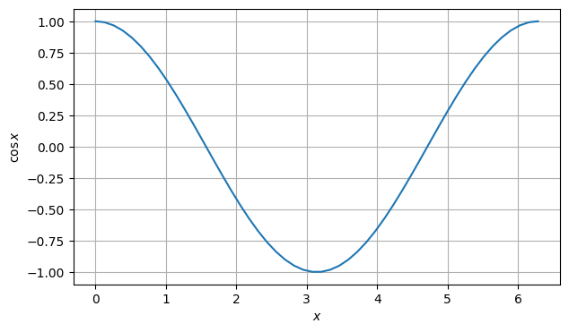
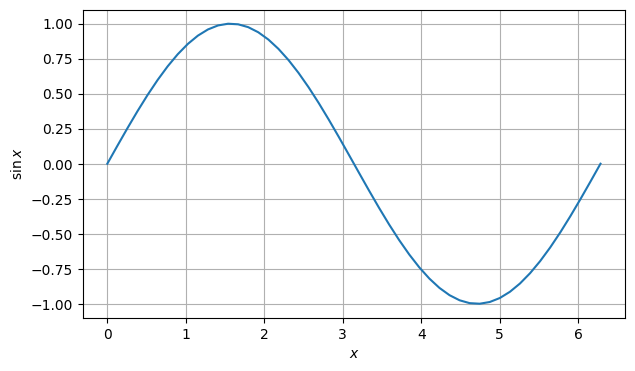
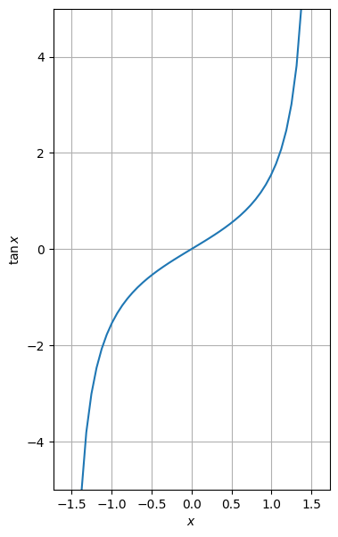
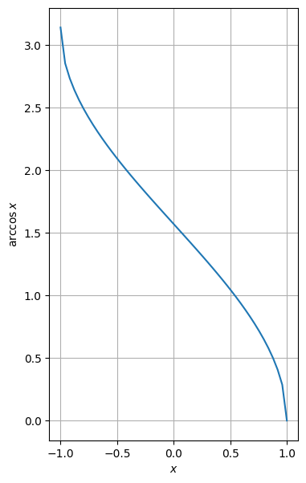
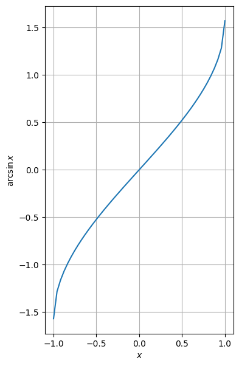
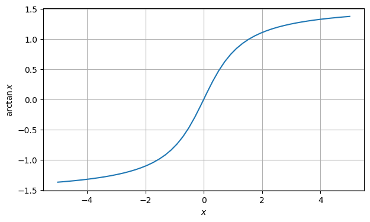

# [Mathematical functions](readme.md)

Defined in header [`numcpp/math.h`](/include/numcpp/math.h)

- [Mathematical functions](#mathematical-functions)
  - [Trigonometric functions](#trigonometric-functions)
    - [`cos`](#cos)
    - [`sin`](#sin)
    - [`tan`](#tan)
    - [`hypot`](#hypot)
    - [`acos`](#acos)
    - [`asin`](#asin)
    - [`atan`](#atan)
    - [`atan2`](#atan2)
    - [`degrees`](#degrees)
    - [`radians`](#radians)

## Trigonometric functions

### `cos`

Return the cosine, element-wise.
```cpp
template <class T, size_t Rank>
tensor<T, Rank> cos(const tensor<T, Rank> &x);
```

Parameters

* `x` A tensor-like object with the angles in radians.

Returns

* A light-weight object with the cosine of each element in the tensor. This function does not create a new tensor, instead, an expression object is returned (see [lazy-evaluation](/doc/Tensor%20class/Tensor/Operators.md)).

Example

```cpp
#include <iostream>
#include "numcpp/tensor.h"
#include "numcpp/math.h"
#include "numcpp/routines.h" // np::linspace
#include "numcpp/io.h"
namespace np = numcpp;
int main() {
    const double pi = np::constants<double>::pi;
    np::vector<double> x = np::linspace(0, 2*pi);
    np::vector<double> y = np::cos(x);
    std::cout << "x:\n" << x << "\n";
    std::cout << "cos(x):\n" << y << "\n";
    return 0;
}
```

Output

```
x:
[         0, 0.12822827, 0.25645654, 0.38468481, 0.51291309, 0.64114136, 
 0.76936963,  0.8975979,  1.0258262,  1.1540544,  1.2822827,   1.410511, 
  1.5387393,  1.6669675,  1.7951958,  1.9234241,  2.0516523,  2.1798806, 
  2.3081089,  2.4363372,  2.5645654,  2.6927937,   2.821022,  2.9492502, 
  3.0774785,  3.2057068,  3.3339351,  3.4621633,  3.5903916,  3.7186199, 
  3.8468481,  3.9750764,  4.1033047,   4.231533,  4.3597612,  4.4879895, 
  4.6162178,   4.744446,  4.8726743,  5.0009026,  5.1291309,  5.2573591, 
  5.3855874,  5.5138157,  5.6420439,  5.7702722,  5.8985005,  6.0267288, 
   6.154957,  6.2831853]
cos(x):
[           1,   0.99179001,   0.96729486,   0.92691676,    0.8713187, 
   0.80141362,   0.71834935,    0.6234898,   0.51839257,   0.40478334, 
   0.28452759,    0.1595999,  0.032051578, -0.096023026,  -0.22252093, 
  -0.34536505,  -0.46253829,  -0.57211666,  -0.67230089,  -0.76144596, 
   -0.8380881,  -0.90096887,  -0.94905575,  -0.98155916,  -0.99794539, 
  -0.99794539,  -0.98155916,  -0.94905575,  -0.90096887,   -0.8380881, 
  -0.76144596,  -0.67230089,  -0.57211666,  -0.46253829,  -0.34536505, 
  -0.22252093, -0.096023026,  0.032051578,    0.1595999,   0.28452759, 
   0.40478334,   0.51839257,    0.6234898,   0.71834935,   0.80141362, 
    0.8713187,   0.92691676,   0.96729486,   0.99179001,            1]
```



### `sin`

Return the sine, element-wise.
```cpp
template <class T, size_t Rank>
tensor<T, Rank> sin(const tensor<T, Rank> &x);
```

Parameters

* `x` A tensor-like object with the angles in radians.

Returns

* A light-weight object with the sine of each element in the tensor. This function does not create a new tensor, instead, an expression object is returned (see [lazy-evaluation](/doc/Tensor%20class/Tensor/Operators.md)).

Example

```cpp
#include <iostream>
#include "numcpp/tensor.h"
#include "numcpp/math.h"
#include "numcpp/routines.h" // np::linspace
#include "numcpp/io.h"
namespace np = numcpp;
int main() {
    const double pi = np::constants<double>::pi;
    np::vector<double> x = np::linspace(0, 2*pi);
    np::vector<double> y = np::sin(x);
    std::cout << "x:\n" << x << "\n";
    std::cout << "sin(x):\n" << y << "\n";
    return 0;
}
```

Output

```
x:
[         0, 0.12822827, 0.25645654, 0.38468481, 0.51291309, 0.64114136, 
 0.76936963,  0.8975979,  1.0258262,  1.1540544,  1.2822827,   1.410511, 
  1.5387393,  1.6669675,  1.7951958,  1.9234241,  2.0516523,  2.1798806, 
  2.3081089,  2.4363372,  2.5645654,  2.6927937,   2.821022,  2.9492502, 
  3.0774785,  3.2057068,  3.3339351,  3.4621633,  3.5903916,  3.7186199, 
  3.8468481,  3.9750764,  4.1033047,   4.231533,  4.3597612,  4.4879895, 
  4.6162178,   4.744446,  4.8726743,  5.0009026,  5.1291309,  5.2573591, 
  5.3855874,  5.5138157,  5.6420439,  5.7702722,  5.8985005,  6.0267288, 
   6.154957,  6.2831853]
sin(x):
[             0,     0.12787716,     0.25365458,       0.375267,     0.49071755, 
     0.59811053,     0.69568255,     0.78183148,     0.85514276,     0.91441262, 
     0.95866785,     0.98718178,     0.99948622,     0.99537911,     0.97492791, 
     0.93846842,     0.88659931,     0.82017225,       0.740278,      0.6482284, 
      0.5455349,     0.43388374,     0.31510822,     0.19115863,     0.06407022, 
    -0.06407022,    -0.19115863,    -0.31510822,    -0.43388374,     -0.5455349, 
     -0.6482284,      -0.740278,    -0.82017225,    -0.88659931,    -0.93846842, 
    -0.97492791,    -0.99537911,    -0.99948622,    -0.98718178,    -0.95866785, 
    -0.91441262,    -0.85514276,    -0.78183148,    -0.69568255,    -0.59811053, 
    -0.49071755,      -0.375267,    -0.25365458,    -0.12787716, -2.4492936e-16]
```



### `tan`

Return the tangent, element-wise.
```cpp
template <class T, size_t Rank>
tensor<T, Rank> tan(const tensor<T, Rank> &x);
```

Parameters

* `x` A tensor-like object with the angles in radians.

Returns

* A light-weight object with the tangent of each element in the tensor. This function does not create a new tensor, instead, an expression object is returned (see [lazy-evaluation](/doc/Tensor%20class/Tensor/Operators.md)).

Example

```cpp
#include <iostream>
#include "numcpp/tensor.h"
#include "numcpp/math.h"
#include "numcpp/routines.h" // np::linspace
#include "numcpp/io.h"
namespace np = numcpp;
int main() {
    const double pi = np::constants<double>::pi;
    np::vector<double> x = np::linspace(-pi/2, pi/2);
    np::vector<double> y = np::tan(x);
    std::cout << "x:\n" << x << "\n";
    std::cout << "tan(x):\n" << y << "\n";
    return 0;
}
```

Output

```
x:
[  -1.5707963,   -1.5066822,   -1.4425681,   -1.3784539,   -1.3143398, 
   -1.2502256,   -1.1861115,   -1.1219974,   -1.0578832,   -0.9937691, 
  -0.92965497,  -0.86554083,   -0.8014267,  -0.73731256,  -0.67319843, 
  -0.60908429,  -0.54497015,  -0.48085602,  -0.41674188,  -0.35262775, 
  -0.28851361,  -0.22439948,  -0.16028534, -0.096171204, -0.032057068, 
  0.032057068,  0.096171204,   0.16028534,   0.22439948,   0.28851361, 
   0.35262775,   0.41674188,   0.48085602,   0.54497015,   0.60908429, 
   0.67319843,   0.73731256,    0.8014267,   0.86554083,   0.92965497, 
    0.9937691,    1.0578832,    1.1219974,    1.1861115,    1.2502256, 
    1.3143398,    1.3784539,    1.4425681,    1.5066822,    1.5707963]
tan(x):
[-1.6331239e+16,     -15.575807,     -7.7558025,     -5.1347886,     -3.8134334, 
     -3.0118407,     -2.4700193,     -2.0765214,     -1.7756013,     -1.5362685, 
     -1.3399089,     -1.1746569,     -1.0325821,    -0.90817354,    -0.79747339, 
    -0.69755671,    -0.60620588,    -0.52169936,    -0.44267034,    -0.36800924, 
    -0.29679475,    -0.22824347,    -0.16167224,   -0.096468797,   -0.032068054, 
    0.032068054,    0.096468797,     0.16167224,     0.22824347,     0.29679475, 
     0.36800924,     0.44267034,     0.52169936,     0.60620588,     0.69755671, 
     0.79747339,     0.90817354,      1.0325821,      1.1746569,      1.3399089, 
      1.5362685,      1.7756013,      2.0765214,      2.4700193,      3.0118407, 
      3.8134334,      5.1347886,      7.7558025,      15.575807,  1.6331239e+16]
```



### `hypot`

Return the hypotenuse of a right-angled triangle whose legs are $x$ and $y$, element-wise.
```cpp
template <class T, size_t Rank>
tensor<T, Rank> hypot(const tensor<T, Rank> &x, const tensor<T, Rank> &y);

template <class T, size_t Rank>
tensor<T, Rank> hypot(const tensor<T, Rank> &x,
                      const typename tensor<T, Rank>::value_type &y);

template <class T, size_t Rank>
tensor<T, Rank> hypot(const typename tensor<T, Rank>::value_type &x,
                      const tensor<T, Rank> &y);
```

Parameters

* `x` A tensor-like object with one of the legs of the right-angle triangles.
* `y` A tensor-like object with one of the legs of the right-angle triangles.

Returns

* A light-weight object with the hypotenuse of the triangles. This function does not create a new tensor, instead, an expression object is returned (see [lazy-evaluation](/doc/Tensor%20class/Tensor/Operators.md)).

Example

```cpp
#include <iostream>
#include "numcpp/tensor.h"
#include "numcpp/math.h"
#include "numcpp/io.h"
namespace np = numcpp;
int main() {
    np::vector<double> x, y;
    std::cin >> x >> y;
    std::cout << np::hypot(x, y) << "\n";
    return 0;
}
```

Input

```
[1, 3,  5,  7,  8,  9, 11, 12]
[1, 4, 12, 24, 15, 40, 60, 35]
```

Output

```
[1.4142136,         5,        13,        25,        17,        41,        61, 
        37]
```

### `acos`

Return the principal value of the arc cosine, element-wise.
```cpp
template <class T, size_t Rank>
tensor<T, Rank> acos(const tensor<T, Rank> &x);
```

Parameters

* `x` A tensor-like object with the values whose arc cosine is computed.

Returns

* A light-weight object with the arc cosine, in radians, of each value in the tensor. This function does not create a new tensor, instead, an expression object is returned (see [lazy-evaluation](/doc/Tensor%20class/Tensor/Operators.md)).

Example

```cpp
#include <iostream>
#include "numcpp/tensor.h"
#include "numcpp/math.h"
#include "numcpp/routines.h" // np::linspace
#include "numcpp/io.h"
namespace np = numcpp;
int main() {
    np::vector<double> x = np::linspace(-1., 1.);
    np::vector<double> y = np::acos(x);
    std::cout << "x:\n" << x << "\n";
    std::cout << "acos(x):\n" << y << "\n";
    return 0;
}
```

Output

```
x:
[          -1,  -0.95918367,  -0.91836735,  -0.87755102,  -0.83673469, 
  -0.79591837,  -0.75510204,  -0.71428571,  -0.67346939,  -0.63265306, 
  -0.59183673,  -0.55102041,  -0.51020408,  -0.46938776,  -0.42857143, 
   -0.3877551,  -0.34693878,  -0.30612245,  -0.26530612,   -0.2244898, 
  -0.18367347,  -0.14285714,  -0.10204082,  -0.06122449, -0.020408163, 
  0.020408163,   0.06122449,   0.10204082,   0.14285714,   0.18367347, 
    0.2244898,   0.26530612,   0.30612245,   0.34693878,    0.3877551, 
   0.42857143,   0.46938776,   0.51020408,   0.55102041,   0.59183673, 
   0.63265306,   0.67346939,   0.71428571,   0.75510204,   0.79591837, 
   0.83673469,   0.87755102,   0.91836735,   0.95918367,            1]
acos(x):
[    3.1415927,     2.8548975,     2.7347312,     2.6415269,     2.5620893, 
     2.4913193,     2.4266061,     2.3663993,     2.3096885,     2.2557706, 
     2.2041319,     2.1543829,     2.1062184,     2.0593936,     2.0137074, 
     1.9689912,     1.9251015,     1.8819136,     1.8393177,     1.7972158, 
     1.7555185,     1.7141439,     1.6730151,     1.6320591,     1.5912059, 
     1.5503867,     1.5095335,     1.4685776,     1.4274488,     1.3860741, 
     1.3443769,     1.3022749,     1.2596791,     1.2164912,     1.1726014, 
     1.1278853,     1.0821991,     1.0353743,    0.98720979,    0.93746072, 
    0.88582209,    0.83190417,    0.77519337,    0.71498658,    0.65027331, 
     0.5795034,    0.50006579,    0.40686148,    0.28669514, 2.1073424e-08]
```



### `asin`

Return the principal value of the arc sine, element-wise.
```cpp
template <class T, size_t Rank>
tensor<T, Rank> asin(const tensor<T, Rank> &x);
```

Parameters

* `x` A tensor-like object with the values whose arc sine is computed.

Returns

* A light-weight object with the arc sine, in radians, of each value in the tensor. This function does not create a new tensor, instead, an expression object is returned (see [lazy-evaluation](/doc/Tensor%20class/Tensor/Operators.md)).

Example

```cpp
#include <iostream>
#include "numcpp/tensor.h"
#include "numcpp/math.h"
#include "numcpp/routines.h" // np::linspace
#include "numcpp/io.h"
namespace np = numcpp;
int main() {
    np::vector<double> x = np::linspace(-1., 1.);
    np::vector<double> y = np::asin(x);
    std::cout << "x:\n" << x << "\n";
    std::cout << "asin(x):\n" << y << "\n";
    return 0;
}
```

Output

```
x:
[          -1,  -0.95918367,  -0.91836735,  -0.87755102,  -0.83673469, 
  -0.79591837,  -0.75510204,  -0.71428571,  -0.67346939,  -0.63265306, 
  -0.59183673,  -0.55102041,  -0.51020408,  -0.46938776,  -0.42857143, 
   -0.3877551,  -0.34693878,  -0.30612245,  -0.26530612,   -0.2244898, 
  -0.18367347,  -0.14285714,  -0.10204082,  -0.06122449, -0.020408163, 
  0.020408163,   0.06122449,   0.10204082,   0.14285714,   0.18367347, 
    0.2244898,   0.26530612,   0.30612245,   0.34693878,    0.3877551, 
   0.42857143,   0.46938776,   0.51020408,   0.55102041,   0.59183673, 
   0.63265306,   0.67346939,   0.71428571,   0.75510204,   0.79591837, 
   0.83673469,   0.87755102,   0.91836735,   0.95918367,            1]
asin(x):
[  -1.5707963,   -1.2841012,   -1.1639348,   -1.0707305,  -0.99129292, 
  -0.92052302,  -0.85580975,  -0.79560295,  -0.73889215,  -0.68497424, 
   -0.6333356,  -0.58358653,  -0.53542206,  -0.48859727,  -0.44291104, 
   -0.3981949,  -0.35430517,  -0.31111726,  -0.26852141,  -0.22641944, 
   -0.1847222,  -0.14334757,  -0.10221873, -0.061262804,  -0.02040958, 
   0.02040958,  0.061262804,   0.10221873,   0.14334757,    0.1847222, 
   0.22641944,   0.26852141,   0.31111726,   0.35430517,    0.3981949, 
   0.44291104,   0.48859727,   0.53542206,   0.58358653,    0.6333356, 
   0.68497424,   0.73889215,   0.79560295,   0.85580975,   0.92052302, 
   0.99129292,    1.0707305,    1.1639348,    1.2841012,    1.5707963]
```



### `atan`

Return the principal value of the arc tangent, element-wise.
```cpp
template <class T, size_t Rank>
tensor<T, Rank> atan(const tensor<T, Rank> &x);
```

Parameters

* `x` A tensor-like object with the values whose arc tangent is computed.

Returns

* A light-weight object with the arc tangent, in radians, of each value in the tensor. This function does not create a new tensor, instead, an expression object is returned (see [lazy-evaluation](/doc/Tensor%20class/Tensor/Operators.md)).

Example

```cpp
#include <iostream>
#include "numcpp/tensor.h"
#include "numcpp/math.h"
#include "numcpp/routines.h" // np::linspace
#include "numcpp/io.h"
namespace np = numcpp;
int main() {
    np::vector<double> x = np::linspace(-5., 5.);
    np::vector<double> y = np::atan(x);
    std::cout << "x:\n" << x << "\n";
    std::cout << "atan(x):\n" << y << "\n";
    return 0;
}
```

Output

```
x:
[         -5,  -4.7959184,  -4.5918367,  -4.3877551,  -4.1836735,  -3.9795918, 
  -3.7755102,  -3.5714286,  -3.3673469,  -3.1632653,  -2.9591837,   -2.755102, 
  -2.5510204,  -2.3469388,  -2.1428571,  -1.9387755,  -1.7346939,  -1.5306122, 
  -1.3265306,   -1.122449, -0.91836735, -0.71428571, -0.51020408, -0.30612245, 
 -0.10204082,  0.10204082,  0.30612245,  0.51020408,  0.71428571,  0.91836735, 
    1.122449,   1.3265306,   1.5306122,   1.7346939,   1.9387755,   2.1428571, 
   2.3469388,   2.5510204,    2.755102,   2.9591837,   3.1632653,   3.3673469, 
   3.5714286,   3.7755102,   3.9795918,   4.1836735,   4.3877551,   4.5918367, 
   4.7959184,           5]
atan(x):
[ -1.3734008,   -1.365231,  -1.3563666,  -1.3467167,   -1.336174,  -1.3246114, 
  -1.3118769,  -1.2977876,  -1.2821219,  -1.2646087,  -1.2449136,  -1.2226202, 
  -1.1972055,  -1.1680054,  -1.1341692,  -1.0945971,  -1.0478576, -0.99208138, 
 -0.92483822, -0.84302659, -0.74287063, -0.62024949, -0.47177751, -0.29706421, 
 -0.10168885,  0.10168885,  0.29706421,  0.47177751,  0.62024949,  0.74287063, 
  0.84302659,  0.92483822,  0.99208138,   1.0478576,   1.0945971,   1.1341692, 
   1.1680054,   1.1972055,   1.2226202,   1.2449136,   1.2646087,   1.2821219, 
   1.2977876,   1.3118769,   1.3246114,    1.336174,   1.3467167,   1.3563666, 
    1.365231,   1.3734008]
```



### `atan2`

Return the principal value of the arc tangent of $y/x$, element-wise. To compute the value, the function takes into account the sign of both arguments in order to determine the quadrant.
```cpp
template <class T, size_t Rank>
tensor<T, Rank> atan2(const tensor<T, Rank> &y, const tensor<T, Rank> &x);

template <class T, size_t Rank>
tensor<T, Rank> atan2(const tensor<T, Rank> &y,
                      const typename tensor<T, Rank>::value_type &x);

template <class T, size_t Rank>
tensor<T, Rank> atan2(const typename tensor<T, Rank>::value_type &y,
                      const tensor<T, Rank> &x);
```

Parameters

* `y` A tensor-like object with the $y$-coordinates.
* `x` A tensor-like object with the $x$-coordinates.

Returns

* A light-weight object with the arc tangent, in radians, of $y/x$. This function does not create a new tensor, instead, an expression object is returned (see [lazy-evaluation](/doc/Tensor%20class/Tensor/Operators.md)).

Example

```cpp
#include <iostream>
#include "numcpp/tensor.h"
#include "numcpp/math.h"
#include "numcpp/routines.h" // np::linspace, np::allclose
#include "numcpp/io.h"
namespace np = numcpp;
int main() {
    const double pi = np::constants<double>::pi;
    np::vector<double> t = np::linspace(-pi, pi);
    np::vector<double> x = np::cos(t);
    np::vector<double> y = np::sin(t);
    std::cout << std::boolalpha << np::allclose(t, np::atan2(y, x)) << "\n";
    return 0;
}
```

Output

```
true
```

### `degrees`

Convert angles from radians to degrees.
```cpp
double degrees(double x);
float degrees(float x);
long double degrees(long double x);
template <class T>
double degrees(T x); // Additional overloads for integral types.
```

Parameters

* `x` Angle in radians.

Returns

* The corresponding angle in degrees.

<h3><code>degrees</code></h3>

Convert angles from radians to degrees, element-wise.
```cpp
template <class T, size_t Rank>
tensor<T, Rank> degrees(const tensor<T, Rank> &x);
```

Parameters

* `x` A tensor-like object with the angles in radians.

Returns

* A light-weight object with the corresponding angles in degrees. This function does not create a new tensor, instead, an expression object is returned (see [lazy-evaluation](/doc/Tensor%20class/Tensor/Operators.md)).

Example

```cpp
#include <iostream>
#include "numcpp/tensor.h"
#include "numcpp/math.h"
#include "numcpp/io.h"
namespace np = numcpp;
int main() {
    const double pi = np::constants<double>::pi;
    np::vector<double> x{0, pi/6, pi/4, pi/3, pi/2, 2*pi/3, 3*pi/4, 5*pi/6, pi};
    std::cout << "x:\n" << x << "\n";
    std::cout << "degrees(x):\n" << np::degrees(x) << "\n";
    return 0;
}
```

Output

```
x:
[         0, 0.52359878, 0.78539816,  1.0471976,  1.5707963,  2.0943951, 
  2.3561945,  2.6179939,  3.1415927]
degrees(x):
[  0,  30,  45,  60,  90, 120, 135, 150, 180]
```

### `radians`

Convert angles from degrees to radians.
```cpp
double radians(double x);
float radians(float x);
long double radians(long double x);
template <class T>
double radians(T x); // Additional overloads for integral types.
```

Parameters

* `x` Angle in degrees.

Returns

* The corresponding angle in radians.

<h3><code>radians</code></h3>

Convert angles from degrees to radians, element-wise.
```cpp
template <class T, size_t Rank>
tensor<T, Rank> radians(const tensor<T, Rank> &x);
```

Parameters

* `x` A tensor-like object with the angles in degrees.

Parameters

* A light-weight object with the corresponding angles in radians. This function does not create a new tensor, instead, an expression object is returned (see [lazy-evaluation](/doc/Tensor%20class/Tensor/Operators.md)).

Example

```cpp
#include <iostream>
#include "numcpp/tensor.h"
#include "numcpp/math.h"
#include "numcpp/io.h"
namespace np = numcpp;
int main() {
    np::vector<double> x{0, 30, 45, 60, 90, 120, 135, 150, 180};
    std::cout << "x:\n" << x << "\n";
    std::cout << "radians(x):\n" << np::radians(x) << "\n";
    return 0;
}
```

Output

```
x:
[  0,  30,  45,  60,  90, 120, 135, 150, 180]
radians(x):
[         0, 0.52359878, 0.78539816,  1.0471976,  1.5707963,  2.0943951, 
  2.3561945,  2.6179939,  3.1415927]
```
