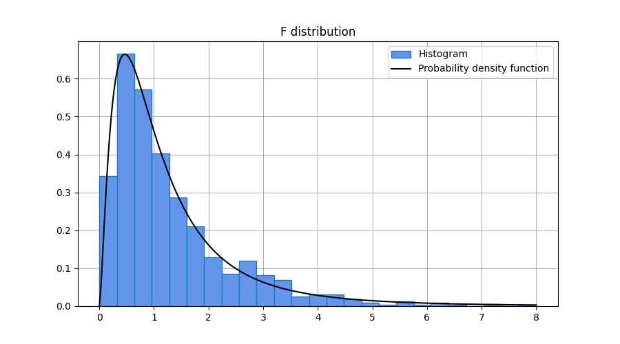
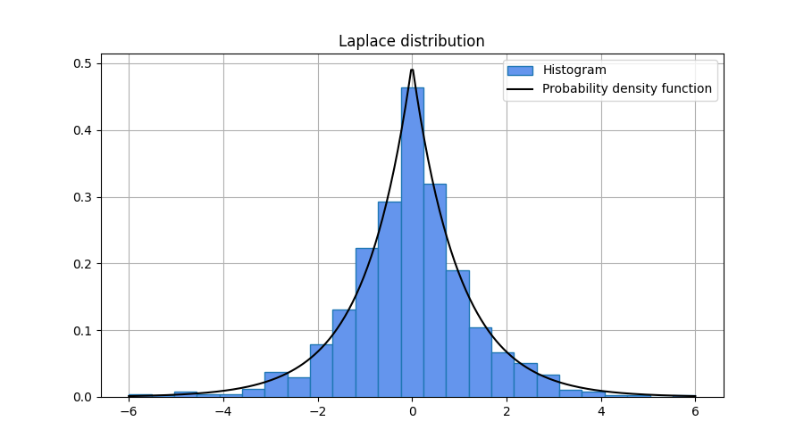
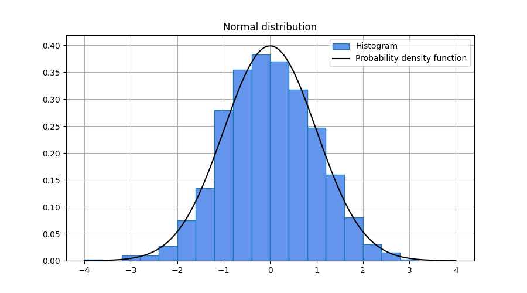
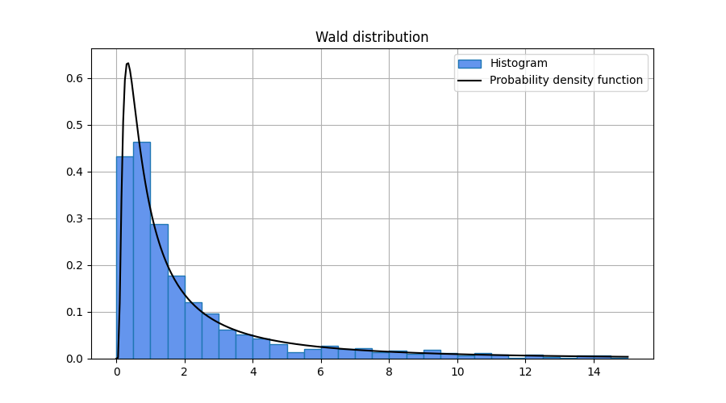

# Random sampling

Defined in header [`numcpp/random.h`](/include/numcpp/random.h)

- [Random sampling](#random-sampling)
  - [Continuous distributions](#continuous-distributions)
    - [`Generator::beta`](#generatorbeta)
    - [`Generator::cauchy`](#generatorcauchy)
    - [`Generator::chisquare`](#generatorchisquare)
    - [`Generator::exponential`](#generatorexponential)
    - [`Generator::fisher_f`](#generatorfisher_f)
    - [`Generator::gamma`](#generatorgamma)
    - [`Generator::gumbel`](#generatorgumbel)
    - [`Generator::laplace`](#generatorlaplace)
    - [`Generator::logistic`](#generatorlogistic)
    - [`Generator::lognormal`](#generatorlognormal)
    - [`Generator::normal`](#generatornormal)
    - [`Generator::pareto`](#generatorpareto)
    - [`Generator::rayleigh`](#generatorrayleigh)
    - [`Generator::standard_normal`](#generatorstandard_normal)
    - [`Generator::student_t`](#generatorstudent_t)
    - [`Generator::uniform`](#generatoruniform)
    - [`Generator::wald`](#generatorwald)
    - [`Generator::weibull`](#generatorweibull)

## Continuous distributions

### `Generator::beta`

Draw samples from a Beta distribution.
```cpp
template <class T, class U>
Promoted beta(T shape1, U shape2);

template <class T, size_t Rank>
tensor<T, Rank> beta(const tensor<T, Rank> &shape1,
                     const tensor<T, Rank> &shape2);

template <class T, size_t Rank>
tensor<T, Rank> beta(const tensor<T, Rank> &shape1,
                     typename tensor<T, Rank>::value_type shape2);

template <class T, size_t Rank>
tensor<T, Rank> beta(typename tensor<T, Rank>::value_type shape1,
                     const tensor<T, Rank> &shape2);
```

The probability density function for the Beta distribution is

$$f(x;\alpha,\beta) = \frac{\Gamma(\alpha+\beta)}
    {\Gamma(\alpha)\Gamma(\beta)} x^{\alpha-1} (1-x)^{\beta-1}$$

for $0 \leq x \leq 1$, where $\alpha$ and $\beta$ are shape parameters.

Paramters

* `shape1` Shape parameter. This shall be a positive value.
* `shape2` Shape parameter. This shall be a positive value.

Returns

* A sample from the distribution.

Exceptions

* `std::invalid_argument` Thrown if the shapes are not compatible and cannot be broadcasted according to [broadcasting rules](/doc/Tensor%20class/Shapes/Non-member%20functions.md#broadcast_shapes).
* `std::bad_alloc` If the function fails to allocate storage it may throw an exception.

Example

```cpp
#include <iostream>
#include <numcpp/tensor.h>
#include <numcpp/random.h>
#include <numcpp/io.h>
namespace np = numcpp;
int main() {
    // Set seed to 0 to replicate results.
    np::default_rng rng(0);
    np::vector<double> shape1, shape2;
    std::cin >> shape1 >> shape2;
    std::cout << rng.beta(shape1, shape2) << "\n";
    return 0;
}
```

Input

```
[0.5, 5, 1, 2, 2]
[0.5, 1, 3, 2, 5]
```

Possible output

```
[0.075999418,  0.98167236,  0.26811036,  0.54658428,  0.33848634]
```

<h3><code>Generator::beta</code></h3>

Draw samples from a Beta distribution.
```cpp
template <class T, class U>
tensor<Promoted, 1> beta(T shape1, U shape2, size_t size);

template <class T, class U, size_t Rank>
tensor<Promoted, Rank> beta(T shape1, U shape2, const shape_t<Rank> &size);
```

Parameters

* `shape1` Shape parameter. This shall be a positive value.
* `shape2` Shape parameter. This shall be a positive value.
* `size` Output shape.

Returns

* A tensor with samples from the distribution.

Exceptions

* `std::bad_alloc` If the function fails to allocate storage it may throw an exception.

Example

```cpp
#include <iostream>
#include <numcpp/tensor.h>
#include <numcpp/random.h>
#include <numcpp/io.h>
namespace np = numcpp;
int main() {
    // Set seed to 0 to replicate results.
    np::default_rng rng(0);
    double shape1, shape2;
    int size;
    std::cin >> shape1 >> shape2 >> size;
    // Sample from a beta distribution and print a few samples.
    np::vector<double> sample = rng.beta(shape1, shape2, size);
    std::cout << sample << "\n";
    // Export sample to .csv for latter plotting.
    np::savetxt("beta-sample.csv", sample);
    return 0;
}
```

Input

```
3 5 1000
```

Possible output

```
[ 0.4788716, 0.29615235, 0.40601717, ..., 0.40486009, 0.19895942, 0.44644586]
```


### `Generator::cauchy`

Draw samples from a Cauchy distribution.
```cpp
template <class T, class U>
Promoted cauchy(T loc, U scale);

template <class T, size_t Rank>
tensor<T, Rank> cauchy(const tensor<T, Rank> &loc,
                       const tensor<T, Rank> &scale);

template <class T, size_t Rank>
tensor<T, Rank> cauchy(const tensor<T, Rank> &loc,
                       typename tensor<T, Rank>::value_type scale);

template <class T, size_t Rank>
tensor<T, Rank> cauchy(typename tensor<T, Rank>::value_type loc,
                       const tensor<T, Rank> &scale);
```

The probability density function for the Cauchy distribution is

$$f(x;x_0,\gamma) = \frac{1}
    {\pi\gamma\left[1+\left(\frac{x-x_0}{\gamma}\right)^2\right]}$$

for all $x$, where $x_0$ and $\gamma$ are location and scale parameters.

Parameters

* `loc` Location parameter.
* `scale` Scale parameter. This shall be a positive value.

Returns

* A sample from the distribution.

Exceptions

* `std::invalid_argument` Thrown if the shapes are not compatible and cannot be broadcasted according to [broadcasting rules](/doc/Tensor%20class/Shapes/Non-member%20functions.md#broadcast_shapes).
* `std::bad_alloc` If the function fails to allocate storage it may throw an exception.

Example

```cpp
#include <iostream>
#include <numcpp/tensor.h>
#include <numcpp/random.h>
#include <numcpp/io.h>
namespace np = numcpp;
int main() {
    // Set seed to 0 to replicate results.
    np::default_rng rng(0);
    np::vector<double> loc, scale;
    std::cin >> loc >> scale;
    std::cout << rng.cauchy(loc, scale) << "\n";
    return 0;
}
```

Input

```
[  0, 0, 0, -2, 2]
[0.5, 1, 2,  1, 1]
```

Possible output

```
[0.21924325,  7.6546159,  1.6435584, -3.5882405,  1.7919036]
```

<h3><code>Generator::cauchy</code></h3>

Draw samples from a Cauchy distribution.
```cpp
template <class T, class U>
tensor<Promoted, 1> cauchy(T loc, U scale, size_t size);

template <class T, class U, size_t Rank>
tensor<Promoted, Rank> cauchy(T loc, U scale, const shape_t<Rank> &size);
```

Parameters

* `loc` Location parameter.
* `scale` Scale parameter. This shall be a positive value.
* `size` Output shape.

Returns

* A tensor with samples from the distribution.

Exceptions

* `std::bad_alloc` If the function fails to allocate storage it may throw an exception.

Example

```cpp
#include <iostream>
#include <numcpp/tensor.h>
#include <numcpp/random.h>
#include <numcpp/io.h>
namespace np = numcpp;
int main() {
    // Set seed to 0 to replicate results.
    np::default_rng rng(0);
    double loc, scale;
    int size;
    std::cin >> loc >> scale >> size;
    // Sample from a cauchy distribution and print a few samples.
    np::vector<double> sample = rng.cauchy(loc, scale, size);
    std::cout << sample << "\n";
    // Export sample to .csv for latter plotting.
    np::savetxt("cauchy-sample.csv", sample);
    return 0;
}
```

Input

```
0 1 1000
```

Possible output

```
[0.43848649,  7.6546159, 0.82177918, ...,  1.4471235,  2.2834329, 0.11030869]
```


### `Generator::chisquare`

Draw samples from a chi-squared distribution.
```cpp
template <class T>
Promoted chisquare(T df);

template <class T, size_t Rank>
tensor<T, Rank> chisquare(const tensor<T, Rank> &df);
```

The probability density function for the chi-squared distribution is

$$f(x;k) = \frac{1}{2^{k/2}\Gamma(k/2)} x^{k/2-1} e^{-x/2}$$

for $x \geq 0$, where $k$ is the degrees of freedom.

Parameters

* `df` Degrees of freedom. This shall be a positive value.

Returns

* A sample from the distribution.

Exceptions

* `std::bad_alloc` If the function fails to allocate storage it may throw an exception.

Example

```cpp
#include <iostream>
#include <numcpp/tensor.h>
#include <numcpp/random.h>
#include <numcpp/io.h>
namespace np = numcpp;
int main() {
    // Set seed to 0 to replicate results.
    np::default_rng rng(0);
    np::vector<double> df;
    std::cin >> df;
    std::cout << rng.chisquare(df) << "\n";
    return 0;
}
```

Input

```
[1, 2, 3, 4, 5]
```

Possible output

```
[ 0.9584218, 0.22955437,  1.3629919,   3.390926,  4.9206675]
```

<h3><code>Generator::chisquare</code></h3>

Draw samples from a chi-squared distribution.
```cpp
template <class T>
tensor<Promoted, 1> chisquare(T df, size_t size);

template <class T, size_t Rank>
tensor<Promoted, Rank> chisquare(T df, const shape_t<Rank> &size);
```

Parameters

* `df` Degrees of freedom. This shall be a positive value.
* `size` Output shape.

Returns

* A tensor with samples from the distribution.

Exceptions

* `std::bad_alloc` If the function fails to allocate storage it may throw an exception.

Example

```cpp
#include <iostream>
#include <numcpp/tensor.h>
#include <numcpp/random.h>
#include <numcpp/io.h>
namespace np = numcpp;
int main() {
    // Set seed to 0 to replicate results.
    np::default_rng rng(0);
    double df;
    int size;
    std::cin >> df >> size;
    // Sample from a chi-squared distribution and print a few samples.
    np::vector<double> sample = rng.chisquare(df, size);
    std::cout << sample << "\n";
    // Export sample to .csv for latter plotting.
    np::savetxt("chisquare-sample.csv", sample);
    return 0;
}
```

Input

```
10 1000
```

Possible output

```
[8.8162358, 5.3811734, 9.4778131, ..., 12.611585, 13.209053, 12.202197]
```


### `Generator::exponential`

Draw samples from an exponential distribution.
```cpp
template <class T>
Promoted exponential(T rate);

template <class T, size_t Rank>
tensor<T, Rank> exponential(const tensor<T, Rank> &rate);
```

The probability density function for the exponential distribution is

$$f(x;\lambda) = \lambda e^{-\lambda x}$$

for $x \geq 0$, where $\lambda$ is the rate parameter.

Parameters

* `rate` Rate parameter. This shall be a positive value.

Returns

* A sample from the distribution.

Exceptions

* `std::bad_alloc` If the function fails to allocate storage it may throw an exception.

Example

```cpp
#include <iostream>
#include <numcpp/tensor.h>
#include <numcpp/random.h>
#include <numcpp/io.h>
namespace np = numcpp;
int main() {
    // Set seed to 0 to replicate results.
    np::default_rng rng(0);
    np::vector<double> rate;
    std::cin >> rate;
    std::cout << rng.exponential(rate) << "\n";
    return 0;
}
```

Input

```
[1, 2, 3, 4, 5]
```

Possible output

```
[  0.1410312,  0.30684475, 0.082375957,   0.2839732,  0.54573089]
```

<h3><code>Generator::exponential</code></h3>

Draw samples from an exponential distribution.
```cpp
template <class T>
tensor<Promoted, 1> exponential(T rate, size_t size);

template <class T, size_t Rank>
tensor<Promoted, Rank> exponential(T rate, const shape_t<Rank> &size);
```

Parameters

* `rate` Rate parameter. This shall be a positive value.
* `size` Output shape.

Returns

* A tensor with samples from the distribution.

Exceptions

* `std::bad_alloc` If the function fails to allocate storage it may throw an exception.

Example

```cpp
#include <iostream>
#include <numcpp/tensor.h>
#include <numcpp/random.h>
#include <numcpp/io.h>
namespace np = numcpp;
int main() {
    // Set seed to 0 to replicate results.
    np::default_rng rng(0);
    double rate;
    int size;
    std::cin >> rate >> size;
    // Sample from an exponential distribution and print a few samples.
    np::vector<double> sample = rng.exponential(rate, size);
    std::cout << sample << "\n";
    // Export sample to .csv for latter plotting.
    np::savetxt("exponential-sample.csv", sample);
    return 0;
}
```

Input

```
1 1000
```

Possible output

```
[  0.1410312,   0.6136895,  0.24712787, ...,  0.36748328,  0.45982982, 
 0.035597086]
```


### `Generator::fisher_f`

Draw samples from a Fisher F-distribution.
```cpp
template <class T, class U>
Promoted fisher_f(T df1, U df2);

template <class T, size_t Rank>
tensor<T, Rank> fisher_f(const tensor<T, Rank> &df1,
                         const tensor<T, Rank> &df2);

template <class T, size_t Rank>
tensor<T, Rank> fisher_f(const tensor<T, Rank> &df1,
                         typename tensor<T, Rank>::value_type df2);

template <class T, size_t Rank>
tensor<T, Rank> fisher_f(typename tensor<T, Rank>::value_type df1,
                         const tensor<T, Rank> &df2);
```

The probability density function for the F distribution is

$$f(x;d_1,d_2) = \frac{\Gamma\left(\frac{d_1+d_2}{2}\right)}
    {\Gamma\left(\frac{d_1}{2}\right)\Gamma\left(\frac{d_2}{2}\right)}
    \frac{\left(\frac{d_1x}{d_2}\right)^{d_1/2}}
    {x\left(1+\frac{d_1x}{d_2}\right)^{(d_1+d_2)/2}}$$

for $x \geq 0$, where $d_1$ and $d_2$ are the degrees of freedom.

Parameters

* `df1` Degrees of freedom. This shall be a positive value.
* `df2` Degrees of freedom. This shall be a positive value.

Returns

* A sample from the distribution.

Exceptions

* `std::invalid_argument` Thrown if the shapes are not compatible and cannot be broadcasted according to [broadcasting rules](/doc/Tensor%20class/Shapes/Non-member%20functions.md#broadcast_shapes).
* `std::bad_alloc` If the function fails to allocate storage it may throw an exception.

Example

```cpp
#include <iostream>
#include <numcpp/tensor.h>
#include <numcpp/random.h>
#include <numcpp/io.h>
namespace np = numcpp;
int main() {
    // Set seed to 0 to replicate results.
    np::default_rng rng(0);
    np::vector<double> df1, df2;
    std::cin >> df1 >> df2;
    std::cout << rng.fisher_f(df1, df2) << "\n";
    return 0;
}
```

Input

```
[1, 2, 5, 10, 100]
[1, 1, 2,  1, 100]
```

Possible output

```
[ 1.4197468, 0.11212807,  1.1804376,  21.896826, 0.87208432]
```

<h3><code>Generator::fisher_f</code></h3>

Draw samples from a Fisher F-distribution.
```cpp
template <class T, class U>
tensor<Promoted, 1> fisher_f(T df1, U df2, size_t size);

template <class T, class U, size_t Rank>
tensor<Promoted, Rank> fisher_f(T df1, U df2, const shape_t<Rank> &size);
```

Parameters

* `df1` Degrees of freedom. This shall be a positive value.
* `df2` Degrees of freedom. This shall be a positive value.
* `size` Output shape.

Returns

* A tensor with samples from the distribution.

Exceptions

* `std::bad_alloc` If the function fails to allocate storage it may throw an exception.

Example

```cpp
#include <iostream>
#include <numcpp/tensor.h>
#include <numcpp/random.h>
#include <numcpp/io.h>
namespace np = numcpp;
int main() {
    // Set seed to 0 to replicate results.
    np::default_rng rng(0);
    double df1, df2;
    int size;
    std::cin >> df1 >> df2 >> size;
    // Sample from a F distribution and print a few samples.
    np::vector<double> sample = rng.fisher_f(df1, df2, size);
    std::cout << sample << "\n";
    // Export sample to .csv for latter plotting.
    np::savetxt("f-sample.csv", sample);
    return 0;
}
```

Input

```
5 7 1000
```

Possible output

```
[ 0.6874124, 0.36971954, 0.66868149, ...,  1.2507282, 0.13758113,  2.0387201]
```



### `Generator::gamma`

Draw samples from a Gamma distribution.
```cpp
template <class T, class U>
Promoted gamma(T shape, U scale);

template <class T, size_t Rank>
tensor<T, Rank> gamma(const tensor<T, Rank> &shape,
                      const tensor<T, Rank> &scale);

template <class T, size_t Rank>
tensor<T, Rank> gamma(const tensor<T, Rank> &shape,
                      typename tensor<T, Rank>::value_type scale);

template <class T, size_t Rank>
tensor<T, Rank> gamma(typename tensor<T, Rank>::value_type shape,
                      const tensor<T, Rank> &scale);
```

The probability density function for the Gamma distribution is

$$f(x;\alpha,\beta) = \frac{1}{\Gamma(\alpha)\beta^{\alpha}}
    x^{\alpha-1} e^{-x/\beta}$$

for $x > 0$, where $\alpha$ is the shape parameter and $\beta$ is the scale parameter.

Parameters

* `shape` Shape parameter. This shall be a positive value.
* `scale` Scale parameter. This shall be a positive value.

Returns

* A sample from the distribution.

Exceptions

* `std::invalid_argument` Thrown if the shapes are not compatible and cannot be broadcasted according to [broadcasting rules](/doc/Tensor%20class/Shapes/Non-member%20functions.md#broadcast_shapes).
* `std::bad_alloc` If the function fails to allocate storage it may throw an exception.

Example

```cpp
#include <iostream>
#include <numcpp/tensor.h>
#include <numcpp/random.h>
#include <numcpp/io.h>
namespace np = numcpp;
int main() {
    // Set seed to 0 to replicate results.
    np::default_rng rng(0);
    np::vector<double> shape1, shape2;
    std::cin >> shape1 >> shape2;
    std::cout << rng.gamma(shape1, shape2) << "\n";
    return 0;
}
```

Input

```
[1, 2, 3, 5, 0.5]
[2, 2, 2, 1,   1]
```

Possible output

```
[ 1.1439165,  1.2409735,  5.4427306,  6.4677067, 0.74445336]
```

<h3><code>Generator::gamma</code></h3>

Draw samples from a Gamma distribution.
```cpp
template <class T, class U>
tensor<Promoted, 1> gamma(T shape, U scale, size_t size);

template <class T, class U, size_t Rank>
tensor<Promoted, Rank> gamma(T shape, U scale, const shape_t<Rank> &size);
```

Parameters

* `shape` Shape parameter. This shall be a positive value.
* `scale` Scale parameter. This shall be a positive value.
* `size` Output shape.

Returns

* A tensor with samples from the distribution.

Exceptions

* `std::bad_alloc` If the function fails to allocate storage it may throw an exception.

Example

```cpp
#include <iostream>
#include <numcpp/tensor.h>
#include <numcpp/random.h>
#include <numcpp/io.h>
namespace np = numcpp;
int main() {
    // Set seed to 0 to replicate results.
    np::default_rng rng(0);
    double shape, scale;
    int size;
    std::cin >> shape >> scale >> size;
    // Sample from a Gamma distribution and print a few samples.
    np::vector<double> sample = rng.gamma(shape, scale, size);
    std::cout << sample << "\n";
    // Export sample to .csv for latter plotting.
    np::savetxt("gamma-sample.csv", sample);
    return 0;
}
```

Input

```
5 1 1000
```

Possible output

```
[4.4081179, 2.6905867, 4.7389065, ..., 6.3057923, 6.6045263, 6.1010987]
```


### `Generator::gumbel`

Draw samples from a Gumbel distribution.
```cpp
template <class T, class U>
Promoted gumbel(T loc, U scale);

template <class T, size_t Rank>
tensor<T, Rank> gumbel(const tensor<T, Rank> &loc,
                       const tensor<T, Rank> &scale);

template <class T, size_t Rank>
tensor<T, Rank> gumbel(const tensor<T, Rank> &loc,
                       typename tensor<T, Rank>::value_type scale);

template <class T, size_t Rank>
tensor<T, Rank> gumbel(typename tensor<T, Rank>::value_type loc,
                       const tensor<T, Rank> &scale);
```

The probability density function for the Gumbel distribution is

$$f(x;a,b) = \frac{1}{b}e^{-z-e^{-z}}, \ z=\frac{x-a}{b}$$

for all $x$, where $a$ is the location parameter and $b$ is the scale parameter.

Parameters

* `loc` Location parameter.
* `scale` Scale parameter. This shall be a positive value.

Returns

* A sample from the distribution.

Exceptions

* `std::invalid_argument` Thrown if the shapes are not compatible and cannot be broadcasted according to [broadcasting rules](/doc/Tensor%20class/Shapes/Non-member%20functions.md#broadcast_shapes).
* `std::bad_alloc` If the function fails to allocate storage it may throw an exception.

Example

```cpp
#include <iostream>
#include <numcpp/tensor.h>
#include <numcpp/random.h>
#include <numcpp/io.h>
namespace np = numcpp;
int main() {
    // Set seed to 0 to replicate results.
    np::default_rng rng(0);
    np::vector<double> loc, scale;
    std::cin >> loc >> scale;
    std::cout << rng.gumbel(loc, scale) << "\n";
    return 0;
}
```

Input

```
[  0, 0, 0, -2, 2]
[0.5, 1, 2,  1, 1]
```

Possible output

```
[0.97938706, 0.48826617,  2.7956988,  -2.127419, 0.99619138]
```

<h3><code>Generator::gumbel</code></h3>

Draw samples from a Gumbel distribution.
```cpp
template <class T, class U>
tensor<Promoted, 1> gumbel(T loc, U scale, size_t size);

template <class T, class U, size_t Rank>
tensor<Promoted, Rank> gumbel(T loc, U scale, const shape_t<Rank> &size);
```

Parameters

* `loc` Location parameter.
* `scale` Scale parameter. This shall be a positive value.
* `size` Output shape.

Returns

* A tensor with samples from the distribution.

Exceptions

* `std::bad_alloc` If the function fails to allocate storage it may throw an exception.

Example

```cpp
#include <iostream>
#include <numcpp/tensor.h>
#include <numcpp/random.h>
#include <numcpp/io.h>
namespace np = numcpp;
int main() {
    // Set seed to 0 to replicate results.
    np::default_rng rng(0);
    double loc, scale;
    int size;
    std::cin >> loc >> scale >> size;
    // Sample from a Gumbel distribution and print a few samples.
    np::vector<double> sample = rng.gumbel(loc, scale, size);
    std::cout << sample << "\n";
    // Export sample to .csv for latter plotting.
    np::savetxt("gumbel-sample.csv", sample);
    return 0;
}
```

Input

```
0 1 1000
```

Possible output

```
[ 1.9587741, 0.48826617,  1.3978494, ...,  1.0010775, 0.77689881,  3.3354915]
```


### `Generator::laplace`

Draw samples from a Laplace distribution.
```cpp
template <class T, class U>
Promoted laplace(T loc, U scale);

template <class T, size_t Rank>
tensor<T, Rank> laplace(const tensor<T, Rank> &loc,
                        const tensor<T, Rank> &scale);

template <class T, size_t Rank>
tensor<T, Rank> laplace(const tensor<T, Rank> &loc,
                        typename tensor<T, Rank>::value_type scale);

template <class T, size_t Rank>
tensor<T, Rank> laplace(typename tensor<T, Rank>::value_type loc,
                        const tensor<T, Rank> &scale);
```

The probability density function for the Laplace distribution is

$$f(x;\mu,s) = \frac{1}{2s}\exp\left(-\frac{|x-\mu|}{s}\right)$$

for all $x$, where $\mu$ is the location parameter and $s$ is the scale parameter.

Parameters

* `loc` Location parameter.
* `scale` Scale parameter. This shall be a positive value.

Returns

* A sample from the distribution.

Exceptions

* `std::invalid_argument` Thrown if the shapes are not compatible and cannot be broadcasted according to [broadcasting rules](/doc/Tensor%20class/Shapes/Non-member%20functions.md#broadcast_shapes).
* `std::bad_alloc` If the function fails to allocate storage it may throw an exception.

Example

```cpp
#include <iostream>
#include <numcpp/tensor.h>
#include <numcpp/random.h>
#include <numcpp/io.h>
namespace np = numcpp;
int main() {
    // Set seed to 0 to replicate results.
    np::default_rng rng(0);
    np::vector<double> loc, scale;
    std::cin >> loc >> scale;
    std::cout << rng.laplace(loc, scale) << "\n";
    return 0;
}
```

Input

```
[  0, 0, 0, -2, 2]
[0.5, 1, 2,  1, 1]
```

Possible output

```
[ -0.66765696, -0.086320419,   -1.6514455,   -1.5572544,    4.0355073]
```

<h3><code>Generator::laplace</code></h3>

Draw samples from a Laplace distribution.
```cpp
template <class T, class U>
tensor<Promoted, 1> laplace(T loc, U scale, size_t size);

template <class T, class U, size_t Rank>
tensor<Promoted, Rank> laplace(T loc, U scale, const shape_t<Rank> &size);
```

Parameters

* `loc` Location parameter.
* `scale` Scale parameter. This shall be a positive value.
* `size` Output shape.

Returns

* A tensor with samples from the distribution.

Exceptions

* `std::bad_alloc` If the function fails to allocate storage it may throw an exception.

Example

```cpp
#include <iostream>
#include <numcpp/tensor.h>
#include <numcpp/random.h>
#include <numcpp/io.h>
namespace np = numcpp;
int main() {
    // Set seed to 0 to replicate results.
    np::default_rng rng(0);
    double loc, scale;
    int size;
    std::cin >> loc >> scale >> size;
    // Sample from a Laplace distribution and print a few samples.
    np::vector<double> sample = rng.laplace(loc, scale, size);
    std::cout << sample << "\n";
    // Export sample to .csv for latter plotting.
    np::savetxt("laplace-sample.csv", sample);
    return 0;
}
```

Input

```
0 1 1000
```

Possible output

```
[  -1.3353139, -0.086320419,  -0.82572275, ...,   -0.4860514,  -0.30487187, 
   -2.6600901]
```



### `Generator::logistic`

Draw samples from a logistic distribution.
```cpp
template <class T, class U>
Promoted logistic(T loc, U scale);

template <class T, size_t Rank>
tensor<T, Rank> logistic(const tensor<T, Rank> &loc,
                         const tensor<T, Rank> &scale);

template <class T, size_t Rank>
tensor<T, Rank> logistic(const tensor<T, Rank> &loc,
                         typename tensor<T, Rank>::value_type scale);

template <class T, size_t Rank>
tensor<T, Rank> logistic(typename tensor<T, Rank>::value_type loc,
                         const tensor<T, Rank> &scale);
```

The probability density function for the logistic distribution is

$$f(x;\mu,s) = \frac{e^{-(x-\mu)/2}}{s\left(1+e^{-(x-\mu)/s}\right)^2}$$

for all $x$, where $\mu$ is the location parameter and $s$ is the scale parameter.

Parameters

* `loc` Location parameter.
* `scale` Scale parameter. This shall be a positive value.

Returns

* A sample from the distribution.

Exceptions

* `std::invalid_argument` Thrown if the shapes are not compatible and cannot be broadcasted according to [broadcasting rules](/doc/Tensor%20class/Shapes/Non-member%20functions.md#broadcast_shapes).
* `std::bad_alloc` If the function fails to allocate storage it may throw an exception.

Example

```cpp
#include <iostream>
#include <numcpp/tensor.h>
#include <numcpp/random.h>
#include <numcpp/io.h>
namespace np = numcpp;
int main() {
    // Set seed to 0 to replicate results.
    np::default_rng rng(0);
    np::vector<double> loc, scale;
    std::cin >> loc >> scale;
    std::cout << rng.logistic(loc, scale) << "\n";
    return 0;
}
```

Input

```
[  0, 0, 0, -2, 2]
[0.5, 1, 2,  1, 1]
```

Possible output

```
[-0.94371495,  -0.1657781,  -2.5434841,  -1.2514406,   4.6611172]
```

<h3><code>Generator::logistic</code></h3>

Draw samples from a logistic distribution.
```cpp
template <class T, class U>
tensor<Promoted, 1> logistic(T loc, U scale, size_t size);

template <class T, class U, size_t Rank>
tensor<Promoted, Rank> logistic(T loc, U scale, const shape_t<Rank> &size);
```

Parameters

* `loc` Location parameter.
* `scale` Scale parameter. This shall be a positive value.
* `size` Output shape.

Returns

* A tensor with samples from the distribution.

Exceptions

* `std::bad_alloc` If the function fails to allocate storage it may throw an exception.

Example

```cpp
#include <iostream>
#include <numcpp/tensor.h>
#include <numcpp/random.h>
#include <numcpp/io.h>
namespace np = numcpp;
int main() {
    // Set seed to 0 to replicate results.
    np::default_rng rng(0);
    double loc, scale;
    int size;
    std::cin >> loc >> scale >> size;
    // Sample from a logistic distribution and print a few samples.
    np::vector<double> sample = rng.logistic(loc, scale, size);
    std::cout << sample << "\n";
    // Export sample to .csv for latter plotting.
    np::savetxt("logistic-sample.csv", sample);
    return 0;
}
```

Input

```
0 1 1000
```

Possible output

```
[ -1.8874299,  -0.1657781,  -1.2717421, ...,  -0.8117153, -0.53818923, 
  -3.3176402]
```


### `Generator::lognormal`

Draw samples from a log-normal distribution.
```cpp
template <class T, class U>
Promoted lognormal(T logmean, U logscale);

template <class T, size_t Rank>
tensor<T, Rank> lognormal(const tensor<T, Rank> &logmean,
                          const tensor<T, Rank> &logscale);

template <class T, size_t Rank>
tensor<T, Rank> lognormal(const tensor<T, Rank> &logmean,
                          typename tensor<T, Rank>::value_type logscale);

template <class T, size_t Rank>
tensor<T, Rank> lognormal(typename tensor<T, Rank>::value_type logmean,
                          const tensor<T, Rank> &logscale);
```

The probability density function for the log-normal distribution is

$$f(x;\mu,\sigma) = \frac{1}{x\sigma\sqrt{2\pi}}
    \exp\left(-\frac{(\log x-\mu)^2}{2\sigma^2}\right)$$

for $x > 0$, where $\mu$ and $\sigma$ are the mean and standard deviation of the underlying normal distribution formed by the logarithm transformation.

Parameters

* `logmean` Mean of the underlying normal distribution.
* `logscale` Standard deviation of the underlying normal distribution. This shall be a positive value.

Returns

* A sample from the distribution.

Exceptions

* `std::invalid_argument` Thrown if the shapes are not compatible and cannot be broadcasted according to [broadcasting rules](/doc/Tensor%20class/Shapes/Non-member%20functions.md#broadcast_shapes).
* `std::bad_alloc` If the function fails to allocate storage it may throw an exception.

Example

```cpp
#include <iostream>
#include <numcpp/tensor.h>
#include <numcpp/random.h>
#include <numcpp/io.h>
namespace np = numcpp;
int main() {
    // Set seed to 0 to replicate results.
    np::default_rng rng(0);
    np::vector<double> logmean, logscale;
    std::cin >> logmean >> logscale;
    std::cout << rng.lognormal(logmean, logscale) << "\n";
    return 0;
}
```

Input

```
[   0,   0, 0, 0, 1]
[0.25, 0.5, 1, 2, 1]
```

Possible output

```
[0.96996873, 0.58076503,  1.9823637,  0.1164401,  2.8102388]
```

<h3><code>Generator::lognormal</code></h3>

Draw samples from a log-normal distribution.
```cpp
template <class T, class U>
tensor<Promoted, 1> lognormal(T logmean, U logscale, size_t size);

template <class T, class U, size_t Rank>
tensor<Promoted, Rank> lognormal(T logmean, U logscale,
                                 const shape_t<Rank> &size);
```

Parameters

* `logmean` Mean of the underlying normal distribution.
* `logscale` Standard deviation of the underlying normal distribution. This shall be a positive value.
* `size` Output shape.

Returns

* A tensor with samples from the distribution.

Exceptions

* `std::bad_alloc` If the function fails to allocate storage it may throw an exception.

Example

```cpp
#include <iostream>
#include <numcpp/tensor.h>
#include <numcpp/random.h>
#include <numcpp/io.h>
namespace np = numcpp;
int main() {
    // Set seed to 0 to replicate results.
    np::default_rng rng(0);
    double logmean, logscale;
    int size;
    std::cin >> logmean >> logscale >> size;
    // Sample from a lognormal distribution and print a few samples.
    np::vector<double> sample = rng.lognormal(logmean, logscale, size);
    std::cout << sample << "\n";
    // Export sample to .csv for latter plotting.
    np::savetxt("lognormal-sample.csv", sample);
    return 0;
}
```

Input

```
0 1 1000
```

Possible output

```
[0.88517866, 0.33728802,  1.9823637, ..., 0.66364397, 0.96942976, 0.64501241]
```


### `Generator::normal`

Draw samples from a normal distribution.
```cpp
template <class T, class U>
Promoted normal(T mean, U stddev);

template <class T, size_t Rank>
tensor<T, Rank> normal(const tensor<T, Rank> &mean,
                       const tensor<T, Rank> &stddev);

template <class T, size_t Rank>
tensor<T, Rank> normal(const tensor<T, Rank> &mean,
                       typename tensor<T, Rank>::value_type stddev);

template <class T, size_t Rank>
tensor<T, Rank> normal(typename tensor<T, Rank>::value_type mean,
                       const tensor<T, Rank> &stddev);
```

The probability density function for the normal distribution is

$$f(x;\mu,\sigma) = \frac{1}{\sigma\sqrt{2\pi}}
    \exp\left(-\frac{(x-\mu)^2}{2\sigma^2}\right)$$

for all $x$, where $\mu$ and $\sigma$ are the mean and standard deviation.

Parameters

* `mean` Mean of the distribution.
* `stddev` Standard deviation of the distribution. This shall be a positive value.

Returns

* A sample from the distribution.

Exceptions

* `std::invalid_argument` Thrown if the shapes are not compatible and cannot be broadcasted according to [broadcasting rules](/doc/Tensor%20class/Shapes/Non-member%20functions.md#broadcast_shapes).
* `std::bad_alloc` If the function fails to allocate storage it may throw an exception.

Example

```cpp
#include <iostream>
#include <numcpp/tensor.h>
#include <numcpp/random.h>
#include <numcpp/io.h>
namespace np = numcpp;
int main() {
    // Set seed to 0 to replicate results.
    np::default_rng rng(0);
    np::vector<double> mean, stddev;
    std::cin >> mean >> stddev;
    std::cout << rng.normal(mean, stddev) << "\n";
    return 0;
}
```

Input

```
[   0,   0, 0, 0, 1]
[0.25, 0.5, 1, 2, 1]
```

Possible output

```
[-0.030491446,  -0.54340902,   0.68428994,   -2.1503783,    1.0332695]
```

<h3><code>Generator::normal</code></h3>

Draw samples from a normal distribution.
```cpp
template <class T, class U>
tensor<Promoted, 1> normal(T mean, U stddev, size_t size);

template <class T, class U, size_t Rank>
tensor<Promoted, Rank> normal(T mean, U stddev, const shape_t<Rank> &size);
```

Parameters

* `mean` Mean of the distribution.
* `stddev` Standard deviation of the distribution. This shall be a positive value.
* `size` Output shape.

Returns

* A tensor with samples from the distribution.

Exceptions

* `std::bad_alloc` If the function fails to allocate storage it may throw an
exception.

Example

```cpp
#include <iostream>
#include <numcpp/tensor.h>
#include <numcpp/random.h>
#include <numcpp/io.h>
namespace np = numcpp;
int main() {
    // Set seed to 0 to replicate results.
    np::default_rng rng(0);
    double mean, stddev;
    int size;
    std::cin >> mean >> stddev >> size;
    // Sample from a normal distribution and print a few samples.
    np::vector<double> sample = rng.normal(mean, stddev, size);
    std::cout << sample << "\n";
    // Export sample to .csv for latter plotting.
    np::savetxt("normal-sample.csv", sample);
    return 0;
}
```

Input

```
0 1 1000
```

Possible output

```
[ -0.12196578,    -1.086818,   0.68428994, ...,  -0.41000947, -0.031047253, 
  -0.43848572]
```



### `Generator::pareto`

Draw samples from a Pareto distribution.
```cpp
template <class T, class U>
Promoted pareto(T shape, U scale);

template <class T, size_t Rank>
tensor<T, Rank> pareto(const tensor<T, Rank> &shape,
                       const tensor<T, Rank> &scale);

template <class T, size_t Rank>
tensor<T, Rank> pareto(const tensor<T, Rank> &shape,
                       typename tensor<T, Rank>::value_type scale);

template <class T, size_t Rank>
tensor<T, Rank> pareto(typename tensor<T, Rank>::value_type shape,
                       const <T, Rank> &scale);
```

The probability density function for the Pareto distribution is

$$f(x;\alpha,x_m) = \frac{\alpha x_m^{\alpha}}{x^{\alpha+1}}$$

for $x \geq x_m$, where $\alpha$ is the shape parameter and $x_m$ is the scale parameter.

Parameters

* `shape` Shape parameter. This shall be a positive value.
* `scale` Scale parameter. This shall be a positive value.

Returns

* A sample from the distribution.

Exceptions

* `std::invalid_argument` Thrown if the shapes are not compatible and cannot be broadcasted according to [broadcasting rules](/doc/Tensor%20class/Shapes/Non-member%20functions.md#broadcast_shapes).
* `std::bad_alloc` If the function fails to allocate storage it may throw an exception.

Example

```cpp
#include <iostream>
#include <numcpp/tensor.h>
#include <numcpp/random.h>
#include <numcpp/io.h>
namespace np = numcpp;
int main() {
    // Set seed to 0 to replicate results.
    np::default_rng rng(0);
    np::vector<double> shape, scale;
    std::cin >> shape >> scale;
    std::cout << rng.pareto(shape, scale) << "\n";
    return 0;
}
```

Input

```
[1, 2, 3, 100, 2]
[1, 1, 1,   1, 1]
```

Possible output

```
[1.1514606, 1.3591299,  1.085864, 1.0114237, 3.9130896]
```

<h3><code>Generator::pareto</code></h3>

Draw samples from a Pareto distribution.
```cpp
template <class T, class U>
tensor<Promoted, 1> pareto(T shape, U scale, size_t size);

template <class T, class U, size_t Rank>
tensor<Promoted, Rank> pareto(T shape, U scale, const shape_t<Rank> &size);
```

Parameters

* `shape` Shape parameter. This shall be a positive value.
* `scale` Scale parameter. This shall be a positive value.
* `size` Output shape.

Returns

* A tensor with samples from the distribution.

Exceptions

* `std::bad_alloc` If the function fails to allocate storage it may throw an
exception.

Example

```cpp
#include <iostream>
#include <numcpp/tensor.h>
#include <numcpp/random.h>
#include <numcpp/io.h>
namespace np = numcpp;
int main() {
    // Set seed to 0 to replicate results.
    np::default_rng rng(0);
    double shape, scale;
    int size;
    std::cin >> shape >> scale >> size;
    // Sample from a pareto distribution and print a few samples.
    np::vector<double> sample = rng.pareto(shape, scale, size);
    std::cout << sample << "\n";
    // Export sample to .csv for latter plotting.
    np::savetxt("pareto-sample.csv", sample);
    return 0;
}
```

Input

```
3 1 1000
```

Possible output

```
[1.0481329,  1.226989,  1.085864, ..., 1.1303128, 1.1656474, 1.0119364]
```


### `Generator::rayleigh`

Draw samples from a Rayleigh distribution.
```cpp
template <class T>
Promoted rayleigh(T scale);

template <class T, size_t Rank>
tensor<T, Rank> rayleigh(const tensor<T, Rank> &scale);
```

The probability density function for the Rayleigh distribution is

$$f(x;\sigma) = \frac{x}{\sigma^2}e^{-x^2/(2\sigma^2)}$$

for $x \geq 0$, where $\sigma$ is the scale parameter.

Parameters

* `scale` Scale parameter. This shall be a positive value.

Returns

* A sample from the distribution.

Exceptions

* `std::bad_alloc` If the function fails to allocate storage it may throw an exception.

Example

```cpp
#include <iostream>
#include <numcpp/tensor.h>
#include <numcpp/random.h>
#include <numcpp/io.h>
namespace np = numcpp;
int main() {
    // Set seed to 0 to replicate results.
    np::default_rng rng(0);
    np::vector<double> scale;
    std::cin >> scale;
    std::cout << rng.rayleigh(scale) << "\n";
    return 0;
}
```

Input

```
[1, 2, 3, 4, 5]
```

Possible output

```
[0.53109548,  2.2157428,  2.1090997,  6.0289775,  11.680442]
```

<h3><code>Generator::rayleigh</code></h3>

Draw samples from a Rayleigh distribution.
```cpp
template <class T>
tensor<Promoted, 1> rayleigh(T scale, size_t size);

template <class T, size_t Rank>
tensor<Promoted, Rank> rayleigh(T scale, const shape_t<Rank> &size);
```

Parameters

* `scale` Scale parameter. This shall be a positive value.
* `size` Output shape.

Returns

* A tensor with samples from the distribution.

Exceptions

* `std::bad_alloc` If the function fails to allocate storage it may throw an exception.

Example

```cpp
#include <iostream>
#include <numcpp/tensor.h>
#include <numcpp/random.h>
#include <numcpp/io.h>
namespace np = numcpp;
int main() {
    // Set seed to 0 to replicate results.
    np::default_rng rng(0);
    double scale;
    int size;
    std::cin >> scale >> size;
    // Sample from a Rayleigh distribution and print a few samples.
    np::vector<double> sample = rng.rayleigh(scale, size);
    std::cout << sample << "\n";
    // Export sample to .csv for latter plotting.
    np::savetxt("rayleigh-sample.csv", sample);
    return 0;
}
```

Input

```
1 1000
```

Possible output

```
[0.53109548,  1.1078714, 0.70303325, ..., 0.85730191, 0.95898887, 0.26682236]
```


### `Generator::standard_normal`

Draw samples from a standard normal distribution (`mean = 0`, `stddev = 1`).
```cpp
template <class T = double>
T standard_normal();
```

Parameters

* None

Returns

* A sample from the distribution.

<h3><code>Generator::standard_normal</code></h3>

Draw samples from a standard normal distribution (`mean = 0`, `stddev = 1`).
```cpp
template <class T = double>
tensor<T, 1> standard_normal(size_t size);

template <class T = double, size_t Rank>
tensor<T, Rank> standard_normal(const shape_t<Rank> &size);
```

Parameters

* `size` Output shape.

Returns

* A tensor with samples from the distribution.

Exceptions

* `std::bad_alloc` If the function fails to allocate storage it may throw an exception.

### `Generator::student_t`

Draw samples from a Student's t distribution.
```cpp
template <class T>
Promoted student_t(T df);

template <class T, size_t Rank>
tensor<T, Rank> student_t(const tensor<T, Rank> &df);
```

The probability density function for the Student's t distribution is

$$f(x;\nu) = \frac{1}{\sqrt{\pi\nu}}
    \frac{\Gamma\left(\frac{\nu+1}{2}\right)}{\Gamma\left(\frac{\nu}{2}\right)}
    \left(1+\frac{x^2}{\nu}\right)^{-(\nu+1)/2}$$

for all $x$, where $\nu$ is the degrees of freedom.

Parameters

* `df` Degrees of freedom. This shall be a positive value.

Returns

* A sample from the distribution.

Exceptions

* `std::bad_alloc` If the function fails to allocate storage it may throw an exception.

Example

```cpp
#include <iostream>
#include <numcpp/tensor.h>
#include <numcpp/random.h>
#include <numcpp/io.h>
namespace np = numcpp;
int main() {
    // Set seed to 0 to replicate results.
    np::default_rng rng(0);
    np::vector<double> df;
    std::cin >> df;
    std::cout << rng.student_t(df) << "\n";
    return 0;
}
```

Input

```
[1, 2, 3, 4, 5]
```

Possible output

```
[ 0.033983462,    2.1985312,   0.58677274,   0.21866032, -0.093009367]
```

<h3><code>Generator::student_t</code></h3>

Draw samples from a Student's t distribution.
```cpp
template <class T>
tensor<Promoted, 1> student_t(T df, size_t size);

template <class T, size_t Rank>
tensor<Promoted, Rank> student_t(T df, const shape_t<Rank> &size);
```

Parameters

* `df` Degrees of freedom. This shall be a positive value.
* `size` Output shape.

Returns

* A tensor with samples from the distribution.

Exceptions

* `std::bad_alloc` If the function fails to allocate storage it may throw an exception.

Example

```cpp
#include <iostream>
#include <numcpp/tensor.h>
#include <numcpp/random.h>
#include <numcpp/io.h>
namespace np = numcpp;
int main() {
    // Set seed to 0 to replicate results.
    np::default_rng rng(0);
    double df;
    int size;
    std::cin >> df >> size;
    // Sample from a Student's t distribution and print a few samples.
    np::vector<double> sample = rng.student_t(df, size);
    std::cout << sample << "\n";
    // Export sample to .csv for latter plotting.
    np::savetxt("student-t-sample.csv", sample);
    return 0;
}
```

Input

```
3 1000
```

Possible output

```
[-0.10375263,  -2.2562108, 0.031193867, ...,  0.21611675,  -3.1166077, 
  0.99482596]
```


### `Generator::uniform`

Draw samples from an uniform distribution.
```cpp
template <class T, class U>
Promoted uniform(T low, U high);

template <class T, size_t Rank>
tensor<T, Rank> uniform(const tensor<T, Rank> &low,
                        const tensor<T, Rank> &high);

template <class T, size_t Rank>
tensor<T, Rank> uniform(const tensor<T, Rank> &low,
                        typename tensor<T, Rank>::value_type high);

template <class T, size_t Rank>
tensor<T, Rank> uniform(typename tensor<T, Rank>::value_type low,
                        const tensor<T, Rank> &high);
```

The probability density function for the uniform distribution is

$$f(x;a,b) = \frac{1}{b-a}$$

for $a \leq x < b$, where $a$ and $b$ are the lower and upper boundaries of the distribution.

Parameters

* `low` Lower boundary.
* `high` Upper boundary.

Returns

* A sample from the distribution.

Exceptions

* `std::invalid_argument` Thrown if the shapes are not compatible and cannot be broadcasted according to [broadcasting rules](/doc/Tensor%20class/Shapes/Non-member%20functions.md#broadcast_shapes).
* `std::bad_alloc` If the function fails to allocate storage it may throw an exception.

Example

```cpp
#include <iostream>
#include <numcpp/tensor.h>
#include <numcpp/random.h>
#include <numcpp/io.h>
namespace np = numcpp;
int main() {
    // Set seed to 0 to replicate results.
    np::default_rng rng(0);
    np::vector<double> low, high;
    std::cin >> low >> high;
    std::cout << rng.uniform(low, high) << "\n";
    return 0;
}
```

Input

```
[0, 0, 1, 2, -1]
[1, 2, 2, 3,  1]
```

Possible output

```
[0.13153779, 0.91730026,  1.2189592,  2.6788647, 0.86938579]
```

<h3><code>Generator::uniform</code></h3>

Draw samples from an uniform distribution.
```cpp
template <class T, class U>
tensor<Promoted, 1> uniform(T low, U high, size_t size);

template <class T, class U, size_t Rank>
tensor<Promoted, Rank> uniform(T low, U high, const shape_t<Rank> &size);
```

Parameters

* `low` Lower boundary.
* `high` Upper boundary.
* `size` Output shape.

Returns

* A tensor with samples from the distribution.

Exceptions

* `std::bad_alloc` If the function fails to allocate storage it may throw an exception.

Example

```cpp
#include <iostream>
#include <numcpp/tensor.h>
#include <numcpp/random.h>
#include <numcpp/io.h>
namespace np = numcpp;
int main() {
    // Set seed to 0 to replicate results.
    np::default_rng rng(0);
    double low, high;
    int size;
    std::cin >> low >> high >> size;
    // Sample from an uniform distribution and print a few samples.
    np::vector<double> sample = rng.uniform(low, high, size);
    std::cout << sample << "\n";
    // Export sample to .csv for latter plotting.
    np::savetxt("uniform-sample.csv", sample);
    return 0;
}
```

Input

```
0 10 1000
```

Output

```
[ 1.3153779,  4.5865013,  2.1895919, ...,   3.075251,  3.6860891, 0.34970961]
```


### `Generator::wald`

Draw samples from a Wald, or inverse Gaussian, distribution.
```cpp
template <class T, class U>
Promoted wald(T mean, U scale);

template <class T, size_t Rank>
tensor<T, Rank> wald(const tensor<T, Rank> &mean,
                     const tensor<T, Rank> &scale);

template <class T, size_t Rank>
tensor<T, Rank> wald(const tensor<T, Rank> &mean,
                     typename tensor<T, Rank>::value_type scale);

template <class T, size_t Rank>
tensor<T, Rank> wald(typename tensor<T, Rank>::value_type mean,
                     const tensor<T, Rank> &scale);
```

The probability density function for the Wald distribution is

$$f(x;\mu,\lambda) = \sqrt{\frac{\lambda}{2\pi x^3}}
    \exp\left(-\frac{\lambda(x-\mu)^2}{2\mu^2 x}\right)$$

for $x > 0$, where $\mu$ is the mean and $\lambda$ is the scale parameter.

Parameters

* `mean` Mean of the distribution. This shall be a positive value.
* `scale` Scale parameter. This shall be a positive value.

Returns

* A sample from the distribution.

Exceptions

* `std::invalid_argument` Thrown if the shapes are not compatible and cannot be broadcasted according to [broadcasting rules](/doc/Tensor%20class/Shapes/Non-member%20functions.md#broadcast_shapes).
* `std::bad_alloc` If the function fails to allocate storage it may throw an exception.

Example

```cpp
#include <iostream>
#include <numcpp/tensor.h>
#include <numcpp/random.h>
#include <numcpp/io.h>
namespace np = numcpp;
int main() {
    // Set seed to 0 to replicate results.
    np::default_rng rng(0);
    np::vector<double> mean, scale;
    std::cin >> mean >> scale;
    std::cout << rng.wald(mean, scale) << "\n";
    return 0;
}
```

Input

```
[  1, 1, 1,   3, 3]
[0.2, 1, 3, 0.2, 1]
```

Possible output

```
[0.76194144, 0.35366873, 0.98097545, 0.29343036,  1.3736803]
```

<h3><code>Generator::wald</code></h3>

Draw samples from a Wald distribution.
```cpp
template <class T, class U>
tensor<Promoted, 1> wald(T mean, U scale, size_t size);

template <class T, class U, size_t Rank>
tensor<Promoted, Rank> wald(T mean, U scale, const shape_t<Rank> &size);
```

Parameters

* `mean` Mean of the distribution. This shall be a positive value.
* `scale` Scale parameter. This shall be a positive value.
* `size` Output shape.

Returns

* A tensor with samples from the distribution.

Exceptions

* `std::bad_alloc` If the function fails to allocate storage it may throw an exception.

Example

```cpp
#include <iostream>
#include <numcpp/tensor.h>
#include <numcpp/random.h>
#include <numcpp/io.h>
namespace np = numcpp;
int main() {
    // Set seed to 0 to replicate results.
    np::default_rng rng(0);
    double mean, scale;
    int size;
    std::cin >> mean >> scale >> size;
    // Sample from a Wald distribution and print a few samples.
    np::vector<double> sample = rng.wald(mean, scale, size);
    std::cout << sample << "\n";
    // Export sample to .csv for latter plotting.
    np::savetxt("wald-sample.csv", sample);
    return 0;
}
```

Input

```
3 1 1000
```

Possible output

```
[ 2.4296621, 0.56003132,  2.8320359, ...,  1.9240562, 0.41776467,  2.6238812]
```



### `Generator::weibull`

Draw samples from a Weibull distribution.
```cpp
template <class T, class U>
Promoted weibull(T shape, U scale);

template <class T, size_t Rank>
tensor<T, Rank> weibull(const tensor<T, Rank> &shape,
                        const tensor<T, Rank> &scale);

template <class T, size_t Rank>
tensor<T, Rank> weibull(const tensor<T, Rank> &shape,
                        typename tensor<T, Rank>::value_type scale);

template <class T, size_t Rank>
tensor<T, Rank> weibull(typename tensor<T, Rank>::value_type shape,
                        const tensor<T, Rank> &scale);
```

The probability density function for the Weibull distribution is

$$f(x;a,b) = \frac{a}{b}\left(\frac{x}{b}\right)^{a-1}e^{-(x/b)^a}$$

for $x \geq 0$, where $a$ is the shape parameter and $b$ is the scale parameter.

Parameters

* `shape` Shape parameter. This shall be a positive value.
* `scale` Scale parameter. This shall be a positive value.

Returns

* A sample from the distribution.

Exceptions

* `std::invalid_argument` Thrown if the shapes are not compatible and cannot be broadcasted according to [broadcasting rules](/doc/Tensor%20class/Shapes/Non-member%20functions.md#broadcast_shapes).
* `std::bad_alloc` If the function fails to allocate storage it may throw an exception.

Example

```cpp
#include <iostream>
#include <numcpp/tensor.h>
#include <numcpp/random.h>
#include <numcpp/io.h>
namespace np = numcpp;
int main() {
    // Set seed to 0 to replicate results.
    np::default_rng rng(0);
    np::vector<double> shape, scale;
    std::cin >> shape >> scale;
    std::cout << rng.weibull(shape, scale) << "\n";
    return 0;
}
```

Input

```
[  1, 1,   1, 1, 5]
[0.5, 1, 1.5, 5, 1]
```

Possible output

```
[0.070515602,   0.6136895,  0.37069181,    5.679464,   1.2223335]
```

<h3><code>Generator::weibull</h3></code>

Draw samples from a Weibull distribution.
```cpp
template <class T, class U>
tensor<Promoted, 1> weibull(T shape, U scale, size_t size);

template <class T, class U, size_t Rank>
tensor<Promoted, Rank> weibull(T shape, U scale, const shape_t<Rank> &size);
```

Parameters

* `shape` Shape parameter. This shall be a positive value.
* `scale` Scale parameter. This shall be a positive value.
* `size` Output shape.

Returns

* A tensor with samples from the distribution.

Exceptions

* `std::bad_alloc` If the function fails to allocate storage it may throw an exception.

Example

```cpp
#include <iostream>
#include <numcpp/tensor.h>
#include <numcpp/random.h>
#include <numcpp/io.h>
namespace np = numcpp;
int main() {
    // Set seed to 0 to replicate results.
    np::default_rng rng(0);
    double shape, scale;
    int size;
    std::cin >> shape >> scale >> size;
    // Sample from a Weibull distribution and print a few samples.
    np::vector<double> sample = rng.weibull(shape, scale, size);
    std::cout << sample << "\n";
    // Export sample to .csv for latter plotting.
    np::savetxt("weibull-sample.csv", sample);
    return 0;
}
```

Input

```
5 1 1000
```

Possible output

```
[ 0.6758698, 0.90696335, 0.75610889, ..., 0.81855434, 0.85609001, 0.51319556]
```


