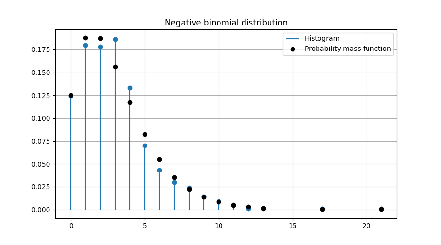

# Random sampling

Defined in header [`numcpp/random.h`](/include/numcpp/random.h)

- [Random sampling](#random-sampling)
  - [Discrete distributions](#discrete-distributions)
    - [`Generator::bernoulli`](#generatorbernoulli)
    - [`Generator::binomial`](#generatorbinomial)
    - [`Generator::geometric`](#generatorgeometric)
    - [`Generator::negative_binomial`](#generatornegative_binomial)
    - [`Generator::poisson`](#generatorpoisson)

## Discrete distributions

### `Generator::bernoulli`

Draw samples from a Bernoulli distribution.
```cpp
bool bernoulli(double prob);

template <size_t Rank>
tensor<bool, Rank> bernoulli(const tensor<double, Rank> &prob);
```

The probability mass function for the Bernoulli distribution is

$$f(x;p) = \begin{cases}
    1-p, & x=0,\\
    p, & x=1,
\end{cases}$$

where $p$ is the probability of success.

Parameters

* `prob` Probability of success. This shall be a value between 0 and 1 (inclusive).

Returns

* A sample from the distribution.

Exceptions

* `std::bad_alloc` If the function fails to allocate storage it may throw an exception.

Example

```cpp
#include <iostream>
#include <numcpp/tensor.h>
#include <numcpp/random.h>
#include <numcpp/io.h>
namespace np = numcpp;
int main() {
    // Set seed to 0 to replicate results.
    np::default_rng rng(0);
    np::vector<double> prob;
    std::cin >> prob;
    std::cout << rng.bernoulli(prob) << "\n";
    return 0;
}
```

Input

```
[0, 0.1, 0.5, 0.9, 1]
```

Possible output

```
[0, 0, 1, 1, 1]
```

<h3><code>Generator::bernoulli</code></h3>

Draw samples from a Bernoulli distribution.
```cpp
tensor<bool, 1> bernoulli(double prob, size_t size);

template <size_t Rank>
tensor<bool, Rank> bernoulli(double prob, const shape_t<Rank> &size);
```

Parameters

* `prob` Probability of success. This shall be a value between 0 and 1 (inclusive).
* `size` Output shape.

Returns

* A tensor with samples from the distribution.

Exceptions

* `std::bad_alloc` If the function fails to allocate storage it may throw an exception.

Example

```cpp
#include <iostream>
#include <numcpp/tensor.h>
#include <numcpp/routines.h>
#include <numcpp/random.h>
#include <numcpp/io.h>
namespace np = numcpp;
int main() {
    // Set seed to 0 to replicate results.
    np::default_rng rng(0);
    double prob;
    int size;
    std::cin >> prob >> size;
    // Sample from a bernoulli distribution and print a few samples.
    np::vector<bool> sample = rng.bernoulli(prob, size);
    std::cout << sample << "\n";
    // Count true and false values.
    std::cout << "true: " << np::count_nonzero(sample) << "\n";
    std::cout << "false: " << np::count_nonzero(!sample) << "\n";
    return 0;
}
```

Input

```
0.5 1000
```

Possible output

```
[1, 1, 1, ..., 1, 1, 1]
true: 508
false: 492
```

### `Generator::binomial`

Draw samples from a binomial distribution.
```cpp
template <class T>
T binomial(T n, double prob);

template <class T, size_t Rank>
tensor<T, Rank> binomial(const tensor<T, Rank> &n,
                         const tensor<double, Rank> &prob);

template <class T, size_t Rank>
tensor<T, Rank> binomial(const tensor<T, Rank> &n, double prob);

template <class T, size_t Rank>
tensor<T, Rank> binomial(T n, const tensor<double, Rank> &prob);
```

The probability mass function for the binomial distribution is

$$f(x;n,p) = \binom{n}{x} p^x (1-p)^{n-x}$$

for $x = 0, 1, 2, \ldots , n$, where $n$ is the number of trials and $p$ is the probability of success.

Parameters

* `n` Number of trials.
* `prob` Probability of success. This shall be a value between 0 and 1 (inclusive).

Returns

* A sample from the distribution.

Exceptions

* `std::invalid_argument` Thrown if the shapes are not compatible and cannot be broadcasted according to [broadcasting rules](/doc/Tensor%20class/Shapes/Non-member%20functions.md#broadcast_shapes).
* `std::bad_alloc` If the function fails to allocate storage it may throw an exception.

Example

```cpp
#include <iostream>
#include <numcpp/tensor.h>
#include <numcpp/random.h>
#include <numcpp/io.h>
namespace np = numcpp;
int main() {
    // Set seed to 0 to replicate results.
    np::default_rng rng(0);
    np::vector<int> n;
    np::vector<double> prob;
    std::cin >> n >> prob;
    std::cout << rng.binomial(n, prob) << "\n";
    return 0;
}
```

Input

```
[ 10,  10,  10,  20, 100]
[0.3, 0.5, 0.9, 0.5, 0.5]
```

Possible output

```
[ 4,  6,  9,  7, 44]
```

<h3><code>Generator::binomial</code></h3>

Draw samples from a binomial distribution.
```cpp
template <class T>
tensor<T, 1> binomial(T n, double prob, size_t size);

template <class T, size_t Rank>
tensor<T, Rank> binomial(T n, double prob, const shape_t<Rank> &size);
```

Parameters

* `n` Number of trials.
* `prob` Probability of success. This shall be a value between 0 and 1 (inclusive).
* `size` Output shape.

Returns

* A tensor with samples from the distribution.

Exceptions

* `std::bad_alloc` If the function fails to allocate storage it may throw an exception.

Example

```cpp
#include <iostream>
#include <numcpp/tensor.h>
#include <numcpp/random.h>
#include <numcpp/io.h>
namespace np = numcpp;
int main() {
    // Set seed to 0 to replicate results.
    np::default_rng rng(0);
    int n, size;
    double prob;
    std::cin >> n >> prob >> size;
    // Sample from a binomial distribution and print a few samples.
    np::vector<int> sample = rng.binomial(n, prob, size);
    std::cout << sample << "\n";
    // Export sample to .csv for latter plotting.
    np::savetxt("binomial-sample.csv", sample);
    return 0;
}
```

Input

```
10 0.3 1000
```

Possible output

```
[4, 5, 2, ..., 4, 1, 4]
```


### `Generator::geometric`

Draw samples from a geometric distribution.
```cpp
template <class T = int>
T geometric(double prob);

template <class T = int, size_t Rank>
tensor<T, Rank> geometric(const tensor<double, Rank> &prob);
```

The probability mass function for the geometric distribution is

$$f(x;p) = p(1-p)^x$$

for $x = 0, 1, 2, \ldots,$ where $p$ is the probability of success.

Parameters

* `prob` Probability of success. This shall be a value between 0 and 1 (inclusive).

Returns

* A sample from the distribution.

Exceptions

* `std::bad_alloc` If the function fails to allocate storage it may throw an exception.

Example

```cpp
#include <iostream>
#include <numcpp/tensor.h>
#include <numcpp/random.h>
#include <numcpp/io.h>
namespace np = numcpp;
int main() {
    // Set seed to 0 to replicate results.
    np::default_rng rng(0);
    np::vector<double> prob;
    std::cin >> prob;
    std::cout << rng.geometric(prob) << "\n";
    return 0;
}
```

Input

```
[0.01, 0.1, 0.3, 0.5, 0.9]
```

Possible output

```
[14,  5,  0,  1,  1]
```

<h3><code>Generator::geometric</code></h3>

Draw samples from a geometric distribution.
```cpp
template <class T = int>
tensor<T, 1> geometric(double prob, size_t size);

template <class T = int, size_t Rank>
tensor<T, Rank> geometric(double prob, const shape_t<Rank> &size);
```

Parameters

* `prob` Probability of success. This shall be a value between 0 and 1 (inclusive).
* `size` Output shape.

Returns

* A tensor with samples from the distribution.

Exceptions

* `std::bad_alloc` If the function fails to allocate storage it may throw an exception.

Example

```cpp
#include <iostream>
#include <numcpp/tensor.h>
#include <numcpp/random.h>
#include <numcpp/io.h>
namespace np = numcpp;
int main() {
    // Set seed to 0 to replicate results.
    np::default_rng rng(0);
    double prob;
    int size;
    std::cin >> prob >> size;
    // Sample from a geometric distribution and print a few samples.
    np::vector<int> sample = rng.geometric(prob, size);
    std::cout << sample << "\n";
    // Export sample to .csv for latter plotting.
    np::savetxt("geometric-sample.csv", sample);
    return 0;
}
```

Input

```
0.3 1000
```

Possible output

```
[0, 1, 0, ..., 1, 1, 0]
```


### `Generator::negative_binomial`

Draw samples from a negative binomial distribution.
```cpp
template <class T>
T negative_binomial(T n, double prob);

template <class T, size_t Rank>
tensor<T, Rank> negative_binomial(const tensor<T, Rank> &n,
                                  const tensor<double, Rank> &prob);

template <class T, size_t Rank>
tensor<T, Rank> negative_binomial(const tensor<T, Rank> &n,
                                  double prob);

template <class T, size_t Rank>
tensor<T, Rank> negative_binomial(T n, const tensor<double, Rank> &prob);
```

The probability mass function for the negative binomial distribution is

$$f(x;n,p) = \binom{n+x-1}{x} p^{n} (1-p)^{x}$$

for $x = 0, 1, 2, \ldots$, where $n$ is the number of successes before the experiment is stopped and $p$ is the probability of success.

Parameters

* `n` Number of successes.
* `prob` Probability of success. This shall be a value between 0 and 1 (inclusive).

Returns

* A sample from the distribution.

Exceptions

* `std::invalid_argument` Thrown if the shapes are not compatible and cannot be broadcasted according to [broadcasting rules](/doc/Tensor%20class/Shapes/Non-member%20functions.md#broadcast_shapes).
* `std::bad_alloc` If the function fails to allocate storage it may throw an exception.

Example

```cpp
#include <iostream>
#include <numcpp/tensor.h>
#include <numcpp/random.h>
#include <numcpp/io.h>
namespace np = numcpp;
int main() {
    // Set seed to 0 to replicate results.
    np::default_rng rng(0);
    np::vector<int> n;
    np::vector<double> prob;
    std::cin >> n >> prob;
    std::cout << rng.negative_binomial(n, prob) << "\n";
    return 0;
}
```

Input

```
[ 10,   10,  10,  20, 100]
[0.01, 0.1, 0.5, 0.5, 0.9]
```

Possible output

```
[937,  62,  11,  29,   5]
```

<h3><code>Generator::negative_binomial</code></h3>

Draw samples from a negative binomial distribution.
```cpp
template <class T>
tensor<T, 1> negative_binomial(T n, double prob, size_t size);

template <class T, size_t Rank>
tensor<T, Rank> negative_binomial(T n, double prob, const shape_t<Rank> &size);
```

Parameters

* `n` Number of successes.
* `prob` Probability of success. This shall be a value between 0 and 1 (inclusive).
* `size` Output shape.

Returns

* A tensor with samples from the distribution.

Exceptions

* `std::bad_alloc` If the function fails to allocate storage it may throw an exception.

Example

```cpp
#include <iostream>
#include <numcpp/tensor.h>
#include <numcpp/random.h>
#include <numcpp/io.h>
namespace np = numcpp;
int main() {
    // Set seed to 0 to replicate results.
    np::default_rng rng(0);
    int n, size;
    double prob;
    std::cin >> n >> prob >> size;
    // Sample from a negative binomial distribution and print a few samples.
    np::vector<int> sample = rng.negative_binomial(n, prob, size);
    std::cout << sample << "\n";
    // Export sample to .csv for latter plotting.
    np::savetxt("negative-binomial-sample.csv", sample);
    return 0;
}
```

Input

```
3 0.5 1000
```

Possible output

```
[3, 0, 4, ..., 2, 4, 5]
```



### `Generator::poisson`

Draw samples from a Poisson distribution.
```cpp
template <class T = int>
T poisson(double rate);

template <class T = int, size_t Rank>
tensor<T, Rank> poisson(const tensor<double, Rank> &rate);
```

The probability mass function for the Poisson distribution is

$$f(x;\lambda) = \frac{\lambda^{x}}{x!} e^{-\lambda}$$

for $x = 0, 1, 2, \ldots$, where $\lambda$ is the rate parameter.

Parameters

* `rate` Rate parameter. This shall be a positive value.

Returns

* A sample from the distribution.

Exceptions

* `std::bad_alloc` If the function fails to allocate storage it may throw an exception.

Example

```cpp
#include <iostream>
#include <numcpp/tensor.h>
#include <numcpp/random.h>
#include <numcpp/io.h>
namespace np = numcpp;
int main() {
    // Set seed to 0 to replicate results.
    np::default_rng rng(0);
    np::vector<double> rate;
    std::cin >> rate;
    std::cout << rng.poisson(rate) << "\n";
    return 0;
}
```

Input

```
[0.1, 1, 2, 5, 10]
```

Possible output

```
[ 0,  1,  3,  1, 10]
```

<h3><code>Generator::poisson</code></h3>

Draw samples from a Poisson distribution.
```cpp
template <class T = int>
tensor<T, 1> poisson(double rate, size_t size);

template <class T = int, size_t Rank>
tensor<T, Rank> poisson(double rate, const shape_t<Rank> &size);
```

Parameters

* `rate` Rate parameter. This shall be a positive value.
* `size` Output shape.

Returns

* A tensor with samples from the distribution.

Exceptions

* `std::bad_alloc` If the function fails to allocate storage it may throw an exception.

Example

```cpp
#include <iostream>
#include <numcpp/tensor.h>
#include <numcpp/random.h>
#include <numcpp/io.h>
namespace np = numcpp;
int main() {
    // Set seed to 0 to replicate results.
    np::default_rng rng(0);
    double rate;
    int size;
    std::cin >> rate >> size;
    // Sample from a Poisson distribution and print a few samples.
    np::vector<int> sample = rng.poisson(rate, size);
    std::cout << sample << "\n";
    // Export sample to .csv for latter plotting.
    np::savetxt("poisson-sample.csv", sample);
    return 0;
}
```

Input

```
10 1000
```

Possible output

```
[ 8, 10,  9, ...,  9,  3,  7]
```


